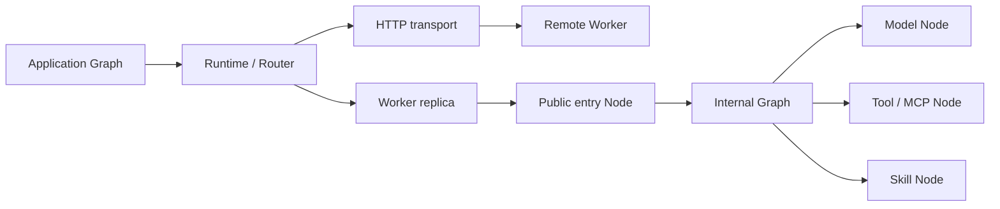

<p align="center">
  
</p>

<h1 align="center">Ditto</h1>

<p align="center">
  An agent-native framework for development nodes.<br />
  Scale on demand. Evolve agent structures at low cost.
</p>

<p align="center">
  <strong>English</strong> · <a href="./README.zh-CN.md">简体中文</a>
</p>

## Overview

Ditto is a lightweight, extensible TypeScript Agent runtime. Scale **Workers**, compose their internal **Nodes** with **Graphs**, and use the same typed capabilities locally or across servers.

A Worker is a deployment and resource boundary. Its internal Graph can combine reasoning, memory, tools, MCP and Skills; the Runtime handles routing, communication, configuration and execution services.



## What is implemented

| Area | Support |
| --- | --- |
| Worker composition | Mixed Node namespaces, explicit public entries, per-replica resources, concurrency limits and cleanup |
| Graphs | Typed immutable DAGs; application-wide routing or execution pinned inside one Worker |
| Communication | Direct local calls, authenticated HTTP across processes/servers, custom transport interface, separate events and artifacts |
| Models | Named providers, runtime defaults and per-Worker model selection; OpenAI-compatible and Anthropic text/tool adapters |
| Interaction Nodes | Bounded model/tool loop, validated local tools, connected MCP client adapter, explicit Skill registration/loading |
| Configuration | Explicit environment parsing, model/key/timeout/workspace settings and default-deny permission services |

Core has **no third-party runtime dependencies**. The original 18 Node contracts remain at v1.0. The package is private and is not published to npm.

A Node is the abstract representation of an operation in a Graph, optionally named with `defineNode`. Workers provide the actual handlers. Contracts and implementations live directly in their capability modules, without per-Worker `node/` directories, an Agent subsystem, or a Node class hierarchy.

```text
src/
  contracts/                # Shared messages/references and NodeContractMap registry
  worker/
    define-worker.ts        # defineWorker / extendWorker
    node.ts                 # Shared typed Node primitive
    execution-context.ts    # Worker resources and Runtime services
    memory/                 # Memory entities and operation contracts
    context/                # Context entities and operation contracts
    reasoning/              # contracts.ts, generate.ts and providers/
    interaction/            # contracts.ts, loop.ts, tools, MCP, Skills
  runtime/                  # Graph/scheduler, registry, capability routing, lifecycle
    communication/          # Transport, HTTP and events
    sandbox/                # Runtime permission service
```

Memory and Context are contract-first extension points, not bundled databases or compression engines. Applications supply their handlers and per-Worker resources. Graph is part of Runtime, not a fourth subsystem.

## Quick start

Requirements: Node.js 24+ and npm 11+ (`.nvmrc` is included).

```bash
npm ci
npm run check
cp .env.example .env
```

Run `node examples/worker-graph.ts` after building for a local, deterministic four-Worker example with no credentials. For real models, configure a provider/model and permissions in `.env`; see the [Interaction configuration guide](docs/interaction-runtime.md).

```ts
import { createDitto, defineWorker, createInteractionNodes, loadRuntimeConfig } from "@ditto/core";

const worker = defineWorker({
  type: "INTERACTION",
  concurrency: 4,
  expose: ["INTERACTION.RUN"],
  nodes: createInteractionNodes(),
});
const runtime = createDitto({ config: loadRuntimeConfig(), workers: [worker] });
try {
  runtime.register(worker); // Add capacity without changing the internal Graph.
  console.log(await runtime.invoke("INTERACTION.RUN", {
    messages: [{ role: "user", content: "Hello" }],
  }));
} finally {
  await runtime.close();
}
```

This library snippet requires a configured model/provider. The npm package has not been published yet.

## Execution boundaries

`runtime.run(graph, input)` routes public Node capabilities across Workers. `ctx.run(graph, input)` runs the entire graph inside the current Worker replica, including private Nodes. `ctx.invoke(node, input)` explicitly routes another public capability.

Scaling is manual registration/deployment; automatic provisioning and durable workflow recovery are not implemented. HTTP timeouts do not cancel remote effects, and calls are not automatically retried. Sandbox provides cooperative permission checks; untrusted code requires an application-supplied OS/container isolation boundary. MCP connections and external client lifecycles are owned by the application.

## Documentation

Start with the [documentation map](docs/README.md). Current guides are maintained in Chinese:

- [Architecture and extension boundaries](docs/architecture.md)
- [Development and package integration](docs/getting-started.md)
- [Local and remote Worker communication](docs/worker-communication.md)
- [Providers, tools, MCP, Skills and Sandbox](docs/interaction-runtime.md)
- [Refactor decisions](docs/refactor-2026-09-10.md)
- [Node API v1.0 contract](docs/13-node-api-contract.md)

Use [GitHub Issues](https://github.com/erwinmsmith/Ditto/issues) for concrete use cases, bugs and architecture discussions.
