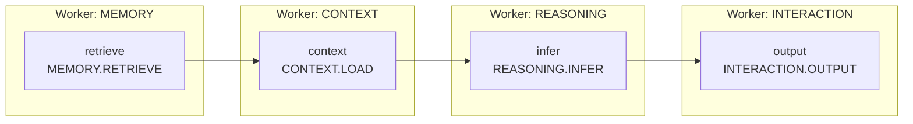

<p align="center">
  
</p>

<h1 align="center">Ditto</h1>

<p align="center">
  An agent-native framework for development nodes.<br />
  Scale on demand. Evolve agent structures at low cost.
</p>

<p align="center">
  <strong>English</strong> · <a href="./README.zh-CN.md">简体中文</a>
</p>

## Define the Graph First

Ditto is a lightweight TypeScript runtime for building Agents around a **Graph**. Declare the **Nodes**, their connections, and how upstream outputs form downstream inputs. Their owning **Workers** then supply implementations and execution resources.

A Graph can be expressed as **G = (V, E)**:

- **V: the set of Nodes.** Each vertex is a concrete operation, such as `MEMORY.RETRIEVE` or `REASONING.INFER`, whose implementation belongs to a Worker.
- **E: the set of directed connections.** `A → B` means B waits for A; a `bind` function transforms dependency results into B's input.

The following Graph connects retrieval, context loading, reasoning, and output. Names such as `retrieve` are logical IDs within the graph; names such as `MEMORY.RETRIEVE` identify the corresponding Node types:

```ts
import { graph, type Message } from "@ditto/core";

const agent = graph<Message>("retrieve-and-respond")
  .node("retrieve", "MEMORY.RETRIEVE", [], (query) => ({ query }))
  .node("context", "CONTEXT.LOAD", ["retrieve"], (_query, result) => ({
    sources: result.retrieve.map((item) => item.message),
  }))
  .node("infer", "REASONING.INFER", ["context"], (query, result) => ({
    messages: [query, ...result.context.items.map((item) => ({
      role: "user" as const, content: item.content,
    }))],
  }))
  .node("output", "INTERACTION.OUTPUT", ["infer"], (_query, result) => ({
    message: result.infer,
  }));
```

## Graph Connections

The four Nodes in the code are the four vertices below. The surrounding groups identify their owning Workers. The Runtime follows the Graph's dependencies and selects registered Worker replicas locally or remotely.



The same structure can be expressed as an adjacency matrix. In the order `retrieve, context, infer, output`, **rows are sources and columns are destinations**. A `1` indicates a direct connection; a `0` indicates none:

| From ↓ / To → | retrieve | context | infer | output |
| --- | ---: | ---: | ---: | ---: |
| retrieve | 0 | 1 | 0 | 0 |
| context | 0 | 0 | 1 | 0 |
| infer | 0 | 0 | 0 | 1 |
| output | 0 | 0 | 0 | 0 |

The diagram and matrix describe the same dependencies; the `bind` functions in code define the actual data transformations. A Node type may appear multiple times with distinct logical IDs. Graphs are currently directed acyclic graphs (DAGs), with support for concurrent independent branches and joins across multiple dependencies.

**Nodes define capabilities, Graphs define connections, and Workers execute them.** Change Nodes and connections to reshape an Agent. Register more Worker replicas to add capacity without changing the Graph definition.

## What is implemented

| Area | Support |
| --- | --- |
| Worker composition | Mixed Node namespaces, explicit public entries, per-replica resources, concurrency limits and cleanup |
| Graphs | Typed immutable DAGs; application-wide routing or execution pinned inside one Worker |
| Communication | Direct local calls, authenticated HTTP across processes/servers, custom transport interface, separate events and artifacts |
| Models | Named providers, runtime defaults and per-Worker model selection; OpenAI-compatible and Anthropic text/tool adapters |
| Interaction Nodes | Bounded model/tool loop, validated local tools, connected MCP client adapter, explicit Skill registration/loading |
| Configuration | Explicit environment parsing, model/key/timeout/workspace settings and default-deny permission services |

Core has **no third-party runtime dependencies**. The original 18 Node contracts remain at v1.0. The package is private and is not published to npm.

A Node is the abstract representation of an operation in a Graph, optionally defined with `defineNode(workerType, nodeType, handler)`. Each Node definition declares its owning Worker type; inline handlers are bound automatically, and Worker assembly rejects ownership mismatches. Workers provide the actual execution. Contracts and implementations live directly in their capability modules, without per-Worker `node/` directories, an Agent subsystem, or a Node class hierarchy.

```text
src/
  contracts/                # Shared messages/references and NodeContractMap registry
  worker/
    define-worker.ts        # defineWorker / extendWorker
    node.ts                 # Shared typed Node primitive
    execution-context.ts    # Worker resources and Runtime services
    memory/                 # Memory entities and operation contracts
    context/                # Context entities and operation contracts
    reasoning/              # contracts.ts, generate.ts and providers/
    interaction/            # contracts.ts, loop.ts, tools, MCP, Skills
  runtime/                  # Graph/scheduler, registry, capability routing, lifecycle
    communication/          # Transport, HTTP and events
    sandbox/                # Runtime permission service
```

Memory and Context are contract-first extension points, not bundled databases or compression engines. Applications supply their handlers and per-Worker resources. Graph is part of Runtime, not a fourth subsystem.

## Quick start

Requirements: Node.js 24+ and npm 11+ (`.nvmrc` is included).

```bash
npm ci
npm run check
cp .env.example .env
```

`examples/` is reserved for future Agents built using the npm package and is currently empty. Configure a provider/model and permissions in `.env` for real models; see the [Interaction configuration guide](docs/interaction-runtime.md).

Use the `agent` Graph defined above. Supply application-owned Worker definitions implementing its four capabilities, then execute it through `runtime.run` to obtain the Node results:

```ts
import { createDitto, loadRuntimeConfig, type WorkerDefinition } from "@ditto/core";

async function runAgent(workers: readonly WorkerDefinition[], query: Message) {
  const runtime = createDitto({ config: loadRuntimeConfig(), workers });
  try {
    const result = await runtime.run(agent, query);
    return result.output;
  } finally {
    await runtime.close();
  }
}
```

The application implements and supplies `workers`; creating the Runtime registers those definitions. Provide the Memory/Context data strategies and Reasoning implementation your application needs, and configure a provider/model when using model adapters. The npm package has not been published yet.

## Execution boundaries

`runtime.run(graph, input)` routes public Node capabilities across Workers. `ctx.run(graph, input)` runs the entire graph inside the current Worker replica, including private Nodes. `ctx.invoke(node, input)` explicitly routes another public capability.

Scaling is manual registration/deployment; automatic provisioning and durable workflow recovery are not implemented. HTTP timeouts do not cancel remote effects, and calls are not automatically retried. Sandbox provides cooperative permission checks; untrusted code requires an application-supplied OS/container isolation boundary. MCP connections and external client lifecycles are owned by the application.

## Documentation

Start with the [documentation map](docs/README.md). All guides are available in English and Simplified Chinese:

- [Architecture and extension boundaries](docs/architecture.md)
- [Development and package integration](docs/getting-started.md)
- [Local and remote Worker communication](docs/worker-communication.md)
- [Providers, tools, MCP, Skills and Sandbox](docs/interaction-runtime.md)
- [Node API v1.0 contract](docs/13-node-api-contract.md)

Use [GitHub Issues](https://github.com/erwinmsmith/Ditto/issues) for concrete use cases, bugs and architecture discussions.
