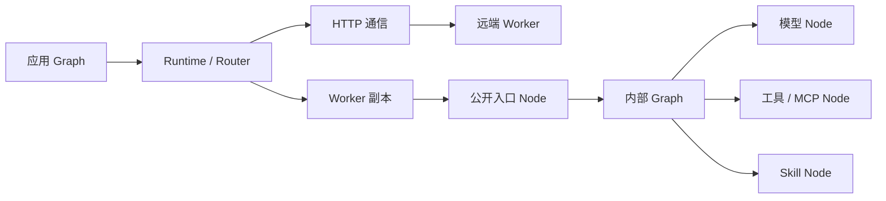

<p align="center">
  
</p>

<h1 align="center">Ditto</h1>

<p align="center">
  面向 Agent 原生工作流的开发节点框架。<br />
  按需扩容，低成本演进 Agent 结构。
</p>

<p align="center">
  <a href="./README.md">English</a> · <strong>简体中文</strong>
</p>

## 概览

Ditto 是轻量、可扩展的 TypeScript Agent Runtime。通过增加 **Worker** 扩充容量，用 **Graph** 组合 Worker 内部的 **Node**，相同类型契约可以在本地或跨服务器执行。

Worker 是部署和资源边界，内部可以包含推理、记忆、工具、MCP 与 Skill Node；Runtime 提供路由、通信、配置和执行服务。



## 当前能力

| 方向 | 已实现 |
| --- | --- |
| Worker 组合 | 混合 Node 命名空间、公开入口声明、副本独立资源、并发上限与资源释放 |
| Graph | 类型化不可变 DAG；支持应用全局路由和固定于当前 Worker 的内部执行 |
| 通信 | 同进程直调、带认证的跨进程/服务器 HTTP、自定义 Transport、独立事件与 Artifact |
| 多模型 | Provider 注册、Runtime 默认模型、Worker 模型覆盖；OpenAI 兼容和 Anthropic 文本/工具协议 |
| Interaction Node | 有界工具循环、本地工具参数校验、已连接 MCP 客户端适配、Skill 注册与显式加载 |
| 运行配置 | 显式环境变量解析、模型/Key/超时/工作区设置、默认拒绝的权限服务 |

Core **没有第三方运行时依赖**，原有 18 个 Node 契约保持 v1.0。项目目前为 private package，尚未发布至 npm。

Node 是 Graph 中对执行操作的抽象表示，可选用 `defineNode` 命名；实际 handler 由 Worker 提供。契约和实现直接归对应能力模块，不为各 Worker 建立 `node/` 目录，也没有独立 Agent 子系统或 Node 类继承层级。

```text
src/
  contracts/                # 通用 Message / Reference 和 NodeContractMap 汇总注册
  worker/
    define-worker.ts        # defineWorker / extendWorker
    node.ts                 # 共享的类型化 Node 原语
    execution-context.ts    # Worker 资源与 Runtime 执行服务
    memory/                 # 记忆实体与操作契约
    context/                # 上下文实体与操作契约
    reasoning/              # contracts.ts、generate.ts、providers/
    interaction/            # contracts.ts、loop.ts、工具、MCP、Skill
  runtime/                  # Graph/调度、注册、能力路由、生命周期
    communication/          # Transport、HTTP、事件
    sandbox/                # 运行时权限服务
```

Memory、Context 当前提供契约与扩展入口，不默认附带数据库或压缩算法；应用提供 handler 和 Worker 资源。Graph 属于 Runtime，不另立顶层子系统。

## 快速开始

需要 Node.js 24+、npm 11+，仓库提供 `.nvmrc`。

```bash
npm ci
npm run check
cp .env.example .env
```

构建后运行 `node examples/worker-graph.ts`，无需 Key 即可执行四个 Worker 的确定性本地示例。接入真实模型时，在 `.env` 配置 Provider/模型和权限，详见 [Interaction 配置](docs/interaction-runtime.md)。

```ts
import { createDitto, defineWorker, createInteractionNodes, loadRuntimeConfig } from "@ditto/core";

const worker = defineWorker({
  type: "INTERACTION",
  concurrency: 4,
  expose: ["INTERACTION.RUN"],
  nodes: createInteractionNodes(),
});
const runtime = createDitto({ config: loadRuntimeConfig(), workers: [worker] });
try {
  runtime.register(worker); // 增加容量，不需要改变内部 Graph。
  console.log(await runtime.invoke("INTERACTION.RUN", {
    messages: [{ role: "user", content: "你好" }],
  }));
} finally {
  await runtime.close();
}
```

这段库接入代码需要配置 Provider/模型；npm 包目前尚未发布。

## 执行边界

`runtime.run(graph, input)` 在 Worker 之间路由公开 Node；`ctx.run(graph, input)` 将整个 Graph 固定在当前 Worker 副本，可使用未公开 Node；`ctx.invoke(node, input)` 明确路由另一项公开能力。

当前通过注册和部署扩容，没有自动开机器或持久化工作流恢复。HTTP 超时不会取消远端副作用，也不会自动重试。Sandbox 提供合作式权限检查；不可信代码需要应用提供 OS/容器隔离。MCP 连接和外部客户端生命周期由应用管理。

## 文档

从 [文档地图](docs/README.md) 开始：

- [整体架构与扩展边界](docs/architecture.md)
- [开发与包接入](docs/getting-started.md)
- [本地与跨服务器 Worker 通信](docs/worker-communication.md)
- [Provider、工具、MCP、Skill 与 Sandbox](docs/interaction-runtime.md)
- [本次重构说明](docs/refactor-2026-09-10.md)
- [Node API v1.0 契约](docs/13-node-api-contract.md)

通过 [GitHub Issues](https://github.com/erwinmsmith/Ditto/issues) 提交具体使用场景、缺陷与架构讨论。
