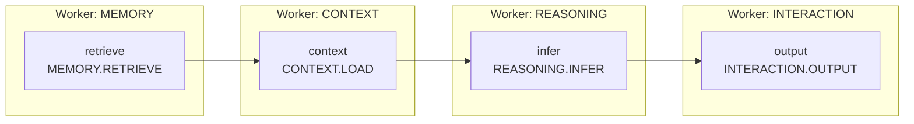

<p align="center">
  
</p>

<h1 align="center">Ditto</h1>

<p align="center">
  面向 Agent 原生工作流的开发节点框架。<br />
  按需扩容，低成本演进 Agent 结构。
</p>

<p align="center">
  <a href="./README.md">English</a> · <strong>简体中文</strong>
</p>

> 负责人确认的目标分类和 API 定义见[节点体系与 API Contract](docs/13-node-api-contract.zh-CN.md)。下方可运行示例仍使用当前 dev 的迁移前 Contract，待 TypeScript 迁移完成后再统一改名。

## 先定义 Graph

Ditto 是围绕 **Graph** 构建 Agent 的轻量 TypeScript Runtime。先声明有哪些 **Node**、它们如何连接，以及下游输入如何由上游输出生成，再由所属 **Worker** 提供实现与执行资源。

一个 Graph 可表示为 **G = (V, E)**：

- **V：Node 集合。** 每个顶点是一项具体操作，例如 `MEMORY.RETRIEVE` 或 `REASONING.INFER`，其实现归属某个 Worker。
- **E：有向连接集合。** `A → B` 表示 B 等待 A 完成；`bind` 函数将依赖结果转换为 B 的输入。

下面定义一个“检索 → 上下文 → 推理 → 输出”的 Graph。`retrieve` 等名称是图内逻辑 ID，`MEMORY.RETRIEVE` 等名称是对应的 Node 类型：

```ts
import { graph, type Message } from "@ditto/core";

const agent = graph<Message>("retrieve-and-respond")
  .node("retrieve", "MEMORY.RETRIEVE", [], (query) => ({ query }))
  .node("context", "CONTEXT.LOAD", ["retrieve"], (_query, result) => ({
    sources: result.retrieve.map((item) => item.message),
  }))
  .node("infer", "REASONING.INFER", ["context"], (query, result) => ({
    messages: [query, ...result.context.items.map((item) => ({
      role: "user" as const, content: item.content,
    }))],
  }))
  .node("output", "INTERACTION.OUTPUT", ["infer"], (_query, result) => ({
    message: result.infer,
  }));
```

## Graph 连接图

代码中的四个 Node 对应图中的四个顶点，外框标明各 Node 的 Worker 归属。Runtime 根据 Graph 执行依赖，在本地或远端选择已注册的 Worker 副本。



同一个连接结构也可以写成邻接矩阵。按 `retrieve, context, infer, output` 排列，**行是起点、列是终点**，`1` 表示存在直接连接，`0` 表示不存在：

| 从 ↓ / 到 → | retrieve | context | infer | output |
| --- | ---: | ---: | ---: | ---: |
| retrieve | 0 | 1 | 0 | 0 |
| context | 0 | 0 | 1 | 0 |
| infer | 0 | 0 | 0 | 1 |
| output | 0 | 0 | 0 | 0 |

连接图和矩阵描述同一份依赖关系；具体的数据转换由代码中的 `bind` 函数定义。一个 Node 类型可在图中出现多次，每次使用不同逻辑 ID。当前 Graph 是有向无环图（DAG），也支持独立分支并发及多路依赖汇合。

**Node 定义能力，Graph 定义一轮，Loop 推进多轮状态，Worker 执行 Node。** Agent 由状态 + Graph + Loop 组成；增加执行容量时注册更多 Worker 副本，Graph 定义无需改变。

## 当前能力

| 方向 | 已实现 |
| --- | --- |
| Worker 组合 | 混合 Node 命名空间、公开入口声明、副本独立资源、并发上限与资源释放 |
| Graph | 类型化不可变 DAG；支持应用全局路由和固定于当前 Worker 的内部执行 |
| Loop | `runtime.loop()` 重复执行 Graph，显式定义状态更新、停止条件和轮次上限 |
| 通信 | 同进程直调、带认证的跨进程/服务器 HTTP、自定义 Transport、独立事件与 Artifact |
| 多模型 | Provider 注册、Runtime 默认模型、Worker 模型覆盖；OpenAI 兼容和 Anthropic 文本/工具协议 |
| Interaction Node | 单个／批量工具调用及参数校验、已连接 MCP 客户端适配、Skill 注册与显式加载 |
| 运行配置 | 显式环境变量解析、模型/Key/超时/工作区设置、默认拒绝的权限服务 |

Core **没有第三方运行时依赖**，原有 18 个 Node 契约保持 v1.0。项目目前为 private package，尚未发布至 npm。

Node 是 Graph 中对执行操作的抽象表示，可选用 `defineNode(workerType, nodeType, handler)` 定义。Node 定义必须声明所属 Worker 类型；内联 handler 自动绑定，Worker 组装时拒绝归属不匹配的定义。实际执行由 Worker 提供。契约和实现直接归对应能力模块，不为各 Worker 建立 `node/` 目录，也没有独立 Agent 子系统或 Node 类继承层级。

```text
src/
  contracts/                # 通用 Message / Reference 和 NodeContractMap 汇总注册
  worker/
    define-worker.ts        # defineWorker / extendWorker
    node.ts                 # 共享的类型化 Node 原语
    execution-context.ts    # Worker 资源与 Runtime 执行服务
    memory/                 # 记忆实体与操作契约
    context/                # 上下文实体与操作契约
    reasoning/              # contracts.ts、generate.ts、providers/
    interaction/            # contracts.ts、工具、MCP、Skill；index.ts 组合叶子 handler
  runtime/                  # Graph/调度、注册、能力路由、生命周期
    graph.ts                # 一轮有限 DAG：定义与执行
    loop.ts                 # 状态更新与 Graph 的有界重复执行
    runtime.ts              # invoke / run / loop、注册与生命周期
    communication/          # Transport、HTTP、事件
    sandbox/                # 运行时权限服务
```

Memory、Context 当前提供契约与扩展入口，不默认附带数据库或压缩算法；应用提供 handler 和 Worker 资源。Graph 属于 Runtime，不另立顶层子系统。

## 快速开始

需要 Node.js 24+、npm 11+，仓库提供 `.nvmrc`。

```bash
npm ci
npm run check
cp .env.example .env
```

`examples/` 当前留空，后续用于通过 npm 包构建不同 Agent 的完整例子。接入真实模型时，在 `.env` 配置 Provider/模型和权限，详见 [Interaction 配置](docs/interaction-runtime.zh-CN.md)。

继续使用上面定义的 `agent` Graph。应用提供实现这四项能力的 Worker 定义，通过 `runtime.run` 得到各 Node 的结果：

```ts
import { createDitto, loadRuntimeConfig, type WorkerDefinition } from "@ditto/core";

async function runAgent(workers: readonly WorkerDefinition[], query: Message) {
  const runtime = createDitto({ config: loadRuntimeConfig(), workers });
  try {
    const result = await runtime.run(agent, query);
    return result.output;
  } finally {
    await runtime.close();
  }
}
```

`workers` 中的定义由应用实现并传入；创建 Runtime 时会注册这些 Worker。Memory / Context 的数据策略与 Reasoning 的模型实现按需接入，使用模型适配器时需配置 Provider/模型。npm 包目前尚未发布。

## 多轮执行

`runtime.run(graph, input)` 执行一次 DAG。`runtime.loop(definition, initialState)` 执行连续多轮：`graph` 提供固定 DAG 或按状态选图，`bind(state)` 提供输入，`update(state, output)` 生成新状态，`done(nextState, output)` 决定是否返回。回调均为同步函数。`maxIterations` 默认为 32，必须是正安全整数；达到上限且 `done` 未满足时抛出异常。Node 或回调异常直接传出，不自动重试。

下面是基于当前模型和工具能力的完整组合。在 `.env` 中配置 Provider/模型；应用向 `tools` 注册工具，并通过 `DITTO_ALLOW_TOOLS` 授权。工具注册表为空时可进行纯文本对话。

```ts
import {
  createDitto, defineWorker, graph, loop, loadRuntimeConfig,
  createGenerateNode, createInteractionNodes, ToolRegistry, type ModelMessage,
} from "@ditto/core";

interface AgentState { messages: readonly ModelMessage[]; turns: number }
const tools = new ToolRegistry();
const runtime = createDitto({ config: loadRuntimeConfig(), workers: [
  defineWorker({ type: "REASONING", nodes: {
    "REASONING.GENERATE": createGenerateNode({ tools: (ctx) => tools.list(ctx) }),
  } }),
  defineWorker({ type: "INTERACTION", nodes: createInteractionNodes({ tools }) }),
] });
const maxIterations = runtime.services.config.maxTurns;
const step = graph<AgentState>("agent-step")
  .node("response", "REASONING.GENERATE", [], (state) => ({ messages: state.messages }))
  .node("tools", "INTERACTION.TOOL_BATCH", ["response"], (state, { response }) => {
    if (response.toolCalls.length && state.turns + 1 >= maxIterations) {
      throw new Error("Agent turn limit reached");
    }
    return { calls: response.toolCalls };
  });
const agentLoop = loop({
  graph: step, maxIterations,
  bind: (state: AgentState) => state,
  update: (state, { response, tools }): AgentState => ({
    turns: state.turns + 1,
    messages: [
      ...state.messages,
      { role: "assistant", content: response.content, toolCalls: response.toolCalls },
      ...tools.map(({ id, result }) => ({
        role: "tool" as const, toolCallId: id, content: JSON.stringify(result),
      })),
    ],
  }),
  done: (_state, { response }) => response.toolCalls.length === 0,
});
try {
  const result = await runtime.loop(agentLoop, {
    messages: [{ role: "user", content: "Hello" }], turns: 0,
  });
  console.log(result.messages.at(-1)?.content);
} finally { await runtime.close(); }
```

每轮 Graph 为 `REASONING.GENERATE → INTERACTION.TOOL_BATCH`。空批次不执行工具；有请求时按顺序执行，将结果加入下一轮消息。应用的 Graph 在最后一轮执行工具前检查上限；通用 Loop 只限制完整 Graph 的执行次数，不内置 Agent 策略。这里显式使用 `DITTO_MAX_TURNS`，它不会改变通用 Loop 的默认值 32。

`INTERACTION.RUN` 已移除。`createInteractionNodes({ tools, skills })` 提供工具和 Skill handler；模型选择改由 `createGenerateNode({ model, tools })` 负责。通过 `runtime.invoke("INTERACTION.SKILL", { name })` 显式加载 Skill，再将指令放入初始状态。详见[配置指南](docs/interaction-runtime.zh-CN.md)。

### 不同 Step 使用不同 DAG

将多个候选 Graph 放入集合，传入 `graph: (state) => graphs[state.step]`，每个 step 选择其中一个执行。候选图可以重复选中，例如 `draft → revise → draft`。下面的纯文本流程先选单 Node 图生成草稿，再选双 Node 图评审并修订。传入仍在运行的 Runtime，并注册不带工具的 `REASONING.GENERATE`。

```ts
import { graph, loop, type DittoRuntime, type ModelMessage } from "@ditto/core";

interface ReviewState { messages: readonly ModelMessage[]; step: "draft" | "revise"; turns: number }
const draft = graph<ReviewState>("draft")
  .node("response", "REASONING.GENERATE", [], (state) => ({ messages: state.messages }));
const revise = graph<ReviewState>("revise")
  .node("critique", "REASONING.GENERATE", [], (state) => ({
    messages: [...state.messages, { role: "user", content: "Review the previous answer." }],
  }))
  .node("response", "REASONING.GENERATE", ["critique"], (state, { critique }) => ({
    messages: [...state.messages, { role: "user", content: `Revise using this feedback: ${critique.content}` }],
  }));
const graphs = { draft, revise };

async function runReview(runtime: DittoRuntime, messages: readonly ModelMessage[]) {
  return runtime.loop(loop({
    graph: (state: ReviewState) => graphs[state.step],
    bind: (state: ReviewState) => state,
    update: (state, { response }): ReviewState => ({
      step: "revise",
      turns: state.turns + 1,
      messages: [...state.messages, { role: "assistant", content: response.content }],
    }),
    done: (state) => state.turns === 2,
    maxIterations: 2,
  }), { messages, step: "draft", turns: 0 });
}
```

各轮选中的 Graph 可以有不同 Node、连线与并行分支。这里两个 Graph 都向 Loop 暴露 `response`；结果类型不同时，在 `LoopDefinition<S, I, O>` 中声明联合类型，并在 `update` / `done` 中缩窄。选择函数也可以根据状态构造新 Graph，每轮只调用一次；选图异常会在输入映射或 Node 执行前终止 Loop。

## 执行边界

`runtime.run(graph, input)` 在 Worker 之间路由公开 Node；`ctx.run(graph, input)` 将整个 Graph 固定在当前 Worker 副本，可使用未公开 Node；`ctx.invoke(node, input)` 明确路由另一项公开能力。

`runtime.loop()` 每轮调用 `runtime.run()`，各轮可能选中不同副本。对话状态保存在 Loop 状态或显式共享的存储中。先等待顶层运行完成，再关闭 Runtime。Loop 不向 Graph 引入环，也不提供检查点、取消或自动重试。

当前通过注册和部署扩容，没有自动开机器或持久化工作流恢复。HTTP 超时不会取消远端副作用，也不会自动重试。Sandbox 提供合作式权限检查；不可信代码需要应用提供 OS/容器隔离。MCP 连接和外部客户端生命周期由应用管理。

## 文档

从 [文档地图](docs/README.zh-CN.md) 开始，所有指南均提供中英文版本：

- [整体架构与扩展边界](docs/architecture.zh-CN.md)
- [开发与包接入](docs/getting-started.zh-CN.md)
- [本地与跨服务器 Worker 通信](docs/worker-communication.zh-CN.md)
- [Provider、工具、MCP、Skill 与 Sandbox](docs/interaction-runtime.zh-CN.md)
- [Node API v1.0 契约](docs/13-node-api-contract.zh-CN.md)

通过 [GitHub Issues](https://github.com/erwinmsmith/Ditto/issues) 提交具体使用场景、缺陷与架构讨论。
