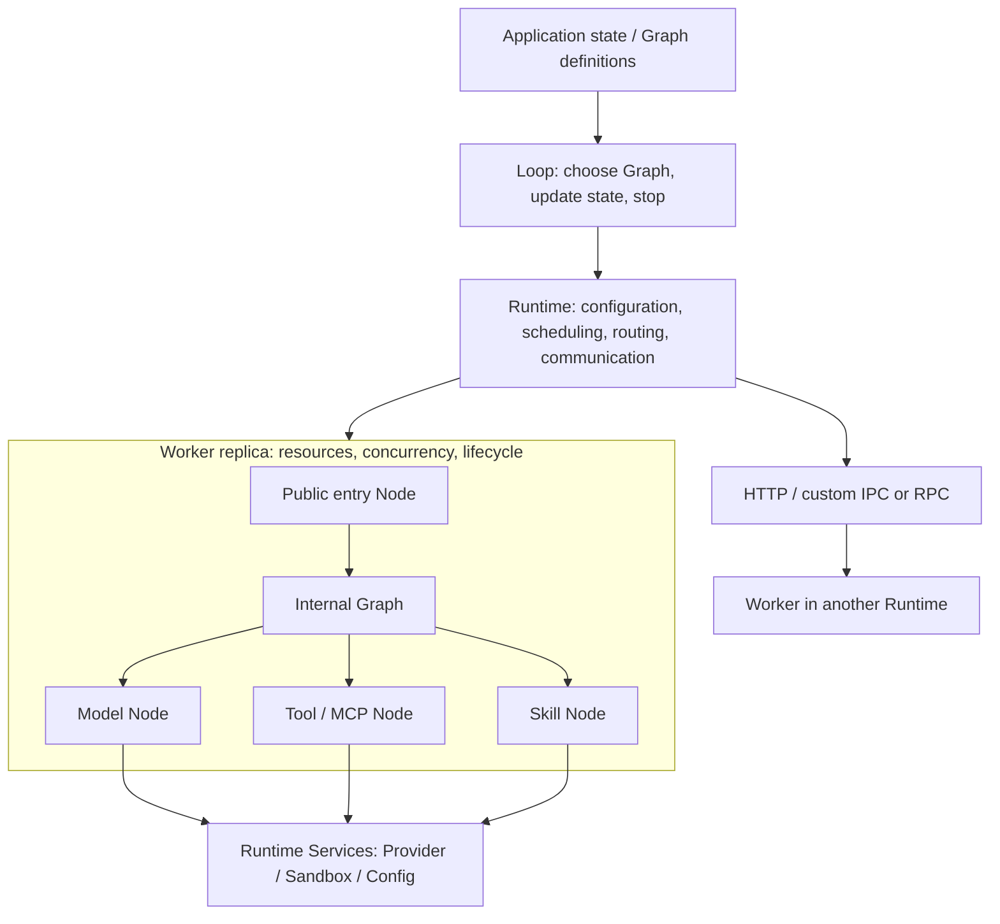

# Ditto Architecture

**English** · [简体中文](architecture.zh-CN.md)

Ditto is a single TypeScript package with no third-party runtime dependencies. Workers own capabilities and resources. A Graph defines one finite DAG; a Loop advances application state and selects the next round's Graph. The Runtime provides execution, routing, communication, and shared services. The [Node Taxonomy and API Contract](13-node-api-contract.md) governs target classification and interfaces. `INTERACTION.RUN` has been removed; other names such as `REASONING.*`, `INTERACTION.TOOL/SKILL`, and `CONTEXT.RESET` still use the current pre-migration Contracts.

## Structure and Responsibilities

| Module | Responsibility |
| --- | --- |
| `contracts/` | Shared Message/Reference/JSON types, the generic NodeContractMap interface, and type exports |
| `worker/node.ts`, `worker/execution-context.ts` | Shared typed handlers, `defineNode`, and execution context; no domain operations |
| `worker/define-worker.ts` | `defineWorker` / `extendWorker`, public capabilities, and replica resources |
| `worker/memory/` | `contracts.ts`: Memory entities and RETRIEVE / WRITE / UPDATE / CONSOLIDATE / EVICT contracts |
| `worker/context/` | `contracts.ts`: Context entities and LOAD / SELECT / UPDATE / COMPRESS / RESET contracts |
| `worker/infer/` (target) | `reasoning/`: final reasoning Contracts/handlers; `providers/`: unified vendor adapters. Current code remains under `worker/reasoning/` until migration. |
| `worker/interaction/` | Interaction contracts, tools / MCP / Skills; leaf handler composition in `index.ts` |
| `runtime/graph.ts` | Immutable finite DAG definition, dependency validation, and execution |
| `runtime/loop.ts` | Graph selection, state transitions, stopping condition, and bounded repetition |
| `runtime/runtime.ts` | `invoke` / `run` / `loop`, Worker registration, routing, and lifecycle |
| `runtime/communication/` | InvokeTransport, HTTP, and asynchronous events; calls and events have separate semantics |
| `runtime/sandbox/` | Permission checks, workspace file operations, and an isolated executor interface |

A Node represents an execution operation. Memory retrieval belongs to memory, model generation to reasoning, and tools to interaction. Shared typed Node definitions live in `worker/node.ts`; operation contracts belong to their capability's `contracts.ts`. `createInteractionNodes` returns leaf handlers directly. Graph construction and scheduling share `runtime/graph.ts`, repetition lives in `runtime/loop.ts`, and registration and lifecycle share `runtime/runtime.ts`. There are no per-Worker node directories, separate Agent subsystem, runner, or control hierarchy.

Memory and Context currently provide contracts; applications supply their data strategies. Reasoning provides replaceable model adapters and a generation Node. Interaction provides single/batch tools and Skill access. Applications compose those capabilities into Graphs and Loops; no Worker owns a built-in Agent loop.

## What Belongs in contracts

`contracts/` defines a type protocol, not an independent business layer. It contains no executors, storage, or model logic:

- `common.ts`: Message, Reference, and JSON data types shared across Workers.
- `node-contract-map.ts`: generic NodeContract<Input, Output>, the open NodeContractMap interface, and InputOf / OutputOf type inference.
- `index.ts`: type-only exports forming the package's unified type entry, including each Worker's contract declarations.

Concrete data types and Node-name mappings belong to the relevant Worker. For example, MemoryItem, MemoryRetrieveInput, and MEMORY.RETRIEVE are all declared in `worker/memory/contracts.ts`. Adding a Memory operation means adding its contract and handler within Memory, without modifying the Runtime or a central operation enum. These TypeScript types are erased during compilation; they do not participate in runtime routing or validate network input.

A Node is an operation inside a Worker. For example, an actual memory retrieval implementation would live in `worker/memory/retrieve.ts`, with its handler attached to the Memory Worker's nodes. Create that file only when an implementation needs it. `worker/node.ts` shares handler/defineNode types and definition helpers; it does not own Memory capabilities. Memory and Context currently have contracts, without database, retrieval, or compression implementations.

## Workers Contain Nodes

Built-in capabilities are organized as `MEMORY`, `CONTEXT`, `REASONING`, and `INTERACTION`; Workers with matching names are the recommended deployment boundaries. These names are not first-level Nodes. A custom Worker.type can still be any string, and explicit composition across domains remains supported: an Interaction Worker can include reasoning's GENERATE. Directory ownership does not restrict execution placement.

In `defineWorker({ nodes, expose })`, `nodes` is the internal implementation set, while `expose` lists entry points available to Runtime routing and remote calls. Omitting `expose` exposes all implemented Nodes. Expose the capabilities that application Graphs invoke; internal Graphs may still use private Nodes. Repetition is invoked through `runtime.loop()`, not a RUN Node.

`defineNode(workerType, nodeType, handler)` explicitly records the owning Worker type. Worker assembly rejects definitions with a different owner or a mismatched Node key. Inline handlers are bound to the containing Worker automatically, and structural definitions are validated and copied into immutable definitions. Ownership is a Worker-type constraint: replicas of the same type can share definitions while keeping separate resources. A definition is not executable through Runtime until its Worker is registered. This does not prevent an application from directly calling a JavaScript function outside Runtime.

Each `register(definition)` creates a replica and calls `resources()` once. Resources can hold replica-local caches, connections, or business state; `config` is read-only business configuration shared by instances of the same Worker definition. Model, key, and permission settings come from the execution host's `ctx.services`, not Node business inputs.

Data shared across replicas belongs in explicitly shared storage. Objects captured by a definition's closure are also shared by its replicas; mutable execution state in a `ToolRegistry`, for example, should instead use `ctx.resources` or a separately defined Worker. Asynchronous connections can be established beforehand, or a resource can hold a Promise that handlers await. Release resources with `dispose(resources)`.

## Two Graph Scopes

| Entry point | Selection and execution | Purpose |
| --- | --- | --- |
| `runtime.run(graph, input)` | Each task selects a Worker by public Node capability; tasks may span replicas or servers | Application orchestration across Workers |
| `ctx.run(graph, input)` | All tasks stay on the current Worker replica, including private Nodes | Internal Worker composition |
| `ctx.invoke(node, input)` | Routes by public capability again and may call another Worker | Explicit cross-Worker requests |

Before an internal Graph executes, the current Worker is checked for every required task. Missing internal Nodes do not silently route to another replica. This lets one internal Graph share its replica's resources and configuration. `ctx.invoke` does not guarantee the current replica; use `ctx.run` for internal execution.

Graphs are immutable DAGs. `node(id, nodeType, dependencies, bind)` defines a task, dependencies, and input mapping. The same semantic Node may appear more than once with distinct logical IDs. Dependencies can refer only to previously declared tasks. Independent branches run concurrently; descendants of a failed task do not run, and the scheduler waits for started branches before settling. Execution does not roll back completed external effects.

Graphs contain no Provider keys, physical addresses, or replica counts. Because `bind` is a TypeScript function, a Graph cannot be serialized directly as JSON. Public Node invocations cross the transport boundary; remote Workers execute their already-deployed handlers and internal Graphs.

## Loop Execution

`loop({ graph, bind, update, done, maxIterations })` defines repetition. `graph` may be a fixed DAG or `(state) => graph`: each iteration selects its DAG from the latest state, binds input, awaits `runtime.run`, updates state, and checks `done` against the new state and output. Different rounds may use different Nodes, dependencies, and branch structures. Selected Graphs share the Loop's declared input/output boundary; use explicit union types when their result shapes differ. Graphs themselves remain acyclic.

`runtime.loop(definition, initialState)` returns final state. Callbacks are synchronous, and the default limit is 32 positive-integer iterations. Failure or exhaustion rejects without retrying. Each selected Graph receives a fresh run ID and uses ordinary capability routing, so replicas can change across tasks and rounds. State lives in the calling application; a Loop does not pin a Worker or persist a conversation. `config.maxTurns` is only used when the application explicitly passes it as `maxIterations`.

## Scaling and Lifecycle

Repeated `register(worker)` calls add replicas in the current process. Deploy the same definition on another server and use `registerRemote` to add remote capacity. Node contracts and Graphs remain the same. In-process replicas share an event loop and do not add CPU cores; CPU work requires other processes or machines.

Routing filters public capabilities, availability, and local concurrency capacity, then prefers the same process, the same host, and finally another host. Equal-priority candidates rotate. When local replicas are busy, other replicas can be selected. `concurrency` limits entry invocations per replica and defaults to unlimited. Internal Graphs execute within an accepted entry invocation and do not acquire that quota again, avoiding nested deadlocks when concurrency is 1. Applications still control internal Graph branch counts.

`workers()` reports addresses, public capabilities, availability, and locally observed active/concurrency values. Remote capacity is enforced by the receiving host; callers have no live view of remote load. When no candidate is available, calls fail immediately. There is no unbounded waiting queue, automatic retry, or machine provisioning.

- `setAvailable(false)`: stop accepting new routed calls.
- `unregister()`: remove routing without interrupting accepted calls. Resources remain until the handle or Runtime is closed.
- `await handle.close()`: stop routing, await accepted calls on that replica, and release resources once.
- `await runtime.close()`: reject new calls and close owned Workers. Cleanup failures are returned as an AggregateError.

Handlers must await work they start. Closing a Runtime may reject Graph descendants that have not started or new cross-Worker requests, so applications should stop accepting requests and await top-level work before closing it. A handler must not await its own handle.close: that would wait for the handler itself. Applications own EventFabric, external Provider/MCP clients, and HTTP Server lifecycles.

## Contracts and the Target Node Taxonomy

The current `NodeContractMap` contains the 18 v1.0 contracts plus `INTERACTION.TOOL/TOOL_BATCH/SKILL` and `REASONING.GENERATE`. `INTERACTION.RUN` is removed. The remaining names are a migration baseline, not the final catalog. The target taxonomy requires:

- moving model generation and explicit reasoning under `INFER.*`;
- adding `CONTEXT.RAG.*` and `MEMORY.RAG.*` while separating current-task knowledge from the durable Memory Corpus;
- splitting Skill into `MEMORY.SKILL` and `CONTEXT.SKILL`;
- placing tools and MCP under `INTERACTION.ACT.TOOL` and `INTERACTION.ACT.MCP` respectively;
- removing `CONTEXT.RESET` in favor of Runtime lifecycle; RUN orchestration already belongs to Graph + Loop.

Custom capabilities still use declaration merging without hard-coding a Node enum into the Router or Scheduler. Exact TypeScript inputs and outputs for new and renamed Nodes must be frozen before handlers and Graphs change; this documentation pass does not speculate about fields.

Provider adaptation belongs under target `worker/infer/providers/`, not in Node names or Graph input. Core depends only on `ModelProvider.invoke(ProviderRequest)`. OpenAI-compatible, Anthropic, and future vendor adapters normalize messages, tool calls, completion state, and usage into the common `ModelOutput`; credentials, base URLs, model selection, timeouts, and vendor SDKs remain runtime configuration or optional dependencies.

Use `resources: () => ({ ... })` so each registration creates its own resources. Factory semantics prevent accidentally sharing mutable state through a resource object. Graphs continue to use `.node(id, type, dependencies, bind)` for explicit input mapping, rather than passing raw retrieval results into a reasoning Node that expects messages.

Execution settings remain separate from business input: `ctx.services.config` supplies the environment, default model, and timeouts; `ctx.services.providers` selects adapters; `ctx.services.sandbox` checks permissions. Runtime runs generic Graphs and Loops. Applications define Agent state, load Skills explicitly, and establish MCP connections.

See [Worker Communication](worker-communication.md) for transport details and [Interaction and Runtime Configuration](interaction-runtime.md) for Agent configuration and security boundaries.

## Keeping Execution Lightweight

In-process calls follow Runtime → Worker handler without a base-class or adapter layer. Only cross-process calls encode payloads. Worker handler lookup tables are built when definitions are created. Graphs are immutable reusable plans; each run owns its results and dependency waits. A Loop can select prebuilt Graphs or construct one from current state. Its execution path is `runtime.loop → runLoop → runtime.run → runGraph → invoke → Worker`.

The Router filters capabilities, capacity, and locality in one pass while retaining equal-priority rotation. It does not maintain a second complex index or scheduling service. Extend the system with concrete Nodes or adapters instead of adding a class/factory/registry stack for every concept. No throughput benchmark improvement is claimed; current checks preserve invocation, concurrency, and routing semantics.
