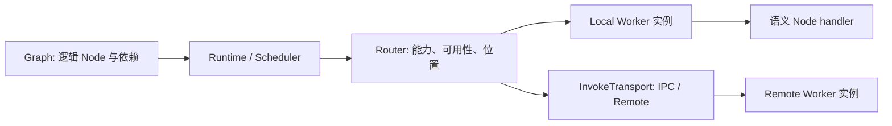

# Ditto 初始化架构

Ditto 的核心是 Node、Worker 和 Runtime。Execution Graph 是 Runtime 的逻辑执行描述。当前实现采用单一 TypeScript 工程，运行时仅使用 Node.js 标准库，外部重依赖按需由适配器或实验仓库引入。

## 职责与依赖

```text
contracts/        固定 Node 名称与输入输出
node/             defineNode 与执行类型
worker/           defineWorker、资源工厂、能力声明
runtime/          Graph、调度、路由、通信与 Artifact
nodes/            Contract v1.0 空类兼容入口
index.ts          公开 API
```



执行代码不依赖 `nodes/` 中的旧一级/二级空类。Node 实现的输入输出由 `NodeContractMap` 推导；第二个 `WorkerContext` 参数是执行服务，不是新增的输入字段。Contract 文件和公共基础类型不依赖 Runtime。

## Node 和 Worker 扩展

`NodeType` 从 `NodeContractMap` 推导，`WorkerType` 从 Node 完整名称的前缀推导。增加已声明 Node 的实现，只需增加 handler；不需要修改 Router、Transport 或 Scheduler 的枚举表。

Node 注册使用完整名称，避免省略前缀造成隐式拼接或同名操作混淆。Worker 可以只实现部分能力；每个注册实例持有自己的能力快照。要更换能力集合，可先注册新 Worker，再移除旧实例，已开始的调用继续完成。

实验仓库使用公开模块扩展声明：

```ts
import type { NodeContract } from "@ditto/core";

declare module "@ditto/core/contracts" {
  interface NodeContractMap {
    "SEARCH.QUERY": NodeContract<
      { query: string },
      readonly { title: string }[]
    >;
  }
}
```

然后用 `defineWorker({ type: "SEARCH", nodes: { "SEARCH.QUERY": ... } })` 实现。内置 Worker 新增 Node 采用同样方式，如 `MEMORY.ARCHIVE`。自定义声明应由实验仓库管理自己的语义和版本，不改写已有字段、不使用任意字符串或 `metadata` 绕过类型。

内置 Contract 的正式变更仍遵循 v1.0 文档：新增语义节点需同步映射、空类和表格；破坏已有输入输出必须升级主版本。更换 Provider 不改变语义 Node。声明式实现提供与对应空类等价的 type / execute 公开形状。

## 实例与资源

`defineWorker` 声明能力与实现，`register` 创建可执行实例。每次注册调用一次同步资源工厂，使不同副本可拥有独立连接或模型资源。若确实要共享资源，由工厂明确返回同一对象。异步连接建立可在注册前完成；关闭与释放由实验仓库负责，尚未引入生命周期状态机。

`config` 在同一 Worker 定义的副本之间共享，按只读配置使用；可变状态应放在资源工厂产生的对象内。资源、模型、配置不进入 Graph 或 Runtime Envelope。

实例地址包含 Worker ID、Worker Type、Host ID、Process ID。Worker ID 在一个 Runtime 的注册表内必须唯一，默认使用 UUID。配置多个 Runtime 时应明确填写真实设备的 hostId；默认 `local` 仅用于单进程实验。

实例可暂停参与路由或移除。路由首先过滤能力和可用状态，再按 direct、同 host、跨 host 排序，同优先级轮询。移除不会取消已开始的执行。这里没有负载监控、并发配额、自动重试或自动增减机器。

## Graph 与调度

`graph<Input>()` 构建不可变 DAG。`node(id, nodeType, dependencies, bind)` 同时定义逻辑实例、依赖和输入映射。相同 Node Type 可以在 Graph 中出现多次，逻辑 ID 必须不同。

一个依赖只能引用已声明的逻辑节点，从构建方式上排除前向引用和环。Runtime 在执行前再验证完整计划。独立分支并发启动；依赖未完成的节点等待；依赖失败后下游不执行。run 会等待所有已开始分支收尾，再返回失败。执行失败不回滚已产生的外部副作用。

仅画一条 `edge` 无法确定数据怎么转换，例如 Context 不能直接作为 InferInput。因此 bind 显式生成下游输入，并只能看到声明的依赖输出。最终返回由逻辑 ID 映射到输出的对象。

Graph 不包含物理地址或副本数量；同一份 Graph 模块可由不同注册拓扑执行。当前 bind 是 TypeScript 函数，不声称 Graph 可以直接 JSON 序列化。执行循环、动态分支、持久化调度、检查点和跨进程迁移运行中的调度状态未实现。

## 通信只保留 invoke 和 emit

`invoke(node, input)` 返回对应 `OutputOf<node>`。Worker 内使用 `ctx.invoke`，不选择设备或传输协议。

同进程直接调用 handler，无序列化和大小扫描。适配器调用使用 Runtime Envelope 包裹 payload、源/目标地址、唯一 invocation ID，以及可选 Graph 执行标识。接收端检查地址和能力、解析载荷，再把纯 Node 输入交给 handler。响应 ID 必须匹配调用 ID。

`emit(event)` 返回事件已被当前 Fabric 接受，不等待消费者完成。事件按类型分发给零到多个订阅者，每次 emit 使用当时的订阅快照。消费者独立失败；`drainEvents()` 等待已接受的处理并返回失败记录，调用方应检查这些记录。一次成功的 emit 不代表事件业务处理成功。

默认 LocalEventFabric 在同一事件循环异步执行，无持久化、跨机投递或重试保证。无限产生事件的消费者也会使 drain 无法结束。实验仓库可注入实现相同接口的 EventFabric，把位置选择与 Pub/Sub 放在适配器内部。未限制的队列与失败记录不适合直接用作生产事件平台。

## Local 和 Remote 接口

Core 实现 direct 路径；`InvokeTransport` 是 IPC/RPC 扩展边界。`registerRemote` 只登记地址、能力和已安装适配器 ID，`receive` 是适配器调用的本地主机入口，不是 HTTP/RPC 服务。

网络适配器负责真实协议、序列化、身份认证、边界数据验证、错误编码、断线处理以及协议版本兼容。Core 的 TypeScript 类型不替代对不可信网络数据的校验。业务不会自动在失败后换另一个副本重试，以免重复执行有副作用的 Node。

测试适配器在两个 Runtime 对象间进行序列化后调用 receive，用来验证路由和协议边界；真实 worker_threads、MessagePort、RPC、NATS 均未默认实现或安装。

## Inline 和 Reference

`Payload` 仅有 inline / reference 两个分支。原 Contract 的 `MessagePart.reference` / `Reference` 保持原样；业务本来带的 Reference 不会被隐式展开。

跨传输边界使用 `PayloadCodec`。配置 ArtifactStore 后，超过 inlineLimitBytes（默认 64 KiB）的 JSON 可编码数据被存储，只传 Reference；返回值同样处理。接收端解引用后，Node 仍收到原 Contract 输入。未配置 Store 时，默认 inline。

同进程直调跳过 PayloadCodec。事件 Fabric 适配器也可以复用该编解码器处理跨进程事件；本地 emit 无需编码。

InMemoryArtifactStore 是可选的进程内实验实现，不是跨设备共享服务；多主机部署必须安装各端能访问的外部 Store/Resolver。Reference 持久性、访问权限、删除和保留策略由 Store 的所有者负责。自动 offload 生成的引用不会自动删除，应为生产 Store 配置保留或回收策略。初始化不承诺 Blob 流、零拷贝或通用二进制序列化。

## 稳定接口与后续拆分

Contract v1.0 的空类保留并继续导出；新 Runtime 不将聚合空类当作执行或部署单元。旧初始化机制 NodeRegistry / RegistryMessageNode / InMemoryMessageTransport / NodeRuntime 被 Worker 与 Runtime 接口替代，没有保留两套调度系统。

保持一个 package，公开根入口及 contracts / node / worker / runtime / nodes 子入口。发布目前禁用。只有实际需要外部重依赖时，再拆传输或存储包；MCP、模型 SDK、工具框架不会自动成为 Core 的顶层系统。
