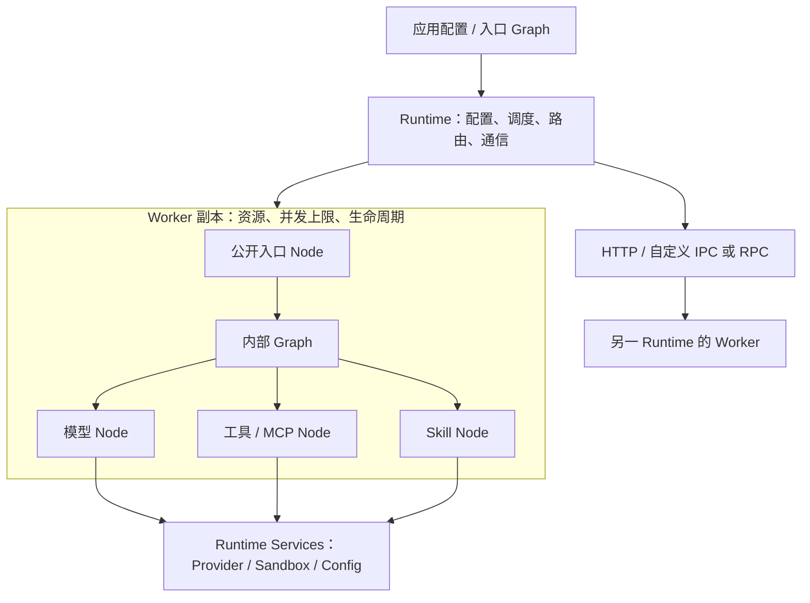

# Ditto 架构

Ditto 保持一个 TypeScript package，Core 没有第三方运行时依赖。Worker 是部署、资源和扩容单位，Node 是 Worker 内部的能力单元，Graph 描述 Node 之间的依赖与数据转换；Runtime 提供执行、路由、通信及运行服务。

## 结构与职责

| 模块 | 职责 |
| --- | --- |
| `contracts/` | 原有 18 个 Node 输入输出；可通过声明合并新增语义 |
| `node.ts` | 唯一 Node 定义：typed handler、`defineNode` 与执行上下文 |
| `worker.ts` | 单个工厂组合 Node、声明公开能力与副本资源 |
| `runtime/` | Graph 构建与执行、实例注册与路由、invoke / emit、HTTP、Artifact、配置与服务装配 |
| `providers/` | 模型协议接口、注册表、OpenAI 兼容与 Anthropic HTTP 适配器 |
| `sandbox/` | 权限检查、工作区文件操作、隔离执行器接口 |
| `agent/` | `AGENT.RUN / GENERATE / TOOL / SKILL` Node；工具、MCP、Skill 注册 |

独立模块仅用于职责稳定、可以替换的边界。一个 Node 就是一个带类型的处理函数，`defineNode` 只是可选的命名包装；没有继承层级、`node/` 与 `nodes/` 双目录，也不保留未参与执行的兼容空类。基础数据类型收在 `contracts/index.ts`，18 个语义契约收在 `node-contract-map.ts`；Graph 构建与调度同在 `runtime/graph.ts`。

## Worker 是 Node 的容器

`Worker.type` 是部署角色，例如 `assistant`、`indexer`。它与 Node 的语义命名空间解耦，一个 Worker 可以同时包含 `MEMORY.RETRIEVE`、`REASONING.INFER` 和 `AGENT.RUN`。

`defineWorker({ nodes, expose })` 中，`nodes` 是内部实现集合；`expose` 是参与 Runtime 路由、允许远端调用的入口集合。省略 `expose` 时，为兼容旧代码公开所有已实现 Node。推荐 Agent Worker 只公开 `AGENT.RUN`，内部的模型、工具、Skill Node 通过内部 Graph 使用。

每次 `register(definition)` 都创建一个副本，并执行一次 `resources()`。资源可存放副本私有缓存、连接或业务状态；`config` 是同一 Worker 定义共享的只读业务配置。模型、Key、权限等基础配置来自执行端的 `ctx.services`，不进入 Node 业务输入。

在多副本之间需要共享的数据，应放在显式共享存储中。定义闭包中的对象也会被各副本共享；如 `ToolRegistry` 中存在可变执行状态，应改用 `ctx.resources` 或单独定义 Worker。异步连接可以先建立，或将资源中的 Promise 交给 handler 等待；关闭资源使用 `dispose(resources)`。

## 两种 Graph 范围

| 入口 | 选择与执行行为 | 用途 |
| --- | --- | --- |
| `runtime.run(graph, input)` | 每个任务按公开 Node 能力选择 Worker；可跨副本、跨服务器 | Worker 之间的应用编排 |
| `ctx.run(graph, input)` | 全部任务固定在当前 Worker 副本；可使用未公开 Node | Worker 内部子结构 |
| `ctx.invoke(node, input)` | 按公开能力重新路由，可调用其他 Worker | 明确的跨 Worker 请求 |

内部 Graph 在执行前验证当前 Worker 实现了全部任务。不会因为缺少内部 Node 而偷偷转发到别的副本。因此同一次内部 Graph 能共享该副本的资源与配置。`ctx.invoke` 不保证留在当前副本，需要内部调用时使用 `ctx.run`。

Graph 是不可变 DAG。`node(id, nodeType, dependencies, bind)` 定义任务、依赖和输入映射；相同语义 Node 可以多次出现，只需不同逻辑 ID。依赖只能引用此前声明的任务；独立分支并发，失败任务的下游不运行，调度器等待已启动分支收尾再返回。执行不会回滚已完成的外部副作用。

Graph 中没有 Provider Key、物理地址或副本数量；`bind` 是 TypeScript 函数，Graph 本身不可直接 JSON 序列化。传输的是公开 Node 调用，远端 Worker 执行已部署的内部 Graph。有限 Agent 循环由 `AGENT.RUN` 实现，每轮使用内部 Graph；没有将有环工作流或持久化调度引入 DAG 核心。

## 扩容与生命周期

手动重复 `register(worker)` 增加本进程副本；另一服务器部署相同定义后，通过 `registerRemote` 增加远端容量。Node 契约与 Graph 不需要改动。同进程副本共享事件循环，不能增加 CPU 核数；CPU 工作需要部署到其他进程或机器。

路由先过滤公开能力、可用性与本地并发容量，再按同进程 → 同 host → 跨 host 排序，同级轮询。本地副本满载时可使用其他副本。`concurrency` 限制每个副本的入口调用数，默认无限制；内部 Graph 在一个已接受的入口调用内执行，不再次申请该配额，避免并发为 1 时的嵌套死锁。内部 Graph 的分支数仍由应用控制。

`workers()` 可查看地址、公开能力、可用性和本地观察到的 active/concurrency。远端容量由接收端限制，调用端没有实时远端负载视图。全部候选不可用时立即失败，没有无界等待队列、自动重试或自动扩机器。

- `setAvailable(false)`：暂停接收新的路由。
- `unregister()`：仅移除路由，不中断已接受调用；资源继续保留，之后调用 handle/runtime 的 `close()` 回收。
- `await handle.close()`：停止路由，等待本副本已接受的调用，释放资源一次。
- `await runtime.close()`：拒绝新调用并关闭所持有的 Worker；释放失败以 AggregateError 返回。

Handler 必须 await 自己启动的工作。关闭 Runtime 时未开始的 Graph 下游或新的跨 Worker 请求可能被拒绝，因此应用应先停止接收请求、等待顶层任务，再关闭 Runtime。调用自身 handle.close 并等待会等待自己，不应在本 Worker handler 内这样做。EventFabric、外部 Provider/MCP 客户端与 HTTP Server 的生命周期由应用所有者管理。

## 契约与扩展

既有 `NodeContractMap` 的 18 个输入输出契约及 Message/Reference 保持 v1.0；新增 `AGENT.*` 位于 `agent/contracts.ts` 的声明扩展中。自定义能力使用相同机制，无需修改 Router/Scheduler 枚举。原有空类、`@ditto/core/nodes`、一级聚合请求类型及 `workerTypeOf` / `NodesOfWorker` 已删除；迁移为 handler 或 `defineNode`。`defineWorker<R, C>` 仅保留实际使用的资源与配置类型参数，Worker 名称不需要类型参数。

运行设置和业务输入分离：`ctx.services.config` 提供环境、默认模型和超时，`ctx.services.providers` 选择适配器，`ctx.services.sandbox` 检查能力。Runtime 不运行 Agent 循环，不扫描 Skill，不建立 MCP 连接；这些行为由 Agent Node 和应用启动代码控制。

通信细节见 [Worker 通信](worker-communication.md)，Agent 配置与安全边界见 [Agent 与运行配置](agent-runtime.md)。

## 执行路径的轻量约束

同进程调用沿 Runtime → Worker handler 执行，不经过基类或适配层；只有跨进程调用才编码 payload。Worker 中的 handler 在定义时建立查找表，Graph 是不可变计划，运行只创建自己的结果与依赖等待。Agent 的三个内部计划预先构建并跨轮次/副本复用，避免每个工具调用都重新构图。

Router 用一次遍历筛选能力、容量与位置，保留同级轮询；没有维护第二套复杂索引或调度服务。需要扩展时增加具体 Node 或适配器，不以每个概念拆一套 class/factory/registry。性能变化未作吞吐基准承诺，当前验证保持调用、并发与路由语义一致。
