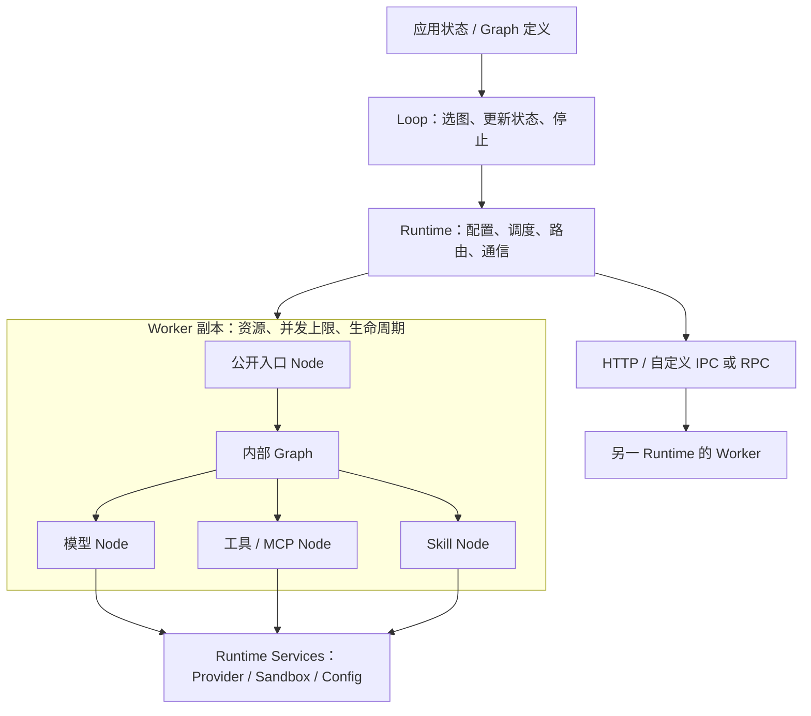

# Ditto 架构

[English](architecture.md) · **简体中文**

Ditto 保持一个 TypeScript package，Core 没有第三方运行时依赖。Worker 拥有能力与资源；Graph 定义一轮有限 DAG；Loop 推进应用状态并选择下一轮 Graph。Runtime 提供执行、路由、通信及运行服务。目标分类与接口以[节点体系与 API Contract](13-node-api-contract.zh-CN.md)为准；`INTERACTION.RUN` 已移除，`REASONING.*`、`INTERACTION.TOOL/SKILL`、`CONTEXT.RESET` 等仍使用当前迁移前契约。

## 结构与职责

| 模块 | 职责 |
| --- | --- |
| `contracts/` | 仅共享 Message/Reference/JSON、通用 NodeContractMap 接口与类型导出 |
| `worker/node.ts`、`worker/execution-context.ts` | 共享 typed handler、`defineNode` 与执行上下文，不放领域操作 |
| `worker/define-worker.ts` | `defineWorker` / `extendWorker`、公开能力与副本资源 |
| `worker/memory/` | `contracts.ts`：Memory 实体与 RETRIEVE / WRITE / UPDATE / CONSOLIDATE / EVICT 契约 |
| `worker/context/` | `contracts.ts`：Context 实体与 LOAD / SELECT / UPDATE / COMPRESS / RESET 契约 |
| `worker/infer/`（目标） | `reasoning/`：最终推理 Contract/handler；`providers/`：统一供应商适配器。迁移完成前，当前实现仍在 `worker/reasoning/`。 |
| `worker/interaction/` | 交互契约、工具 / MCP / Skill；`index.ts` 组合叶子 handler |
| `runtime/graph.ts` | 不可变有限 DAG 定义、依赖校验与执行 |
| `runtime/loop.ts` | Graph 选择、状态推进、停止条件与有界重复执行 |
| `runtime/runtime.ts` | `invoke` / `run` / `loop`、Worker 注册、路由与生命周期 |
| `runtime/communication/` | InvokeTransport、HTTP、异步事件；调用与事件语义分离 |
| `runtime/sandbox/` | 权限检查、工作区文件操作、隔离执行器接口 |

Node 表示执行操作。记忆检索属于 memory，模型生成属于 reasoning，工具属于 interaction。共享类型化 Node 定义留在 `worker/node.ts`，操作契约归各能力模块的 `contracts.ts`。`createInteractionNodes` 直接返回叶子 handler。Graph 构建与调度同在 `runtime/graph.ts`，重复执行在 `runtime/loop.ts`，注册与生命周期在 `runtime/runtime.ts`。不设各 Worker 的 node 目录、独立 Agent 子系统、runner 或 control 层级。

Memory 与 Context 当前提供契约，具体数据策略由应用实现。Reasoning 提供可替换模型适配器和生成 Node。Interaction 提供单个／批量工具调用与 Skill 读取。应用将这些能力组成 Graph 和 Loop；Worker 不再拥有内置 Agent 循环。

## contracts 放什么

`contracts/` 是类型协议，不是独立业务层，也没有执行器、存储或模型逻辑：

- `common.ts`：跨 Worker 共享的 Message、Reference 和 JSON 数据类型。
- `node-contract-map.ts`：通用 NodeContract<Input, Output>、开放的 NodeContractMap 接口，以及 InputOf / OutputOf 类型推导。
- `index.ts`：仅用 type 导出，作为 npm 包的统一类型入口；包含各 Worker 的契约声明。

具体类型和 Node 名称的映射一起归属对应 Worker。例如 MemoryItem、MemoryRetrieveInput 和 MEMORY.RETRIEVE 的声明都在 `worker/memory/contracts.ts`。增加 Memory 的操作时，在 Memory 内补充契约及 handler；不需要修改 Runtime 或中央操作枚举。这些 TypeScript 类型在编译后擦除，不参与运行路由，也不提供网络输入校验。

Node 是 Worker 内的操作。例如真实记忆检索实现应放 `worker/memory/retrieve.ts`，其 handler 挂到 Memory Worker 的 nodes 中；只有实现确实需要时才建文件。`worker/node.ts` 只共享 handler/defineNode 的类型和定义工具，不拥有 Memory 的能力。目前 Memory / Context 初始化到契约，尚未提供数据库、检索、压缩实现。

## Worker 是 Node 的容器

内置能力按 `MEMORY`、`CONTEXT`、`REASONING`、`INTERACTION` 组织，推荐同名 Worker 作为部署边界。这些名称不是一级 Node。自定义 Worker.type 仍可为任意字符串；保留显式组合不同领域 Node 的能力，例如 Interaction Worker 组合 reasoning 的 GENERATE，不将目录归属误当作运行位置限制。

`defineWorker({ nodes, expose })` 中，`nodes` 是内部实现集合；`expose` 是参与 Runtime 路由、允许远端调用的入口集合。省略 `expose` 时公开全部实现。公开应用 Graph 调用的能力；内部 Graph 仍可使用私有 Node。重复执行通过 `runtime.loop()` 发起，不再使用 RUN Node。

`defineNode(workerType, nodeType, handler)` 显式记录所属 Worker 类型。Worker 组装时拒绝归属不同或 Node 键不匹配的定义；内联 handler 自动绑定当前 Worker，结构化定义经过校验并复制为不可变定义。归属约束针对 Worker 类型：同类型副本可以共用定义，资源各自独立。只有所属 Worker 注册后，定义才能通过 Runtime 执行；这不阻止应用在 Runtime 之外直接调用 JavaScript 函数。

每次 `register(definition)` 都创建一个副本，并执行一次 `resources()`。资源可存放副本私有缓存、连接或业务状态；`config` 是同一 Worker 定义共享的只读业务配置。模型、Key、权限等基础配置来自执行端的 `ctx.services`，不进入 Node 业务输入。

在多副本之间需要共享的数据，应放在显式共享存储中。定义闭包中的对象也会被各副本共享；如 `ToolRegistry` 中存在可变执行状态，应改用 `ctx.resources` 或单独定义 Worker。异步连接可以先建立，或将资源中的 Promise 交给 handler 等待；关闭资源使用 `dispose(resources)`。

## 两种 Graph 范围

| 入口 | 选择与执行行为 | 用途 |
| --- | --- | --- |
| `runtime.run(graph, input)` | 每个任务按公开 Node 能力选择 Worker；可跨副本、跨服务器 | Worker 之间的应用编排 |
| `ctx.run(graph, input)` | 全部任务固定在当前 Worker 副本；可使用未公开 Node | Worker 内部子结构 |
| `ctx.invoke(node, input)` | 按公开能力重新路由，可调用其他 Worker | 明确的跨 Worker 请求 |

内部 Graph 在执行前验证当前 Worker 实现了全部任务。不会因为缺少内部 Node 而偷偷转发到别的副本。因此同一次内部 Graph 能共享该副本的资源与配置。`ctx.invoke` 不保证留在当前副本，需要内部调用时使用 `ctx.run`。

Graph 是不可变 DAG。`node(id, nodeType, dependencies, bind)` 定义任务、依赖和输入映射；相同语义 Node 可以多次出现，只需不同逻辑 ID。依赖只能引用此前声明的任务；独立分支并发，失败任务的下游不运行，调度器等待已启动分支收尾再返回。执行不会回滚已完成的外部副作用。

Graph 中没有 Provider Key、物理地址或副本数量；`bind` 是 TypeScript 函数，Graph 本身不可直接 JSON 序列化。传输的是公开 Node 调用，远端 Worker 执行已部署的 handler 与内部 Graph。

## Loop 执行

`loop({ graph, bind, update, done, maxIterations })` 定义重复执行。`graph` 可以是固定 DAG 或 `(state) => graph`：每轮根据最新状态选图，映射输入，等待 `runtime.run`，更新状态，再用新状态与输出检查 `done`。不同轮可使用不同 Node、依赖和分支结构。选中的 Graph 共用 Loop 声明的输入／输出边界；结果结构不同时可显式声明联合类型。Graph 自身始终无环。

`runtime.loop(definition, initialState)` 返回最终状态。回调均为同步函数，默认最多执行 32 轮，上限必须为正整数。失败或耗尽上限时直接拒绝，不重试。每次选中的 Graph 获得新的 run ID，并使用普通能力路由，所以任务和轮次之间可能切换副本。状态在调用方应用中，Loop 不固定 Worker，也不持久化对话。只有应用显式将 `config.maxTurns` 传为 `maxIterations` 时才使用该配置。

## 扩容与生命周期

手动重复 `register(worker)` 增加本进程副本；另一服务器部署相同定义后，通过 `registerRemote` 增加远端容量。Node 契约与 Graph 不需要改动。同进程副本共享事件循环，不能增加 CPU 核数；CPU 工作需要部署到其他进程或机器。

路由先过滤公开能力、可用性与本地并发容量，再按同进程 → 同 host → 跨 host 排序，同级轮询。本地副本满载时可使用其他副本。`concurrency` 限制每个副本的入口调用数，默认无限制；内部 Graph 在一个已接受的入口调用内执行，不再次申请该配额，避免并发为 1 时的嵌套死锁。内部 Graph 的分支数仍由应用控制。

`workers()` 可查看地址、公开能力、可用性和本地观察到的 active/concurrency。远端容量由接收端限制，调用端没有实时远端负载视图。全部候选不可用时立即失败，没有无界等待队列、自动重试或自动扩机器。

- `setAvailable(false)`：暂停接收新的路由。
- `unregister()`：仅移除路由，不中断已接受调用；资源继续保留，之后调用 handle/runtime 的 `close()` 回收。
- `await handle.close()`：停止路由，等待本副本已接受的调用，释放资源一次。
- `await runtime.close()`：拒绝新调用并关闭所持有的 Worker；释放失败以 AggregateError 返回。

Handler 必须 await 自己启动的工作。关闭 Runtime 时未开始的 Graph 下游或新的跨 Worker 请求可能被拒绝，因此应用应先停止接收请求、等待顶层任务，再关闭 Runtime。调用自身 handle.close 并等待会等待自己，不应在本 Worker handler 内这样做。EventFabric、外部 Provider/MCP 客户端与 HTTP Server 的生命周期由应用所有者管理。

## 契约与目标节点体系

当前 `NodeContractMap` 包含 18 个 v1.0 契约及 `INTERACTION.TOOL/TOOL_BATCH/SKILL`、`REASONING.GENERATE`；`INTERACTION.RUN` 已移除。剩余名称是待迁移的实现基线，不是最终目录。目标体系要求：

- 将模型生成和显式推理统一迁入 `INFER.*`；
- 新增 `CONTEXT.RAG.*` 与 `MEMORY.RAG.*`，同时保持当前任务知识与长期 Memory Corpus 的生命周期隔离；
- 将 Skill 拆成 `MEMORY.SKILL` 与 `CONTEXT.SKILL`；
- 将工具和 MCP 分别置于 `INTERACTION.ACT.TOOL` 与 `INTERACTION.ACT.MCP`；
- 移除 `CONTEXT.RESET`，由 Runtime 生命周期承担；RUN 编排已归 Graph + Loop。

自定义能力仍通过声明合并扩展，无需把 Node 枚举硬编码进 Router/Scheduler。最终 Contract 必须先固定新增/改名节点的 TypeScript 输入输出，再变更 handler 和 Graph；本轮文档不推测字段。

Provider 适配归目标目录 `worker/infer/providers/`，不进入 Node 名称或 Graph 业务输入。Core 只依赖 `ModelProvider.invoke(ProviderRequest)`；OpenAI-compatible、Anthropic 及后续供应商 adapter 将消息、工具调用、完成状态和 usage 规范化为统一 `ModelOutput`。凭证、base URL、模型选择、超时和供应商 SDK 仍属于 Runtime 配置或可选依赖。

资源继续使用 `resources: () => ({ ... })`，保证每次注册创建自己的资源。相较草案中的资源对象写法，这里明确保留工厂语义，避免副本意外共享可变状态。Graph 继续用 `.node(id, type, dependencies, bind)` 明确输入映射，避免把检索结果未经转换传给要求 messages 的推理 Node。

运行设置和业务输入分离：`ctx.services.config` 提供环境、默认模型和超时，`ctx.services.providers` 选择适配器，`ctx.services.sandbox` 检查能力。Runtime 执行通用 Graph 和 Loop；应用定义 Agent 状态、显式加载 Skill 并建立 MCP 连接。

通信细节见 [Worker 通信](worker-communication.zh-CN.md)，Agent 配置与安全边界见 [Agent 与运行配置](interaction-runtime.zh-CN.md)。

## 执行路径的轻量约束

同进程调用沿 Runtime → Worker handler 执行，不经过基类或适配层；只有跨进程调用才编码 payload。Worker 的 handler 在定义时建立查找表。Graph 是不可变可复用计划，每次运行拥有自己的结果与依赖等待。Loop 可选择预先构建的 Graph，也可按状态构建新图。执行链为 `runtime.loop → runLoop → runtime.run → runGraph → invoke → Worker`。

Router 用一次遍历筛选能力、容量与位置，保留同级轮询；没有维护第二套复杂索引或调度服务。需要扩展时增加具体 Node 或适配器，不以每个概念拆一套 class/factory/registry。性能变化未作吞吐基准承诺，当前验证保持调用、并发与路由语义一致。
