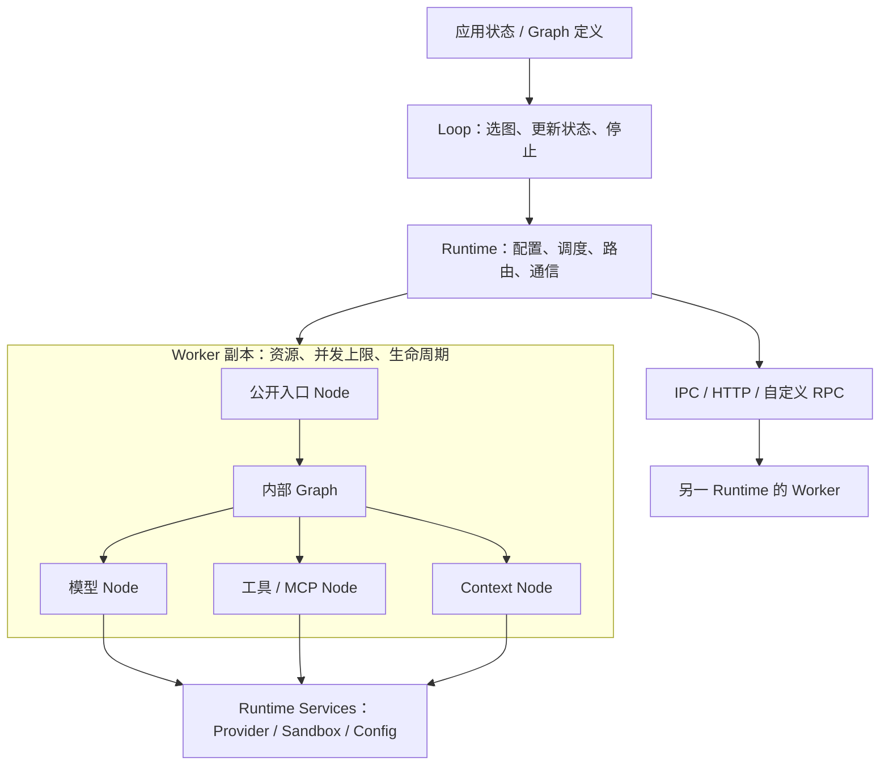

# Ditto 架构

[English](architecture.md) · **简体中文**

Ditto 保持一个 TypeScript package，Core 的第三方运行时依赖仅有 `yaml` 解析器。Worker 拥有能力与资源；Graph 定义一轮有限 DAG；Loop 推进应用状态并选择下一轮 Graph。Runtime 提供执行、路由、通信、共享服务和四个预定义 Context 流程。当前实现分类与接口以[节点体系与 API Contract](13-node-api-contract.zh-CN.md)为准。

## 结构与职责

| 模块 | 职责 |
| --- | --- |
| `contracts/` | 仅共享 Message/Reference/JSON、通用 NodeContractMap 接口与类型导出 |
| `worker/node.ts`、`worker/execution-context.ts` | 共享 typed handler、`defineNode` 与执行上下文，不放领域操作 |
| `worker/define-worker.ts` | `defineWorker` / `extendWorker`、公开能力与副本资源 |
| `worker/memory/` | `contracts.ts`：Memory 实体与 GET / QUERY / SEARCH / WRITE / UPDATE / DELETE 契约 |
| `worker/context/` | LOAD / SELECT / UPDATE / COMPRESS、可替换缓存、引用解析与 RAG 服务 |
| `worker/infer/` | `reasoning/`：采样、轨迹、反思和审议；`providers/`：模型适配器；`cache/`：查询、写入、失效和可替换存储 |
| `worker/interaction/` | ACT.TOOL 目录、ACT.MCP、OBSERVE、OUTPUT 与叶子 handler 组合 |
| `runtime/graph.ts` | 不可变有限 DAG 定义、依赖校验、执行与四个预定义 Context 流程 |
| `runtime/loop.ts` | Graph 选择、状态推进、停止条件与有界重复执行 |
| `runtime/runtime.ts` | `invoke` / `run` / `loop`、Worker 注册、路由与生命周期 |
| `runtime/communication/` | InvokeTransport、同机 IPC、HTTP、异步事件；调用与事件语义分离 |
| `runtime/sandbox/` | 权限检查、工作区文件操作、可选有界本地执行器及可替换隔离执行器接口 |

Node 表示执行操作。共享类型化 Node 定义位于 `worker/node.ts`，操作 Contract 归各能力模块的 `contracts.ts`。`createInteractionNodes` 返回已配置的 ACT.TOOL/ACT.MCP/OUTPUT handler 和 OBSERVE。Graph 构建、调度和四个标准流程函数位于 `runtime/graph.ts`；重复执行位于 `runtime/loop.ts`；注册与生命周期位于 `runtime/runtime.ts`。

Memory 与 Context 提供类型化 Contract，存储和检索策略由应用实现。Infer 负责推理和可替换 Provider adapter。Interaction 负责 Tool/MCP 执行、观察和最终输出。应用将能力组合成 Graph 和 Loop；Worker 不拥有内置 Agent 循环。

## contracts 放什么

`contracts/` 是类型协议，不是独立业务层，也没有执行器、存储或模型逻辑：

- `common.ts`：跨 Worker 共享的 Message、Reference 和 JSON 数据类型。
- `node-contract-map.ts`：通用 NodeContract<Input, Output>、开放的 NodeContractMap 接口，以及 InputOf / OutputOf 类型推导。
- `index.ts`：仅用 type 导出，作为 npm 包的统一类型入口；包含各 Worker 的契约声明。

具体类型和 Node 名称的映射一起归属对应 Worker。例如 MemoryItem、MemoryGetInput 和 MEMORY.GET 的声明都在 `worker/memory/contracts.ts`。增加 Memory 的操作时，在 Memory 内补充契约及 handler；不需要修改 Runtime 或中央操作枚举。这些 TypeScript 类型在编译后擦除，不参与运行路由，也不提供网络输入校验。

MEMORY 已在 `worker/memory/<operation>/node.ts` 实现六个节点的校验与执行，通过 createMemoryWorker 注入外部存储和搜索插件。Core 不集成数据库驱动。CONTEXT 通过 createContext/createContextWorker 执行四个有校验的操作；叶子描述符用于自定义组合时绑定类型和身份，并非待实现业务代码。

## Worker 是 Node 的容器

内置能力按 `MEMORY`、`CONTEXT`、`INFER`、`INTERACTION` 组织，推荐同名 Worker 作为部署边界。这些名称不是一级 Node。自定义 Worker.type 仍可为任意字符串；保留显式组合不同领域 Node 的能力，例如 Interaction Worker 组合 INFER.REASONING.SAMPLE，不将目录归属误当作运行位置限制。

`defineWorker({ nodes, expose })` 中，`nodes` 是内部实现集合；`expose` 是参与 Runtime 路由、允许远端调用的入口集合。省略 `expose` 时公开全部实现。公开应用 Graph 调用的能力；内部 Graph 仍可使用私有 Node。重复执行通过 `runtime.loop()` 发起，不再使用 RUN Node。

`defineNode(workerType, nodeType, handler)` 显式记录所属 Worker 类型。Worker 组装时拒绝归属不同或 Node 键不匹配的定义；内联 handler 自动绑定当前 Worker，结构化定义经过校验并复制为不可变定义。归属约束针对 Worker 类型：同类型副本可以共用定义，资源各自独立。只有所属 Worker 注册后，定义才能通过 Runtime 执行；这不阻止应用在 Runtime 之外直接调用 JavaScript 函数。

每次 `register(definition)` 都创建一个副本，并执行一次 `resources()`。资源可存放副本私有缓存、连接或业务状态；`config` 是同一 Worker 定义共享的只读业务配置。模型、Key、权限等基础配置来自执行端的 `ctx.services`，不进入 Node 业务输入。

在多副本之间需要共享的数据，应放在显式共享存储中。定义闭包中的对象也会被各副本共享；如 `ToolRegistry` 中存在可变执行状态，应改用 `ctx.resources` 或单独定义 Worker。异步连接可以先建立，或将资源中的 Promise 交给 handler 等待；关闭资源使用 `dispose(resources)`。

## 两种 Graph 范围

| 入口 | 选择与执行行为 | 用途 |
| --- | --- | --- |
| `runtime.run(graph, input)` | 每个任务按公开 Node 能力选择 Worker；可跨副本、跨服务器 | Worker 之间的应用编排 |
| `ctx.run(graph, input)` | 全部任务固定在当前 Worker 副本；可使用未公开 Node | Worker 内部子结构 |
| `ctx.invoke(node, input)` | 按公开能力重新路由，可调用其他 Worker | 明确的跨 Worker 请求 |

内部 Graph 在执行前验证当前 Worker 实现了全部任务。不会因为缺少内部 Node 而偷偷转发到别的副本。因此同一次内部 Graph 能共享该副本的资源与配置。`ctx.invoke` 不保证留在当前副本，需要内部调用时使用 `ctx.run`。

Graph 是不可变 DAG。`node(id, nodeType, dependencies, bind)` 定义任务、依赖和输入映射；相同语义 Node 可以多次出现，只需不同逻辑 ID。依赖只能引用此前声明的任务；独立分支并发，失败任务的下游不运行，调度器等待已启动分支收尾再返回。执行不会回滚已经对外部系统产生的变更。

Graph 中没有 Provider Key、物理地址或副本数量；`bind` 是 TypeScript 函数，Graph 本身不可直接 JSON 序列化。传输的是公开 Node 调用，远端 Worker 执行已部署的 handler 与内部 Graph。

## Loop 执行

`loop({ graph, bind, update, done, maxIterations })` 定义重复执行。`graph` 可以是固定 DAG 或 `(state) => graph`：每轮根据最新状态选图，映射输入，等待 `runtime.run`，更新状态，再用新状态与输出检查 `done`。不同轮可使用不同 Node、依赖和分支结构。选中的 Graph 共用 Loop 声明的输入／输出边界；结果结构不同时可显式声明联合类型。Graph 自身始终无环。

`runtime.loop(definition, initialState)` 返回最终状态。回调均为同步函数，默认最多执行 32 轮，上限必须为正整数。失败或耗尽上限时直接拒绝，不重试。每次选中的 Graph 获得新的 run ID，并使用普通能力路由，所以任务和轮次之间可能切换副本。状态在调用方应用中，Loop 不固定 Worker，也不持久化对话。默认轮数可由 YAML `runtime.loopMaxIterations` 配置；运行选项可按 Graph ID 指定节点到 Worker 的映射。

## 扩容与生命周期

手动重复 `register(worker)` 增加本进程副本；另一服务器部署相同定义后，通过 `registerRemote` 增加远端容量。Node 契约与 Graph 不需要改动。同进程副本共享事件循环，不能增加 CPU 核数；CPU 工作需要部署到其他进程或机器。

路由先过滤公开能力、可用性与本地并发容量，再按同进程 → 同 host → 跨 host 排序，同级轮询。本地副本满载时可使用其他副本。`concurrency` 限制每个副本的入口调用数，默认无限制；内部 Graph 在一个已接受的入口调用内执行，不再次申请该配额，避免并发为 1 时的嵌套死锁。内部 Graph 的分支数仍由应用控制。

`workers()` 可查看地址、公开能力、可用性和本地观察到的 active/concurrency。远端容量由接收端限制，调用端没有实时远端负载视图。全部候选不可用时立即失败，没有无界等待队列、自动重试或自动扩机器。

- `setAvailable(false)`：暂停接收新的路由。
- `unregister()`：仅移除路由，不中断已接受调用；资源继续保留，之后调用 handle/runtime 的 `close()` 回收。
- `await handle.close()`：停止路由，等待本副本已接受的调用，释放资源一次。
- `await runtime.close()`：拒绝新调用，等待已接受的 Graph/Loop/调用和事件处理，再关闭所持有的 Worker；释放失败以 AggregateError 返回。

Handler 必须 await 自己启动的工作。关闭 Runtime 时未开始的 Graph 下游或新的跨 Worker 请求可能被拒绝，因此应用应先停止接收请求、等待顶层任务，再关闭 Runtime。调用自身 handle.close 并等待会等待自己，不应在本 Worker handler 内这样做。EventFabric、外部 Provider/MCP 客户端与 HTTP Server 的生命周期由应用所有者管理。

## Contract 与最终节点体系

`NodeContractMap` 包含 21 个 Core 叶子 Contract。CONTEXT 提供 LOAD/SELECT/UPDATE/COMPRESS，RAG 为 SELECT 内部策略，Skill 作为应用已解析的 sources 装入；缓存模式通过可替换 ContextStateStore 接口读写，默认提供 Redis 适配。INFER、MEMORY、INTERACTION 各自负责计算、长期存储与外部交互；可选 RETRIEVAL 提供独立检索。详细调用见 [Worker API](worker-api/README.zh-CN.md)。

自定义能力仍通过 declaration merging 扩展，不在 Router 或 Scheduler 中硬编码 Node enum。固定 TypeScript 输入输出以[节点体系与 API Contract](13-node-api-contract.zh-CN.md)为准。

Provider adapter 保持扁平放置在 `worker/infer/providers/`，不进入 Node 名称或 Graph 业务输入。Core 只依赖 `ModelProvider.invoke(SampleInput, { signal })` 和可选的 `stream`；凭证、base URL、模型选择、超时和可选供应商 SDK 仍属于 Runtime 配置或 adapter。

四个可直接调用的标准流程位于 `runtime/graph.ts`：RAG、Skill、MCP 和 Tool Call。它们调用既有叶子 Node 并把结果送入 `CONTEXT.UPDATE`，不会扩展 `NodeContractMap`。

资源继续使用 `resources: () => ({ ... })`，保证每次注册创建自己的资源。相较草案中的资源对象写法，这里明确保留工厂语义，避免副本意外共享可变状态。Graph 继续用 `.node(id, type, dependencies, bind)` 明确输入映射，避免把检索结果未经转换传给要求 messages 的推理 Node。

运行设置和业务输入分离：`ctx.services.config` 提供环境、默认模型和超时，`ctx.services.providers` 选择适配器，`ctx.services.sandbox` 检查能力。Runtime 执行通用 Graph 和 Loop；应用定义 Agent 状态、显式加载 Skill 并建立 MCP 连接。

通信细节见 [Worker 通信](worker-communication.zh-CN.md)，Agent 配置与安全边界见 [Agent 与运行配置](interaction-runtime.zh-CN.md)。

## 执行路径的轻量约束

同进程调用沿 Runtime → Worker handler 执行，不经过基类或适配层；只有跨进程调用才编码 payload。Worker 的 handler 在定义时建立查找表。Graph 是不可变可复用计划，每次运行拥有自己的结果与依赖等待。Loop 可选择预先构建的 Graph，也可按状态构建新图。执行链为 `runtime.loop → runLoop → runtime.run → runGraph → invoke → Worker`。

Router 用一次遍历筛选能力、容量与位置，保留同级轮询；没有维护第二套复杂索引或调度服务。需要扩展时增加具体 Node 或适配器，不以每个概念拆一套 class/factory/registry。性能变化未作吞吐基准承诺，当前验证保持调用、并发与路由语义一致。

## 可选 RETRIEVAL 扩展

四个 Core Worker 的 21 个叶子保持不变。可选入口 `@ditto/core/worker/retrieval` 增加 `RETRIEVAL.SEARCH` 的契约与实现，仅在应用显式导入/注册时启用。它通过 Target/Strategy Registry 调用用户 Provider，不拥有数据、不执行 RAG，也不要求 MEMORY/CONTEXT 经由它检索。需要独立执行资源或水平扩容时，可使用现有 Runtime/HTTP 部署多个副本。[详细 API 与部署边界](worker-api/retrieval.zh-CN.md)。

[Runtime API](worker-api/runtime.zh-CN.md) 提供并发与取消、节点部署绑定、独立 services/Sandbox 和 IPC 的完整调用示例。
