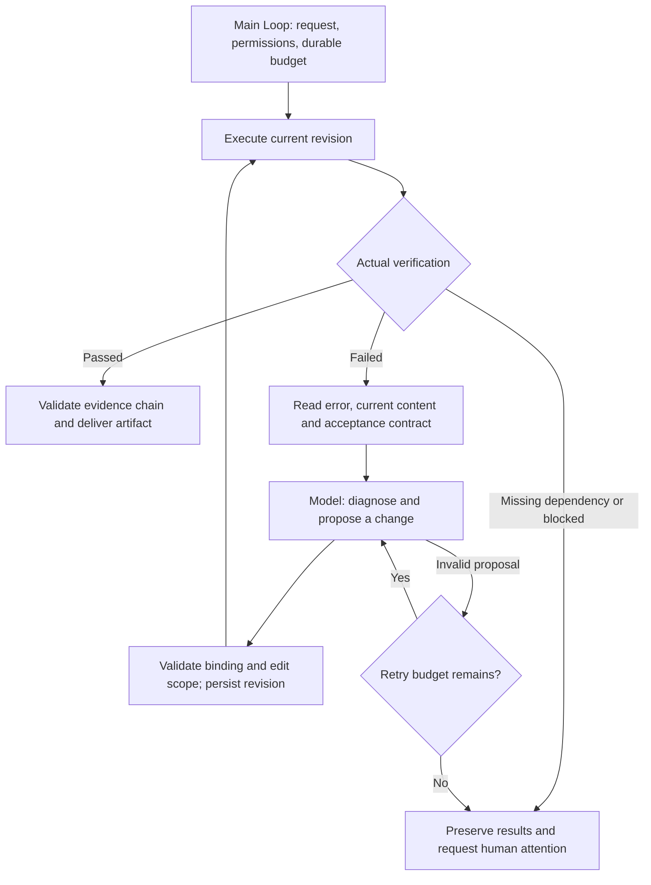

# Automatic repair

Run a task, inspect its actual failure, generate a bounded change, and execute again until verification succeeds or a stop condition is reached. The example delivers repaired files and an execution history. A model proposal alone never marks a task complete.

## Complete consumer

Copy `examples/patterns/auto-repair`, `examples/_shared/tools/auto-repair`, `examples/_shared/tools/storage`, `examples/_shared/tools/evidence.ts`, and `examples/_shared/tools/execution/files.ts` into the consumer. Install the Core package and the Redis dependency declared by `storage/dependencies/package.json`. Use Node 24, a real Redis server, `ditto.yaml`, and model credentials in the environment.

```ts
import { mkdtemp, rm } from "node:fs/promises";
import { tmpdir } from "node:os";
import { join } from "node:path";
import { loadRuntimeConfigFile } from "@codesoul-co/ditto/runtime";
import { createDemo } from "./examples/_shared/tools/auto-repair/adapters.ts";
import { openRepair } from "./examples/patterns/auto-repair/cli.ts";
import { runRepair } from "./examples/patterns/auto-repair/index.ts";

const config = loadRuntimeConfigFile("ditto.yaml", process.env);
const provider =
  process.env.EXAMPLE_AUTO_REPAIR_PROVIDER ?? config.model?.provider;
if (!provider || !config.providers[provider])
  throw new Error("Configure provider");
const model = config.providers[provider].model ?? config.model?.model;
if (!model) throw new Error("Configure model");
const directory = await mkdtemp(join(tmpdir(), "ditto-auto-repair-example-"));
try {
  const request = await createDemo(directory, {}, "code"); // code | sql | config
  const app = await openRepair(directory, request, config);
  try {
    const result = await runRepair(app.runtime, {
      request,
      model: { provider, model },
    });
    console.log(JSON.stringify(result));
  } finally {
    await app.close();
  }
} finally {
  // Retain a persistent directory when reports/checkpoints must survive.
  await rm(directory, { recursive: true, force: true });
}
```

## Loop and Graph composition



`runRepair` invokes `runtime.loop(runRepairLoop, ...)` once. Its plan composes flat Worker Graphs through `yield* graphStep`; it never runs Workers or I/O directly. Tools perform execution and revision persistence through `INTERACTION.ACT.TOOL`. Redis context reaches `INFER.REASONING.SAMPLE` through `CONTEXT.LOAD`; SQLite memory is read and written through `MEMORY.*`. Existing public APIs provide the required composition; no new Core dependency or private entry is necessary.

## Actual tasks

| Scenario          | Initial feedback                                       | Repair and acceptance                                                                                                      |
| ----------------- | ------------------------------------------------------ | -------------------------------------------------------------------------------------------------------------------------- |
| `code`            | Six Node tests expose an incorrect basis-point divisor | Model edits a numeric expression in `discount.mjs`; the immutable tests run again in a child process                       |
| `sql`             | SQLite reports missing `amount_cents`                  | Model corrects the aggregate SELECT; execution must return paid-only totals, north 160000 and south 80000 cents            |
| `config`          | A CSV workflow fails because its delimiter is wrong    | Model edits JSON configuration; the fixed workflow actually reads the CSV again and must produce the same paid-only totals |
| `already-correct` | Original tests pass                                    | Deliver the verified original without a model call                                                                         |
| `missing-input`   | Required CSV input is absent                           | Stop with `needs-human`; do not invent missing data or repeatedly change configuration                                     |

The configuration task demonstrates recovery of a local automation workflow. It does not deploy configuration to an external service. The SQL database is business data, separate from the SQLite Memory database.

Model edits are intentionally bounded. Code accepts arithmetic over `amountCents` and `discountBps`, numeric literals, parentheses, `+ - * /`, and `Math.round/floor/ceil`. The wrapper and test suite are fixed. SQL accepts only the documented aggregate SELECT shape, including an optional paid/cancelled filter, and uses a read-only SQLite connection. Configuration accepts only `delimiter`, `amountColumn`, and `statusFilter` with finite allowed values. No arbitrary shell commands, test edits, dynamic imports, arbitrary file paths, or SQL writes are accepted. These constraints define the example's edit language; this is not a general-purpose sandbox for untrusted programs. A broader code-repair integration must provide an isolated executor and its own edit policy.

Code and configuration child processes receive an empty environment, have a 10-second timeout and a 256 KB output bound. Timeouts become blocked execution evidence. Process creation/storage/integrity errors fail the invocation and retain checkpoints. A nonzero test exit or a SQL error can be repaired; a zero exit with incorrect business output is still a failure. Fixed acceptance tests establish the demonstrated contract, not correctness for every possible input.

## API and records

- `createDemo(directory, overrides?, scenario?)` writes immutable request, original inputs, source manifest and policy, and creates a real orders database. Default scenario: `code`.
- `openRepair(directory, request, config)` registers public Workers and application tools, opens Redis and SQLite, and returns `runtime/storage/adapters/close()`.
- `runRepair(runtime, {request, model}, options?)` returns a report or a checkpoint. `options.signal` cancels execution. `stopAfter` accepts `execution`, `patch`, or `report`; resume with the same directory/request and omit it.
- Request fields: `id/tenant/principal/question/kind/sourceDigest/maxModelCalls/maxExecutions/maxAttempts/deadlineSeconds`. Defaults: 6 model calls, 4 executions including the baseline, 2 proposal attempts per failed revision, and 600 seconds. Valid ranges: 1–12, 1–8, 1–3, and 1–3600 respectively.
- The model returns `{baseRevisionId, executionId, diagnosis, changeSummary, content}`. IDs must refer to the exact current failed execution. Unknown fields, no-op edits, out-of-scope content, and stale bindings are rejected. Diagnosis and change summary are model-written explanations; execution evidence decides success.
- Each immutable `Revision` binds the request digest, parent revision, content and proposal. Each `Run` includes its digest ID, revision ID, status, error code, exit code, stdout, stderr and acceptance checks.
- `Report` includes `requestId/status/stopReason/runs/acceptedRevisionId/errors/usage/generatedAt`. Only `completed` may contain an accepted revision, and its last run must have passed.

`revisions/<digest>/` stores the actual editable artifact, proposal and execution receipt. Original files stay under `input/`. `output/report.json` and `output/report.md` retain all failed and successful runs. Only a completed task writes the verified `discount.mjs`, `query.sql`, or `config.json` to `output/`; SQL/config tasks also write `rows.json`.

## Failure and recovery

Invalid model output retries up to `maxAttempts`; exhausted proposal attempts become `needs-human`. A valid edit that still fails goes through another diagnosis/edit/execute round. Missing input and execution timeouts stop for human attention. Model/execution budgets and elapsed deadline stop with `partial`, retaining actual feedback without claiming a successful repair. The deadline gates new operations; running child processes also have their own timeout, and provider calls use configured timeout/cancellation.

Reservations are written to Memory before model calls and executions. Persisted model responses are reused, and an immutable execution receipt prevents rerunning a finished revision after recovery. Replaying an applied proposal produces the same revision. A crash before a receipt is persisted can repeat execution; these example operations only read fixed data or test a local copy. They do not establish exactly-once behavior for arbitrary external effects. Reserved budget remains spent even if interruption happens before the operation starts.

Redis scope is `repair:<tenant>:<principal>:<task>`. An expired cache is rebuilt from durable model responses, revision data and execution feedback. Unavailable Redis/Memory fails without an in-memory fallback. The original request, source data, database rows, permissions, test files, revisions and previously remembered execution receipts are checked during resume. Revoked permission or tampering blocks further work. Hashes detect inconsistency, not malicious control of both storage and the application; task directories, Memory and the controller are trusted infrastructure.

Use one active Loop per task. There is no cross-process budget lease. A published report is terminal: replay validates and republishes the same report without new model calls. Changed inputs, permissions or requirements should start a new authorized request. Do not reuse checkpoints after changing the example protocol or acceptance fixtures.

## Run and verify

```sh
export DITTO_WORKER_CONTEXT_REDIS_URL=redis://127.0.0.1:6379
npm run example:auto-repair -- --provider deepseek
npm run example:auto-repair -- --provider deepseek --scenario sql
npm run example:auto-repair -- --provider deepseek --scenario config
npm run example:auto-repair -- --provider deepseek --stop-after patch
npm run example:auto-repair -- --provider deepseek --directory .examples-auto-repair-tasks/cli-XXXXXX
npm run check:examples:auto-repair:package -- --provider deepseek
```

Use the actual directory printed by the CLI for resume. Generated task files and result reports are ignored by Git.

The package gate installs the actual npm tarball outside the repository, checks strict public API types without aliases, blocks source/private imports, verifies silent module imports, and runs this consumer snippet. Task E2E uses a real model, Redis, durable SQLite, actual tests, actual SQL and actual CSV processing. Cases cover iterative semantic repair, invalid/unsafe/stale proposals, budgets, missing input, cache expiry, store failure, permission/input/test/revision/receipt tampering, cancellation, SIGKILL after execution/proposal/sample/report persistence, and publication retries. Fault cases explicitly inject proposals or infrastructure failures; normal repairs come from the model. SQLite tests are not PostgreSQL/MySQL acceptance.

[Example](../../examples/patterns/auto-repair/README.md) · [Application tools](../../examples/_shared/tools/auto-repair/README.md) · [简体中文](auto-repair-workflows.zh-CN.md)
