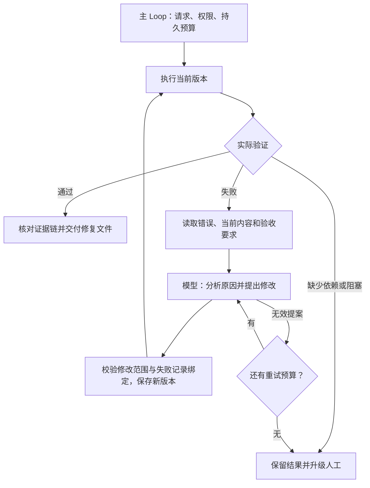

# 自动修复

执行任务后读取真实错误，生成受限修改，再执行验证，直到通过或达到停止条件。交付物包含修复文件和完整执行历史；模型提出修改不代表修复成功。

## 完整调用

将 `examples/patterns/auto-repair`、`examples/_shared/tools/auto-repair`、`examples/_shared/tools/storage`、`examples/_shared/tools/evidence.ts`、`examples/_shared/tools/execution/files.ts` 复制到消费者项目。安装 Core 包及 `storage/dependencies/package.json` 声明的 Redis 依赖。需要 Node 24、真实 Redis、`ditto.yaml` 和环境中的模型凭证。

```ts
import { mkdtemp, rm } from "node:fs/promises";
import { tmpdir } from "node:os";
import { join } from "node:path";
import { loadRuntimeConfigFile } from "@ditto/core/runtime";
import { createDemo } from "./examples/_shared/tools/auto-repair/adapters.ts";
import { openRepair } from "./examples/patterns/auto-repair/cli.ts";
import { runRepair } from "./examples/patterns/auto-repair/index.ts";

const config = loadRuntimeConfigFile("ditto.yaml", process.env);
const provider =
  process.env.EXAMPLE_AUTO_REPAIR_PROVIDER ?? config.model?.provider;
if (!provider || !config.providers[provider])
  throw new Error("Configure provider");
const model = config.providers[provider].model ?? config.model?.model;
if (!model) throw new Error("Configure model");
const directory = await mkdtemp(join(tmpdir(), "ditto-auto-repair-example-"));
try {
  const request = await createDemo(directory, {}, "code"); // code | sql | config
  const app = await openRepair(directory, request, config);
  try {
    const result = await runRepair(app.runtime, {
      request,
      model: { provider, model },
    });
    console.log(JSON.stringify(result));
  } finally {
    await app.close();
  }
} finally {
  // Retain a persistent directory when reports/checkpoints must survive.
  await rm(directory, { recursive: true, force: true });
}
```

## Loop 与 Graph



`runRepair` 只调用一次 `runtime.loop(runRepairLoop, ...)`，主计划通过 `yield* graphStep` 组合平铺的 Worker Graph，不直接执行 Worker 或 I/O。实际执行、修改落盘通过 `INTERACTION.ACT.TOOL`；Redis 上下文经 `CONTEXT.LOAD` 传给 `INFER.REASONING.SAMPLE`；SQLite Memory 通过 `MEMORY.*` 读写。现有公开 API 已满足组合需求，无需引入 Core 依赖或私有入口。

## 实际任务

| 场景              | 初始反馈                            | 修复与验收                                                                   |
| ----------------- | ----------------------------------- | ---------------------------------------------------------------------------- |
| `code`            | 六项 Node 测试发现折扣基点除数错误  | 模型修改 `discount.mjs` 的算术表达式，子进程重跑固定测试                     |
| `sql`             | SQLite 报告不存在 `amount_cents` 列 | 模型修正聚合 SELECT，必须得到已支付订单总额：north 160000 分、south 80000 分 |
| `config`          | CSV 工作流因分隔符错误而失败        | 模型修改 JSON 配置，固定脚本重新读取 CSV，必须得到同样的已支付订单统计       |
| `already-correct` | 原始测试通过                        | 不调用模型，直接交付已验证原始版本                                           |
| `missing-input`   | 缺少 CSV 输入                       | 返回 needs-human，不捏造数据、不反复修改配置                                 |

配置场景同时展示本地自动化流程恢复，不会部署到外部服务。订单 SQLite 是业务数据库，与 Memory SQLite 分开。

修改范围明确受限：代码只允许 `amountCents`、`discountBps`、数值、括号、加减乘除和 `Math.round/floor/ceil` 组成的表达式，函数包装和测试不可修改；SQL 只允许文档规定的单条聚合 SELECT，可选 paid/cancelled 条件，并使用只读连接；配置只接受 `delimiter/amountColumn/statusFilter` 及其枚举值。拒绝任意命令、测试修改、动态导入、任意路径和 SQL 写入。这是示例的受限编辑语言，不是通用的不可信程序沙箱；扩展到完整代码库时，应用必须提供隔离执行环境及自己的修改策略。

代码与配置子进程使用空环境、10 秒超时和 256 KB 输出上限。超时记录为 blocked；进程创建、存储、完整性错误直接使调用失败并保留检查点。测试非零退出或 SQL 错误可进入修复；即便执行退出码为零，业务结果不符合验收也必须继续修复。固定测试验证示例明确要求，不证明所有可能输入都正确。

## 接口与数据契约

- `createDemo(directory, overrides?, scenario?)` 创建不可变请求、原始输入、来源清单、权限策略及真实订单数据库；默认 code。
- `openRepair(directory, request, config)` 注册公开 Worker、应用工具和真实存储，返回 `runtime/storage/adapters/close()`。
- `runRepair(runtime, {request,model}, options?)` 返回报告或检查点。`signal` 传递取消；`stopAfter` 支持 execution/patch/report。恢复使用原请求与目录，并省略 stopAfter。
- Request 字段为 `id/tenant/principal/question/kind/sourceDigest/maxModelCalls/maxExecutions/maxAttempts/deadlineSeconds`。默认最多 6 次模型调用、4 次执行（含初始执行）、每个失败版本 2 次提案尝试、600 秒；有效范围分别为 1–12、1–8、1–3、1–3600。
- 模型返回 `{baseRevisionId,executionId,diagnosis,changeSummary,content}`，必须绑定当前失败执行。额外字段、无变化、越界内容及过期绑定会被拒绝。原因与修改说明由模型生成，实际执行证据决定是否成功。
- Revision 绑定请求摘要、父版本、完整内容和修改提案。Run 包含摘要 ID、版本 ID、状态、错误码、退出码、stdout/stderr 和验收检查。
- Report 包含 `requestId/status/stopReason/runs/acceptedRevisionId/errors/usage/generatedAt`。只有 completed 能带 acceptedRevisionId，且必须指向最后一个实际通过的版本。

`revisions/<digest>/` 保存可执行文件、修改记录和执行回执；原始文件留在 `input/`。`output/report.json` 与 `output/report.md` 保留所有失败和成功执行。只有任务完成才把经过验证的 `discount.mjs/query.sql/config.json` 写入 output；SQL/配置任务还写入实际 `rows.json`。

## 失败、预算与恢复

模型输出无效时按 maxAttempts 重试，耗尽后 needs-human。合法修改再次执行失败，会进入下一轮诊断与修复。缺少输入或执行超时停止并升级人工；调用数、执行数、总时间耗尽时 partial，保留反馈而不声称修复成功。截止时间限制新操作，已开始的子进程另有超时，模型调用使用 provider 超时或取消机制。

模型与执行预算先写入 Memory 再执行。持久化的模型响应会复用；不可变执行回执避免已完成版本在恢复时再次执行；重复应用相同提案得到同一版本。回执落盘前崩溃可能重跑操作：本示例操作只读取固定数据或测试本地副本，不代表任意外部副作用具有恰好一次语义。即使中断发生在操作开始前，已预留预算仍然计入消耗。

Redis scope 为 `repair:<tenant>:<principal>:<task>`。缓存过期后从持久响应、版本和执行反馈重建；Redis/Memory 不可用时直接失败，不静默切换内存。恢复时检查原始请求、来源、业务数据库行、权限、测试文件、版本和已存入 Memory 的执行回执。权限撤销或篡改阻止继续。摘要用于一致性检查，不抵抗同时控制存储与应用的攻击者；任务目录、Memory 和控制器属于可信基础设施。

同一任务只运行一个主 Loop，没有跨进程预算租约。报告交付后为终态，重放核对并返回相同报告，不新增模型调用。资料、权限或要求发生变化应创建新的获准请求；协议或验收素材改变后不要复用旧检查点。

## 运行与验收

```sh
export DITTO_WORKER_CONTEXT_REDIS_URL=redis://127.0.0.1:6379
npm run example:auto-repair -- --provider deepseek
npm run example:auto-repair -- --provider deepseek --scenario sql
npm run example:auto-repair -- --provider deepseek --scenario config
npm run example:auto-repair -- --provider deepseek --stop-after patch
npm run example:auto-repair -- --provider deepseek --directory .examples-auto-repair-tasks/cli-XXXXXX
npm run check:examples:auto-repair:package -- --provider deepseek
```

恢复时使用 CLI 打印的真实目录。运行目录和报告已被 Git 忽略。

包验收在仓库外安装实际 npm tarball，使用无路径别名的严格类型检查，动态禁止源码/私有入口，检查导入无执行副作用，并运行本文完整调用。任务验收使用真实模型、Redis、SQLite、Node 测试、SQL 查询和 CSV 工作流，覆盖多轮语义修复、非法/越界/过期提案、预算、缺少输入、缓存过期、存储故障、权限/数据/测试/版本/回执篡改、取消、执行/修改/模型响应/报告落盘后的 SIGKILL 恢复和交付重试。异常场景显式注入提案或环境故障，正常修改由真实模型生成；SQLite 验收不等同于 PostgreSQL/MySQL 验收。

[示例](../../examples/patterns/auto-repair/README.zh-CN.md) · [应用工具](../../examples/_shared/tools/auto-repair/README.zh-CN.md) · [English](auto-repair-workflows.md)
