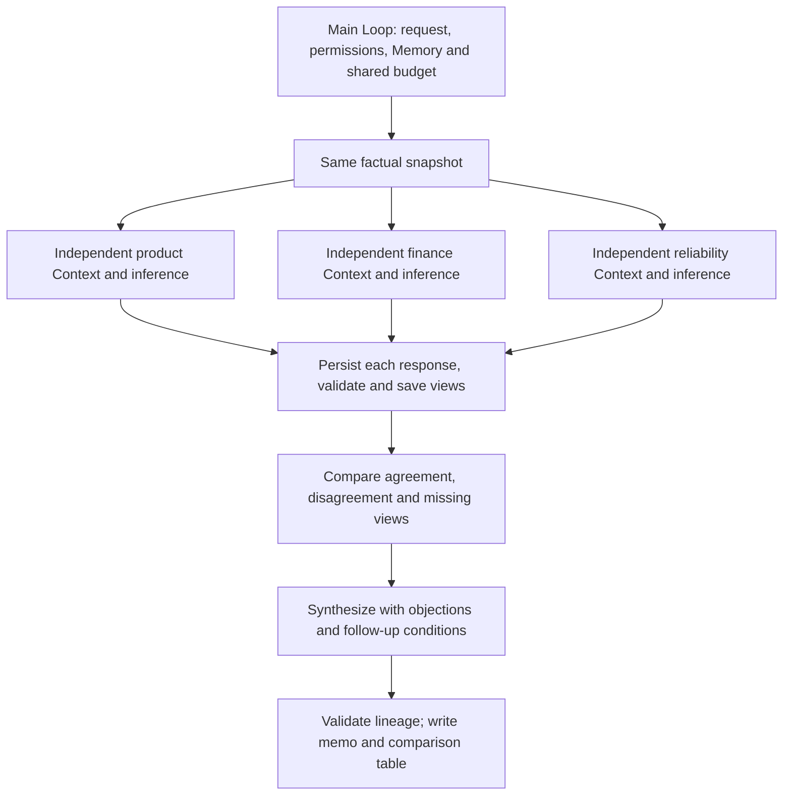

# Multi-perspective discussion

Product, finance and reliability Agents independently analyze the same pilot-expansion question. They use the same factual snapshot and different disclosed evaluation criteria. Only after independent views finish does the workflow compare agreement/disagreement and synthesize a recommendation. Outputs include original views, a comparison CSV and a JSON/Markdown decision memo, without performing rollout, approval or payment.

## Runnable consumer

Copy `examples/patterns/debate`, `examples/_shared/tools/debate`, `examples/_shared/tools/storage`, `examples/_shared/tools/evidence.ts` and `examples/_shared/tools/execution/files.ts` into the consumer project. Install Core and the Redis dependency from `storage/dependencies/package.json`. Use Node 24, real Redis, `ditto.yaml` and model environment credentials.

```ts
import { mkdtemp, rm } from "node:fs/promises";
import { tmpdir } from "node:os";
import { join } from "node:path";
import { loadRuntimeConfigFile } from "@codesoul-co/ditto/runtime";
import { createDemo } from "./examples/_shared/tools/debate/adapters.ts";
import { openDebate } from "./examples/patterns/debate/cli.ts";
import { runDebate } from "./examples/patterns/debate/index.ts";

const config = loadRuntimeConfigFile("ditto.yaml", process.env);
const provider = process.env.EXAMPLE_DEBATE_PROVIDER ?? config.model?.provider;
if (!provider || !config.providers[provider])
  throw new Error("Configure provider");
const model = config.providers[provider].model ?? config.model?.model;
if (!model) throw new Error("Configure model");
const directory = await mkdtemp(join(tmpdir(), "ditto-debate-example-"));
try {
  const request = await createDemo(directory, {}, "tradeoffs");
  const app = await openDebate(directory, request, config);
  try {
    const result = await runDebate(app.runtime, {
      request,
      model: { provider, model },
      // Optional models: { product: { provider, model }, ... }
      // Role keys: product, finance, reliability, comparison, synthesis.
    });
    console.log(JSON.stringify(result));
  } finally {
    await app.close();
  }
} finally {
  // Keep a persistent directory instead when retaining reports/checkpoints.
  await rm(directory, { recursive: true, force: true });
}
```

## Graph composition and independence



`runDebate` calls `runtime.loop(runDebateLoop, ...)` once. The Loop composes flat Graphs through `yield* graphStep`, with public Worker nodes only. Each independent branch runs `CONTEXT.LOAD → INFER.REASONING.SAMPLE → MEMORY.WRITE`; actual inference overlaps. Comparison and synthesis then run sequentially. No direct Worker executors, private modules or model HTTP are used, and one `DELIBERATE` invocation is not presented as independent Agents.

Roles share a Runtime but have distinct instructions, model settings and Redis scopes. They are not isolated processes or authentication principals. Independent views receive no other Agent's opinion or subsequent comparison/synthesis; retries see only their own errors. Downstream stages receive validated durable views. Different calls to one provider/model may have correlated biases and are not independent human experts or cross-model consensus.

## Facts and disclosed criteria

Default `tradeoffs` evidence: 8% observed conversion uplift, 1500000 cents forecast incremental revenue, 1200000 cents estimated cost, 40 basis points observed errors, verified rollback and no assigned on-call. Forecast revenue is explicitly an estimate.

| Role        | Positive benefit criterion                    | Acceptable cost       | Acceptable reliability                                        |
| ----------- | --------------------------------------------- | --------------------- | ------------------------------------------------------------- |
| product     | Uplift at least 5%                            | At most 1800000 cents | Errors at most 100 bps and verified rollback                  |
| finance     | Known cost and forecast revenue at least cost | At most 1000000 cents | Errors at most 50 bps and verified rollback                   |
| reliability | Uplift at least 8%                            | At most 1500000 cents | Errors at most 10 bps, verified rollback and assigned on-call |

These are explicit fixture criteria, not universal business recommendations. Agents independently explain evidence, propose trade-offs and choose their overall stance. Structured topic judgments must follow the assigned criteria. Missing cost means unknown cost for all roles and unknown benefit for finance. Unconditional support requires every topic positive; conditional/opposed positions require model explanations.

The default case agrees on benefit and differs on cost and reliability. All original overall positions and trade-offs remain in the memo. Topic consensus describes that topic's judgment; it does not imply identical overall positions or joint approval.

`aligned` meets every threshold. `missing-cost` forces deferral. `unsafe` has higher errors and unverified rollback. Global gates are separate from opinion votes: missing cost or a missing perspective permits only defer; unverified rollback, unassigned on-call or errors above 100 bps permits only revise/defer. Passing every gate merely permits a pilot recommendation, not actual approval or rollout.

## Interfaces and validation

- `createDemo(directory, overrides?, scenario?)` creates bound request, sources and policy. Default `tradeoffs`; also `aligned/missing-cost/unsafe`. Resume existing directories.
- `openDebate(directory, request, config)` registers public Workers, real stores and tools; returns `runtime/storage/adapters/close()`. Close it after use.
- `runDebate(runtime, {request,model,models?}, options?)` supports per-role overrides for `product/finance/reliability/comparison/synthesis`.
- `options.signal` forwards cancellation; `stopAfter` supports `views/comparison/report` and returns `{status:"checkpoint",stage}`. Resume the same request without stopAfter.
- `Report` includes `requestId/status/stopReason/entries/comparison/synthesis/usage/generatedAt`. Each entry records role, attempts, errors and resultId; missing views have null resultId.

`Request` contains `id/tenant/principal/question/sourceDigest/maxModelCalls/maxAttempts/deadlineSeconds`. Defaults: 12 model calls, two attempts per stage, 600 seconds. Ranges are 1–20, 1–3 and 1–3600 respectively. A normal discussion usually uses five calls: three views, comparison and synthesis; validation retries consume remaining budget. Perspective concurrency is three, Runtime/Infer concurrency four.

`View` contains role, proposalId, overall position, summary, three assessments and tradeoff. Assessments carry topic/judgment/reason/citations; validation checks topic coverage, exact quotes, identity and disclosed thresholds. Prose is generated independently rather than prescribed, but cannot redefine the factual contract.

`Comparison` binds every received view's SHA-256 ID and includes topic notes plus an application-derived matrix:

- Consensus requires the same topic judgment from all three roles.
- Different judgments are disagreement, with each group naming its roles; a two-person majority cannot erase the third role.
- Agreement with missing roles is only agreement-among-available.
- Shared unknown means shared missing evidence, not permission to proceed.

The comparison model cannot rewrite that matrix, omit a received opinion or suppress a topic. `Synthesis` carries recommendation/summary/conditions/unresolvedTopics/missingAgents, with comparisonId attached by the controller. Every unresolved topic requires a follow-up action; missing perspectives and global gates cannot be omitted.

Quotes, labels, coverage and recommendation boundaries have deterministic checks. Natural-language explanations and trade-offs remain model outputs; structural validity does not establish the correctness of every sentence. Full original views remain available for reviewing whether synthesis accurately represents each role.

## Persistence and application tools

Redis scopes are `debate:<tenant>:<principal>:<task>:<agent>`. SQLite `memory.sqlite`, accessed through `MEMORY.*`, stores request binding, reserved budgets, independent samples, result references, comparison and final report. Tools under `_shared/tools/debate` read task-bound evidence and write immutable views/reports outside Core dependencies.

Every tool checks enabled/principals, original request and source digest. Views bind the request digest; comparison binds all view IDs; synthesis binds comparison ID. Delivery rereads and validates that chain. Hashes detect integrity changes; the task directory and process remain trusted infrastructure. Opinion prose cannot grant permissions or choose arbitrary paths.

Artifacts are `views/<digest>.json`, `output/report.json`, `output/report.md` and `output/comparison.csv`. The memo preserves original explanations, overall stances, trade-offs, exact evidence, missing perspectives and synthesis conditions. CSV groups roles by their topic judgments.

## Failure and recovery

Each independent branch persists its own response before the join. Only missing/invalid views retry; successful roles are not regenerated. Partial failure retains valid views and may still produce comparison/synthesis, but the task is partial, recommendation is defer and missing roles are explicit. If every perspective fails, comparison and synthesis stop with needs-human.

Budget for a whole parallel batch is reserved before any of its inference calls start. A batch does not start without sufficient allowance. The deadline controls admission of new inference, not forced termination of existing calls; in-flight requests use provider timeouts or cancellation. Budget/deadline limits return partial without fabricated conclusions. Exhausted comparison/synthesis validation returns needs-human while preserving views.

Run one complete Loop per task; there is no cross-process budget lease. After Redis expiry, durable Memory samples and verified views rebuild the Context needed by subsequent comparison/synthesis. Redis/Memory failures propagate without in-memory fallback. A crash after sample persistence reuses that output; a crash before persistence may repeat a call while retaining its reserved cost. Changed permissions, request/source data or view files block continuation.

Delivered reports are terminal: repeat execution validates and returns the same report. New evidence or human feedback should create a new authorized request, not edit the bound task or silently increase its budget. Do not resume old checkpoints after changing protocol versions.

## Running and acceptance

```sh
export DITTO_WORKER_CONTEXT_REDIS_URL=redis://127.0.0.1:6379
npm run example:debate -- --provider deepseek
npm run example:debate -- --provider deepseek --scenario aligned
npm run example:debate -- --provider deepseek --scenario missing-cost
npm run example:debate -- --provider deepseek --stop-after views
npm run example:debate -- --provider deepseek --directory .examples-debate-tasks/cli-XXXXXX
npm run check:examples:debate:package -- --provider deepseek
```

The package gate installs an actual npm tarball outside the repository, checks strict types without paths aliases, dynamically rejects source/private entries, verifies silent imports and runs the complete consumer above.

Task acceptance uses real models, Redis, SQLite and actual views/comparison tables/reports. It checks independent inputs and call overlap, disagreements/aligned criteria/missing evidence/hard blockers, per-role settings, partial/all-view failure, forged quotes/identity/judgments, false consensus, omitted opinions, erased disagreement, unsafe recommendations, budget/deadline limits, cache expiry, storage faults, changed requests/sources/permissions, tampering, cancellation, SIGKILL after samples/view effects/reports and delivery retry. Fault cases explicitly inject errors; ordinary opinions/synthesis come from real model calls. Single-provider role testing is not cross-provider or production-soak acceptance.

[Example](../../examples/patterns/debate/README.md) · [Application tools](../../examples/_shared/tools/debate/README.md)
