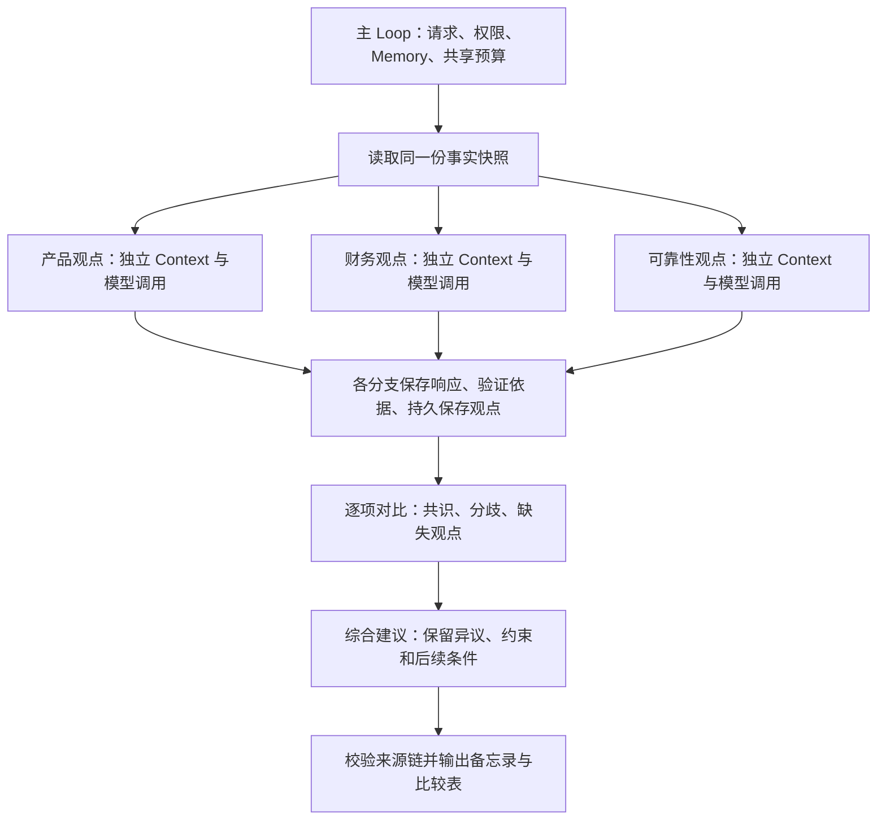

# 多观点讨论

产品、财务、可靠性三个 Agent 对同一个产品试点问题独立分析。它们使用相同事实快照、不同且公开的评估标准；所有独立观点完成后，才比较共识与分歧并形成综合建议。输出包括完整观点、比较 CSV 和 JSON/Markdown 决策备忘录，不执行上线、审批或付款。

## 完整调用

复制 `examples/patterns/debate`、`examples/_shared/tools/debate`、`examples/_shared/tools/storage`、`examples/_shared/tools/evidence.ts`、`examples/_shared/tools/execution/files.ts` 到消费者项目。安装 Core 包及 `storage/dependencies/package.json` 的 Redis 依赖。使用 Node 24、真实 Redis、`ditto.yaml` 和模型环境凭证。

```ts
import { mkdtemp, rm } from "node:fs/promises";
import { tmpdir } from "node:os";
import { join } from "node:path";
import { loadRuntimeConfigFile } from "@codesoul-co/ditto/runtime";
import { createDemo } from "./examples/_shared/tools/debate/adapters.ts";
import { openDebate } from "./examples/patterns/debate/cli.ts";
import { runDebate } from "./examples/patterns/debate/index.ts";

const config = loadRuntimeConfigFile("ditto.yaml", process.env);
const provider = process.env.EXAMPLE_DEBATE_PROVIDER ?? config.model?.provider;
if (!provider || !config.providers[provider])
  throw new Error("Configure provider");
const model = config.providers[provider].model ?? config.model?.model;
if (!model) throw new Error("Configure model");
const directory = await mkdtemp(join(tmpdir(), "ditto-debate-example-"));
try {
  const request = await createDemo(directory, {}, "tradeoffs");
  const app = await openDebate(directory, request, config);
  try {
    const result = await runDebate(app.runtime, {
      request,
      model: { provider, model },
      // Optional models: { product: { provider, model }, ... }
      // Role keys: product, finance, reliability, comparison, synthesis.
    });
    console.log(JSON.stringify(result));
  } finally {
    await app.close();
  }
} finally {
  // Keep a persistent directory instead when retaining reports/checkpoints.
  await rm(directory, { recursive: true, force: true });
}
```

## Graph 与独立性



`runDebate` 只调用一次 `runtime.loop(runDebateLoop, ...)`。Loop 通过 `yield* graphStep` 组合平铺 Graph，每个 Graph 的节点为公开 Worker。独立分支各自执行 `CONTEXT.LOAD → INFER.REASONING.SAMPLE → MEMORY.WRITE`，真实推理可以并发；比较与综合随后串行执行。未直接调用 Worker 执行器、私有模块或模型 HTTP，也没有把单次 `DELIBERATE` 调用当作多个独立 Agent。

角色是共享 Runtime 的逻辑 Agent，具有各自的指令、模型配置和 Redis scope，不是独立进程或独立认证主体。独立阶段不接收其他角色的观点、比较结果或综合结论；重试只接收自己的失败原因。比较与综合获得的是通过校验的持久观点，而不是正在生成的分支文本。同一 provider/model 的不同角色调用仍可能有相关偏差，不构成独立人类专家或跨模型共识。

## 示例事实与公开标准

默认 `tradeoffs`：观察到转化提升 8%，预测增量收入 1500000 分，成本估计 1200000 分，错误率 40 个基点，回滚已验证、值班负责人尚未安排。预测收入明确标注为估计值。

| 角色        | 收益为正面的标准             | 成本可接受标准    | 可靠性可接受标准                                   |
| ----------- | ---------------------------- | ----------------- | -------------------------------------------------- |
| product     | 转化提升至少 5%              | 不超过 1800000 分 | 错误率不超过 100 基点，回滚已验证                  |
| finance     | 已知成本且预测收入不少于成本 | 不超过 1000000 分 | 错误率不超过 50 基点，回滚已验证                   |
| reliability | 转化提升至少 8%              | 不超过 1500000 分 | 错误率不超过 10 基点，回滚已验证且值班负责人已安排 |

这些阈值是演示任务显式给定的评估标准，不是通用业务最佳实践。每个 Agent 自行解释依据、提出权衡并选择整体立场；结构化维度判断必须遵循自身标准。成本缺失时成本判断为 unknown，财务的收益比较也为 unknown。无条件 support 必须所有维度 positive；conditional/oppose 由模型说明理由。

默认场景在收益维度形成共识，在成本与可靠性维度产生分歧；原始整体立场和权衡完整保留。逐项共识仅指该维度的判断，不能等同于整体立场一致或共同批准方案。

`aligned` 提供满足所有阈值的资料；`missing-cost` 缺少成本，必须延后建议；`unsafe` 包含更高错误率及未验证回滚。全局门槛独立于观点投票：缺少成本或观点只能 defer；回滚未验证、值班未安排或错误率超过 100 基点时只能 revise/defer。全部门槛通过后也只是允许模型建议 pilot，并不执行批准或上线。

## 接口与契约

- `createDemo(directory, overrides?, scenario?)` 创建绑定的请求、资料和权限策略。默认 `tradeoffs`，可用 `aligned/missing-cost/unsafe`。恢复使用既有目录。
- `openDebate(directory, request, config)` 注册公开 Worker、真实存储和应用工具，返回 `runtime/storage/adapters/close()`，使用结束后关闭。
- `runDebate(runtime, {request,model,models?}, options?)` 执行任务。`models` 可分别覆盖 `product/finance/reliability/comparison/synthesis`。
- `options.signal` 传递取消；`stopAfter` 为 `views/comparison/report`，返回 `{status:"checkpoint",stage}`。恢复保留同一请求并省略 stopAfter。
- `Report` 包含 `requestId/status/stopReason/entries/comparison/synthesis/usage/generatedAt`。`entries` 为每个角色记录尝试次数、错误及 resultId；未得到有效观点时 resultId 为 null。

`Request` 包含 `id/tenant/principal/question/sourceDigest/maxModelCalls/maxAttempts/deadlineSeconds`。默认最多 12 次模型调用、每阶段 2 次尝试、600 秒；取值范围分别为 1–20、1–3、1–3600。正常完整讨论通常需要五次模型调用（三份独立观点、比较、综合），校验失败可以使用剩余额度重试。角色并发为 3，Runtime/Infer 并发为 4。

`View` 包含角色、proposalId、整体 position、summary、三个 assessments 和 tradeoff。每个 assessment 保存 topic/judgment/reason/citations，验证 topic 覆盖、逐字引文、身份和公开阈值。不要求模型产生预先编写的论述，但也不允许通过自由文本改变事实或标准。

`Comparison` 绑定全部已接收观点的 SHA-256 ID，包含每个维度的说明，以及应用根据独立判断生成的矩阵：

- 三个角色都给出相同判断，才能标为 `consensus`。
- 有不同判断则为 `disagreement`，各组明确列出角色；两人赞同不能覆盖一人异议。
- 缺少角色且已接收者一致，只能标为 `agreement-among-available`。
- unknown 的一致表示共同缺少资料，不表示支持执行。

矩阵不可由比较模型重写。比较模型必须覆盖所有观点和维度，不能漏掉少数角色。`Synthesis` 保存 recommendation/summary/conditions/unresolvedTopics/missingAgents，控制器绑定 comparisonId。未解决维度必须完整列出并给出后续行动，缺失观点必须明确列出，建议不能越过全局门槛。

原文引用、判断标签、覆盖范围和建议边界可以确定性验证；自然语言解释、权衡和总结仍是模型输出，不能保证每句话的事实与逻辑均正确。报告保留完整原始观点，便于人工复核综合结果是否准确表达各方意见。

## 持久化与工具边界

Redis Context scope 为 `debate:<tenant>:<principal>:<task>:<agent>`。SQLite `memory.sqlite` 通过 `MEMORY.*` 保存请求、调用预算、各分支模型响应、观点引用、比较与最终报告。应用工具在 `_shared/tools/debate`，只读取当前任务资料并写入不可变观点文件和报告，不加入 Core 依赖。

每次调用检查 enabled/principals、原始请求和资料摘要。每份观点绑定请求摘要；比较绑定全部观点 ID，综合绑定比较 ID；交付前再次读取并校验这条来源链。文件摘要是完整性检测，应用进程和任务目录仍是可信基础设施。模型不能通过意见文本授予自己权限或指定任意路径。

产物位于任务目录：`views/<digest>.json` 为不可变独立观点；`output/report.json` 保存完整运行结果；`output/report.md` 包含各方原始说明、整体立场、权衡、依据、缺失与综合条件；`output/comparison.csv` 按维度列出判断组与角色。

## 失败、预算与恢复

各独立分支先持久化自己的响应，再汇合校验。只有缺失或无效观点会重试，成功角色不重新生成观点。部分观点失败时保留成功结果，可以继续比较和综合，但状态为 partial、建议为 defer，并明确缺失角色。全部观点失败则停止比较与综合，返回 needs-human。

调用预算在推理前持久预留；并行批次整体预留，额度不足时不启动该批次。截止时间控制新推理的开始，不强制终止已开始的请求；运行中的请求使用 provider 超时或显式取消。预算或时间耗尽返回 partial，不伪造综合结论。比较或综合校验耗尽重试时返回 needs-human，保留已完成观点。

同一任务只运行一个完整 Loop，没有跨进程预算租约。Redis 过期后，根据 Memory 中保存的响应和经校验的观点重建后续比较/综合所需上下文；Redis 或 Memory 故障直接失败，不静默改用内存。崩溃发生在响应持久化之后可复用已有模型结果；落盘之前退出可能重做调用，但已预留预算保留。权限撤销、请求或资料改变、观点篡改时阻止后续执行。

报告交付后任务为终态；再次运行校验并返回同一报告，不自动增加预算或生成新观点。新资料或人工反馈应作为新的、获准的请求处理；不要修改当前任务绑定内容，也不要在修改协议版本后复用旧检查点。

## 运行与验收

```sh
export DITTO_WORKER_CONTEXT_REDIS_URL=redis://127.0.0.1:6379
npm run example:debate -- --provider deepseek
npm run example:debate -- --provider deepseek --scenario aligned
npm run example:debate -- --provider deepseek --scenario missing-cost
npm run example:debate -- --provider deepseek --stop-after views
npm run example:debate -- --provider deepseek --directory .examples-debate-tasks/cli-XXXXXX
npm run check:examples:debate:package -- --provider deepseek
```

包验收在仓库外安装实际 npm tarball，以无 paths 别名的严格类型配置检查应用，动态禁止源码和私有入口，检查模块导入无执行副作用，并运行英文文档首个完整调用。

任务验收使用真实模型、Redis、SQLite 和实际观点/比较表/报告，验证独立输入与调用重叠、默认分歧、全部维度一致、资料缺失、硬性阻塞、按角色模型配置、部分/全部观点失败、引文/身份/判断错误、假共识、遗漏观点、压制分歧、越过门槛、预算/截止时间、缓存过期、存储故障、请求/资料/权限变化、篡改、取消、模型样本/观点保存/报告后的 SIGKILL 恢复及交付重试。异常测试显式注入失败，正常观点和综合使用模型生成；单一供应商的角色配置验收不等同于跨供应商或长期生产运行验收。

[示例](../../examples/patterns/debate/README.zh-CN.md) · [应用工具](../../examples/_shared/tools/debate/README.zh-CN.md)
