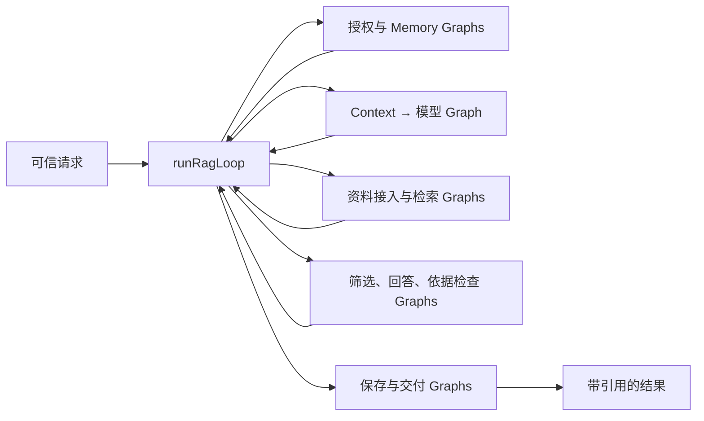

# 通过 Loop 组合 Graph

[English](graph-loops.md) · [Runtime API](runtime.zh-CN.md) · [RAG 应用](../../examples/patterns/rag-qa/README.zh-CN.md)

Graph 描述单个阶段内的节点与依赖。Loop 组合一个或多个 Graph，控制执行顺序、分支、重复和停止。Graph 不包含子 Graph 或内嵌 Loop 节点。

## 两种 Loop 定义

已有 `loop({ graph, bind, update, done, maxIterations })` 适用于显式状态机：每轮选择一个 Graph，绑定输入，通过输出更新状态并判断停止。`graph` 可以是固定 Graph，也可以是根据状态选择 Graph 的函数。此调用保持兼容。

阶段输入输出类型不同、需要复用检查点和恢复分支时，使用执行计划：

```ts
import { createDitto, graph, graphStep, loop } from "@ditto/core/runtime";
import { createContextWorker, createInMemoryContextStore } from "@ditto/core/worker/context";

// 本例仅演示编排契约，显式使用测试 Context；完整 Agent 使用 Redis。
const runtime = createDitto({ workers: [createContextWorker({
  services: { stateStore: createInMemoryContextStore() }
})] });
const load = graph<{ question: string }>("load-question")
  .node("context", "CONTEXT.LOAD", [], input => ({
    sources: [{ id: "question", content: input.question }]
  }));
const select = graph<{ context: import("@ditto/core/contracts").Context }>("select-context")
  .node("selected", "CONTEXT.SELECT", [], input => ({
    context: input.context, purpose: "infer", limit: 1
  }));
const workflow = loop({
  id: "question-workflow",
  maxIterations: 4,
  plan: function* (input: { question: string }) {
    const loaded = yield* graphStep(load, input);
    const result = yield* graphStep(select, { context: loaded.context });
    return result.selected.context;
  }
});
try {
  const result = await runtime.loop(workflow, { question: "设备如何借用？" }, {
    onGraph: event => console.log(event.graphId, event.status)
  });
  console.log(result);
} finally { await runtime.close(); }
```

执行计划是同步生成器。`yield* graphStep(graph, input, options?)` 把 Graph 和输入交给 Loop；Loop 调用 Runtime 执行 Graph，完成后把类型正确的输出送回计划。计划本身不调用 `runtime.run()`，不直接运行 Worker，也不执行模型、数据库、网络或文件操作。

`if` 根据已完成的输出选择下一 Graph，`for` 可重复交出同一 Graph。真正的 Graph 执行、执行次数限制、取消、Worker 分配和运行生命周期归 Loop / Runtime 管理。一个可复用的 `function*` 子计划可以用 `yield* childPlan()` 接入同一个 Loop；它不会另启 Loop，也不会重置总执行预算。

## 公开类型与方法

| API | 说明 |
| --- | --- |
| `GraphPlan<R>` | 只交出 GraphInvocation、最终返回 R 的同步生成器 |
| `graphStep<I,O>(graph,input,options?)` | 输入按 Graph 的 I 校验，恢复值按 O 推导；options 为 GraphRunOptions |
| `LoopPlanDefinition<I,R>` | `{id, plan:(input:I)=>GraphPlan<R>, maxIterations?}` |
| `runtime.loop(definition,input,options?)` | 执行计划，返回 `Promise<R>` |
| `LoopRunOptions.workers` | 按 Graph ID、节点 ID 指定 Worker，保持现有接线形式 |
| `LoopRunOptions.onGraph` | 计划型 Loop 的动态 Graph 事件：loopId、iteration、graphId、nodes、status |

`status` 为 `started`、`completed`、`failed`。`iteration` 从 0 开始；一次实际 Graph 执行占一次预算，失败的执行同样计数。`completed` 表示 Graph 执行返回，不替代各节点结果中的业务成功校验。事件是实际运行轨迹，不能当作提前穷举所有分支的静态 DAG。观察回调应只记录轻量数据；抛异常会终止当前 Loop。

未指定 `maxIterations` 时使用 Runtime 的 `loopMaxIterations`。`graphStep` 的 `concurrency` 可控制本次 Graph 内的节点并发；每个计划同一时刻交出一个 Graph，独立节点并行由 Graph 表达。

## 错误与取消

Graph 抛出的异常会回传到对应的 `yield* graphStep`，计划可以只捕获允许恢复的错误，例如 Context 缓存不存在；连接失败不能当作缓存缺失。`NodeResult.status === "failed"` 仍是节点返回值，应用需要检查它，而不是假设所有业务错误都会抛出。

传给 `runtime.loop(..., {signal})` 的取消控制整个 Loop，不能通过计划的 catch 继续启动后续 Graph。单个 `graphStep` 的 signal 可用于阶段超时；计划可以捕获阶段错误并交出失败登记 Graph。整体信号和阶段信号会合并，阶段配置不能取消整体限制。

执行次数耗尽会终止 Loop，计划不能捕获预算错误并继续执行。终止时关闭生成器；同步 finally 可清理纯本地状态，其中交出的 Graph 不会执行。需要补偿或业务失败登记时，应在正常的错误分支中显式交出对应 Graph，并为它预留预算。Runtime.close 会等待已接收的 Loop 和正在执行的 Graph 结束，再关闭 Worker。

## 检查点与进程恢复

Loop 不将生成器栈保存到数据库，也不自动重放外部副作用。应用用 `MEMORY.GET/WRITE/UPDATE` Graph 保存可验证的阶段结果。新进程重新启动同一计划，读取检查点并跳过已完成步骤；原有副作用核对、权限校验、Redis 恢复和幂等交付仍在计划中明确执行。

RAG 的 `runRagLoop` 与 12 类基础能力的 `run*Loop` 都从示例模块导出。`runRag()` 等便利函数只负责调用一次 `runtime.loop()`。检查点、模型、工具和交付 Graph 都由这个 Loop 调度。外部控制器的独立资料导入仍可以单次 `runtime.run()`，不会隐藏在 Agent 执行计划内。

## RAG 的阶段组织



计划根据检查点、澄清需求、证据及校验结果选择下一 Graph。回答修订最多一次；总 Graph 执行数另受 Loop 预算限制。业务数据库、第三方 SDK 和素材解析仍属于应用工具。
