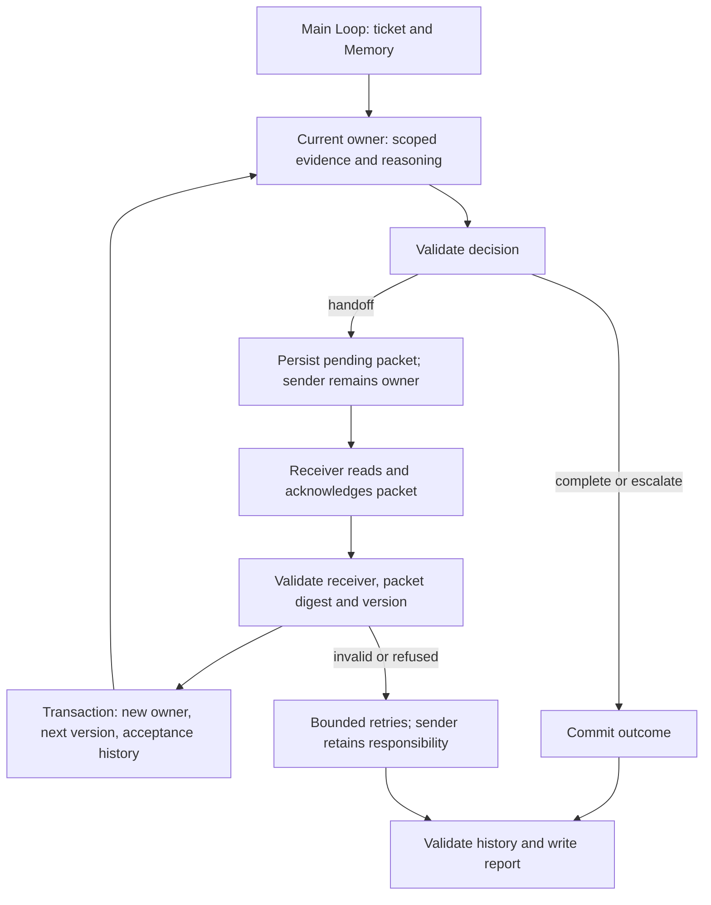

# Agent Handoff workflows

An Agent completes its responsibility and proposes a packet containing completed work, evidence and the remaining task. The receiving Agent reads and acknowledges that packet before the application commits ownership transfer. This example processes a device support ticket: customer service → technical support → after-sales. Technical support can also close an already resolved case; missing diagnostics or ineligible warranty evidence require human attention while retaining the current owner.

## Runnable consumer

Copy `examples/patterns/handoff`, `examples/_shared/tools/handoff`, `examples/_shared/tools/storage`, `examples/_shared/tools/evidence.ts` and `examples/_shared/tools/execution/files.ts` into the consumer project. Install the Core package and the Redis dependency from `storage/dependencies/package.json`. Use Node 24, `ditto.yaml`, model credentials and real Redis (`DITTO_WORKER_CONTEXT_REDIS_URL`).

```ts
import { mkdtemp, rm } from "node:fs/promises";
import { tmpdir } from "node:os";
import { join } from "node:path";
import { loadRuntimeConfigFile } from "@ditto/core/runtime";
import { createDemo } from "./examples/_shared/tools/handoff/adapters.ts";
import { openHandoff } from "./examples/patterns/handoff/cli.ts";
import { runHandoff } from "./examples/patterns/handoff/index.ts";

const config = loadRuntimeConfigFile("ditto.yaml", process.env);
const provider = process.env.EXAMPLE_HANDOFF_PROVIDER ?? config.model?.provider;
if (!provider || !config.providers[provider])
  throw new Error("Configure provider");
const model = config.providers[provider].model ?? config.model?.model;
if (!model) throw new Error("Configure model");
const directory = await mkdtemp(join(tmpdir(), "ditto-handoff-example-"));
try {
  const request = await createDemo(directory, {}, "replacement");
  const app = await openHandoff(directory, request, config);
  try {
    const result = await runHandoff(app.runtime, {
      request,
      model: { provider, model },
      // Optional models: { "technical-support": { provider, model }, ... }
      // Role keys: customer-service, technical-support, after-sales.
    });
    console.log(JSON.stringify(result));
  } finally {
    await app.close();
  }
} finally {
  // Keep a persistent directory instead when retaining reports/checkpoints.
  await rm(directory, { recursive: true, force: true });
}
```

## Ownership and Graph composition



`runHandoff` calls `runtime.loop(runHandoffLoop, ...)` once. Its plan uses `yield* graphStep` to compose flat Graphs containing public Worker nodes: `CONTEXT.LOAD`, `INFER.REASONING.SAMPLE`, `MEMORY.GET/WRITE/UPDATE` and `INTERACTION.ACT.TOOL`. The plan performs no file, database or model I/O directly. All stages execute sequentially in responsibility order.

| Stage                  | Responsibility and available information                                                                                   |
| ---------------------- | -------------------------------------------------------------------------------------------------------------------------- |
| Customer service       | Order and issue only; records intake and the remaining technical task                                                      |
| Technical acceptance   | Reads the intake packet and acknowledges before becoming owner                                                             |
| Technical handling     | Previous accepted handoff and existing diagnosis; close resolved cases, escalate missing records, transfer hardware faults |
| After-sales acceptance | Reads the technical packet, bound to its preceding intake packet                                                           |
| After-sales handling   | Technical handoff, diagnosis and warranty; creates an eligible local replacement request or escalates                      |
| Delivery               | Current owner, case outcome, acknowledgements, exact evidence and JSON/Markdown report                                     |

Agents are logical roles with separate instructions, configurable models and Redis scopes on one Runtime, not isolated processes or authentication principals. A real model produces each receiver acknowledgement. The trusted controller selects fixed tools and validates outputs. Previous owners lose permission to operate this ticket after transfer.

## Application interfaces

- `createDemo(directory, overrides?, scenario?)` initializes request, sources, policy and business SQLite. Scenarios: `replacement` (default), `resolved`, `missing-diagnostic`, `out-of-warranty`. Resume an existing directory rather than initializing a different request over it.
- `openHandoff(directory, request, config)` registers public Workers and application tools; returns `runtime/storage/adapters/close()`. Always close it.
- `runHandoff(runtime, {request,model,models?}, options?)` runs the case. `models` supports `customer-service`, `technical-support`, `after-sales` overrides.
- `options.signal` forwards cancellation. `stopAfter` accepts `sample`, `proposal`, `acceptance`, `report` and returns `{status:"checkpoint",stage}`. Resume with the same request/directory and default options.
- `Report` contains `requestId/status/stopReason/ticket/usage/generatedAt`. `Ticket` includes the current `owner/version/status/pending/history/resolution` and request digest.

`Request` binds `id/tenant/principal/goal/sourceDigest`, `maxModelCalls` (1–20; default 12), `maxAttempts` (1–3 per handling or acceptance stage at each version; default 2), `maxTransfers` (1–6; default 4) and `deadlineSeconds` (1–3600; default 600). The ordinary full chain uses five model calls: intake, technical acceptance, diagnosis interpretation, after-sales acceptance, after-sales handling.

`Decision` has `agent/action/to/resolution/summary/nextTask/citations`. The source policy determines allowed transitions and outcomes. A handoff needs a remaining task; completion/escalation requires `nextTask:null`. All supplied evidence must be cited verbatim without duplicates. Prose summaries, tasks and acknowledgements remain model-generated; structural validation cannot establish the accuracy of every sentence.

`Packet` binds the request digest, ticket version, sender, receiver, validated decision and previous `parentId`. Its SHA-256 is `packetId`. `Acceptance` must contain the exact receiver, packetId, `accepted:true` and acknowledgement summary. Skipped roles, invented evidence, foreign packets, stale versions and conflicting acknowledgement replays are rejected.

## Durable ownership and recovery

`memory.sqlite` persists model samples, reserved budgets, request binding, snapshots and final reports through Memory Worker. Separate application `tickets.sqlite` owns ticket assignment, transfer history and replacement requests.

A pending packet leaves responsibility with the sender. `handoff_accept` checks the current sender, version and packet digest inside a SQLite transaction, then changes owner, increments version, clears pending and appends acceptance history together. Identical acknowledgement replays return existing state; changed replay content is rejected. Old owners and receivers acting before transfer cannot load processing evidence or submit handling decisions. Business transactions serialize ownership changes; run only one full Loop per task because Memory call budgets have no cross-process execution lease. The concurrent-acceptance test specifically checks business transaction/idempotency behavior.

After-sales completion and insertion into `replacements` commit together, with request ID uniqueness. This is a local replacement request, not a shipment, refund or external customer-service operation. Technical support reads an existing diagnostic record and does not run hardware diagnostics. Real integrations must implement authenticated identities, trusted source records, version checks and idempotency keys in their application adapter.

Every tool rechecks request, source digest and principal policy. Loading the ticket replays roles, versions, source quotes, packet hashes and acceptance lineage. The application and business database are trusted infrastructure; hashes do not authenticate history against an administrator who can fabricate the entire database.

Responses are written to Memory before business effects. A crash after acceptance resumes with the new owner from the business ticket without transferring again. A crash before response persistence can repeat a model call, but its reserved budget is retained. Expired Context is rebuilt from Memory and the authoritative ticket. Redis, Memory and business-store failures propagate rather than falling back to in-memory state.

Call/transfer limits and the deadline govern admission of new stages; in-flight calls use provider timeouts or explicit cancellation. Limits return `partial`, preserving owner and pending packet. Invalid output or receiver refusal exhausts bounded retries and returns `needs-human` while the sender retains responsibility. Source-driven escalation marks the business ticket `needs-human`. A delivered report is terminal for that request: reruns validate and return it without new model calls. Continuing an exhausted case requires the trusted controller to create a new authorized task.

## Context boundaries

Each role uses `handoff:<tenant>:<principal>:<task>:<role>`. Acceptance receives the explicit packet and task goal; role-specific sources become available only after ownership transfer. The fixture customer email never enters model input, handoff packets or public reports. This field projection is not general PII detection: production input requires explicit field permissions/redaction rules, and secrets must not be embedded in free-text goals or issues.

## End-to-end acceptance

```sh
export DITTO_WORKER_CONTEXT_REDIS_URL=redis://127.0.0.1:6379
npm run example:handoff -- --provider deepseek
npm run example:handoff -- --provider deepseek --stop-after proposal
npm run example:handoff -- --provider deepseek --directory .examples-handoff-tasks/cli-XXXXXX
npm run check:examples:handoff:package -- --provider deepseek
```

The package gate installs an actual npm tarball outside the repository, checks strict types without paths aliases, dynamically rejects source/private/repository imports, checks silent imports and executes the documented consumer above.

The task suite uses a real model, Redis, SQLite and actual reports/business records. It covers the ordinary chain, direct technical closure, missing diagnosis, ineligible warranty, per-role model settings, sender/receiver retries, receiver refusal, wrong recipients/packets, route skipping, forged citations, old-owner and early-receiver operations, duplicate/concurrent acceptance, budgets/deadlines, Redis expiry, three store failures, changed requests/sources/permissions, packet tampering, cancellation, SIGKILL after proposal/acceptance/completion/sample/report persistence, rollback of replacement-plus-completion on transaction failure and report retry. Fault cases explicitly inject errors or modify actual stores; ordinary outputs come from the model. SQLite acceptance does not establish acceptance for other relational engines or different providers.

[Example](../../examples/patterns/handoff/README.md) · [Application tools](../../examples/_shared/tools/handoff/README.md)
