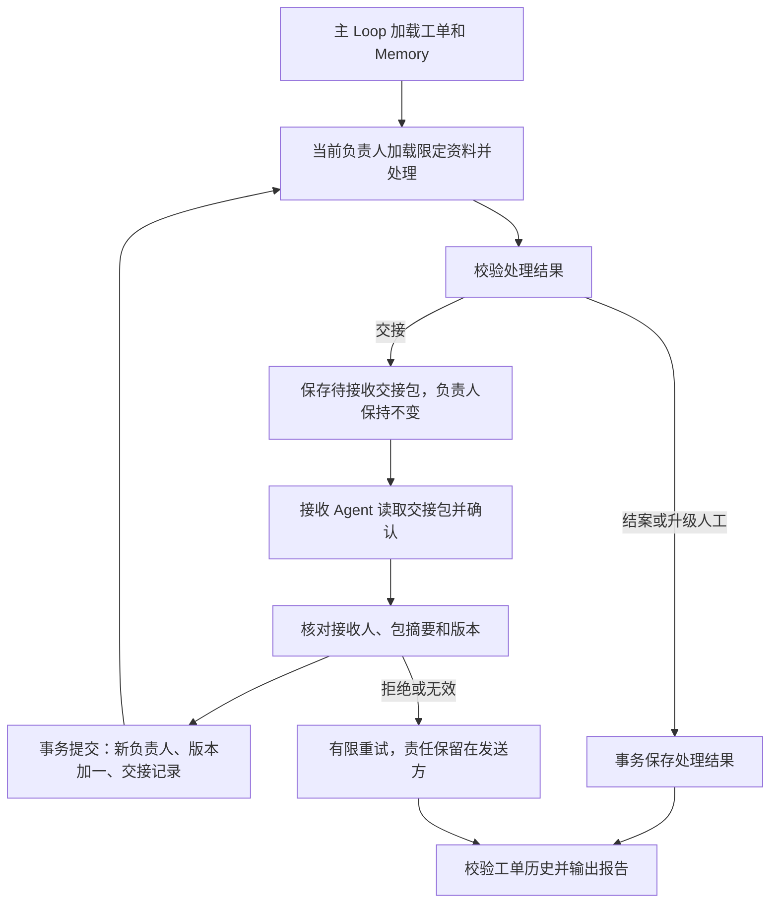

# Agent Handoff 责任转交

一个 Agent 完成当前职责后，提交包含已完成工作、证据和待办事项的交接包。接收 Agent 读完并确认，应用才提交责任转移。示例处理设备售后工单：客服受理 → 技术支持阅读诊断记录 → 售后创建本地更换申请。技术支持也可以直接结案；缺少诊断或不符合保修规则时保留当前负责人并升级人工。

## 完整调用

将 `examples/patterns/handoff`、`examples/_shared/tools/handoff`、`examples/_shared/tools/storage`、`examples/_shared/tools/evidence.ts`、`examples/_shared/tools/execution/files.ts` 复制到消费者项目。安装 Core 包和 `storage/dependencies/package.json` 中的 Redis 依赖。需要 Node 24、`ditto.yaml`、模型凭证和真实 Redis（`DITTO_WORKER_CONTEXT_REDIS_URL`）。

```ts
import { mkdtemp, rm } from "node:fs/promises";
import { tmpdir } from "node:os";
import { join } from "node:path";
import { loadRuntimeConfigFile } from "@ditto/core/runtime";
import { createDemo } from "./examples/_shared/tools/handoff/adapters.ts";
import { openHandoff } from "./examples/patterns/handoff/cli.ts";
import { runHandoff } from "./examples/patterns/handoff/index.ts";

const config = loadRuntimeConfigFile("ditto.yaml", process.env);
const provider = process.env.EXAMPLE_HANDOFF_PROVIDER ?? config.model?.provider;
if (!provider || !config.providers[provider])
  throw new Error("Configure provider");
const model = config.providers[provider].model ?? config.model?.model;
if (!model) throw new Error("Configure model");
const directory = await mkdtemp(join(tmpdir(), "ditto-handoff-example-"));
try {
  const request = await createDemo(directory, {}, "replacement");
  const app = await openHandoff(directory, request, config);
  try {
    const result = await runHandoff(app.runtime, {
      request,
      model: { provider, model },
      // Optional models: { "technical-support": { provider, model }, ... }
      // Role keys: customer-service, technical-support, after-sales.
    });
    console.log(JSON.stringify(result));
  } finally {
    await app.close();
  }
} finally {
  // Keep a persistent directory instead when retaining reports/checkpoints.
  await rm(directory, { recursive: true, force: true });
}
```

## 责任转移与 Graph



`runHandoff` 只调用一次 `runtime.loop(runHandoffLoop, ...)`。主 Loop 通过 `yield* graphStep` 组合平铺的 Graph；每个 Graph 只有公开 Worker 节点。Context 使用 `CONTEXT.LOAD`，推理使用 `INFER.REASONING.SAMPLE`，持久样本和预算使用 `MEMORY.GET/WRITE/UPDATE`，业务操作使用 `INTERACTION.ACT.TOOL`。计划不直接读写文件、数据库或调用模型。所有阶段按责任顺序串行运行。

| 阶段     | 责任及数据                                                                     |
| -------- | ------------------------------------------------------------------------------ |
| 客服受理 | 只读取订单号和问题，说明已完成的受理工作和技术支持待办                         |
| 技术接收 | 读取客服交接包并确认；确认成功前不能执行技术处理                               |
| 技术处理 | 使用客服交接、订单问题和已有诊断记录；故障转售后、已解决直接结案、缺失升级人工 |
| 售后接收 | 读取技术交接包并确认，绑定其父客服交接摘要                                     |
| 售后处理 | 使用技术交接、诊断和保修规则；合格则保存一条本地更换申请，否则升级人工         |
| 交付     | 输出实际工单负责人、处理状态、接受记录、原文证据和 JSON/Markdown 报告          |

这些是共享 Runtime 的逻辑角色，具有独立指令、模型配置和 Redis scope，不是独立进程或认证主体。接收方确认由真实模型生成；可信控制器负责调用固定工具并验证其结果。没有主管 Agent 持续保留指挥权，也不会让前任负责人在转交后继续操作该工单。

## 调用与数据契约

- `createDemo(directory, overrides?, scenario?)` 初始化请求、源资料、权限策略和业务 SQLite。默认 `replacement`；其他场景为 `resolved`、`missing-diagnostic`、`out-of-warranty`。相同目录只用于恢复，不重新初始化不同请求。
- `openHandoff(directory, request, config)` 注册公开 Workers 和应用工具，返回 `runtime/storage/adapters/close()`。使用结束后调用 `close()`。
- `runHandoff(runtime, {request,model,models?}, options?)` 执行完整流程。`models` 可按 `customer-service`、`technical-support`、`after-sales` 覆盖模型。
- `options.signal` 传递取消信号；`stopAfter` 支持 `sample`、`proposal`、`acceptance`、`report`，返回 `{status:"checkpoint",stage}`。随后以同一请求、目录和默认 options 恢复。
- 完整返回值 `Report` 包括 `requestId/status/stopReason/ticket/usage/generatedAt`。`Ticket` 包括当前 `owner/version/status/pending/history/resolution` 及请求摘要。

`Request` 包含 `id/tenant/principal/goal/sourceDigest` 和限制：`maxModelCalls`（1–20，默认 12）、`maxAttempts`（每个版本的处理或接收阶段 1–3，默认 2）、`maxTransfers`（1–6，默认 4）、`deadlineSeconds`（1–3600，默认 600）。默认完整链路通常需要 5 次模型调用：客服处理、技术接收、技术处理、售后接收、售后处理。

`Decision` 包含 `agent/action/to/resolution/summary/nextTask/citations`。路由及结论必须符合当前角色的源资料规则；交接必须包含明确待办，结案与升级时 `nextTask:null`。全部原文证据必须完整、逐字匹配。自然语言总结、待办和接收说明仍由模型生成，结构校验不能保证每句话都正确。

`Packet` 绑定请求摘要、工单版本、发送角色、接收角色、已校验的处理结果及上一次交接的 `parentId`；`packetId` 为完整包的 SHA-256。`Acceptance` 必须包含精确的接收角色、packetId、`accepted:true` 和接收说明。任何角色跳跃、伪造引用、跨任务包、过期版本或不一致的重复确认都会被拒绝。

## 持久责任、效果与恢复

`memory.sqlite` 保存模型样本、调用预算、请求绑定、工单快照和最终报告，全部经过 Memory Worker；`tickets.sqlite` 是独立的应用业务数据库，保存权威工单、交接历史和更换申请，不能替代 Memory。

待接收交接包不会改变负责人。`handoff_accept` 在 SQLite 事务中检查当前发送人、版本和包摘要，然后同时修改 owner、递增版本、清空 pending、写入接受历史。同一确认重复提交返回原有结果；不同确认内容被拒绝。旧负责人和提前执行的接收人都不能读取处理资料或提交处理结果。事务负责业务记录的一致性；不要对同一任务启动多个完整 Loop，Memory 的调用预算没有跨进程执行租约。验收中的并发确认专门检验业务事务和幂等性。

售后结案与插入 `replacements` 记录在同一事务中提交，以请求 ID 保证唯一。该记录是本地更换申请，不是发货、退款或调用外部客服系统。技术支持读取已有诊断记录，不运行硬件诊断。接入真实系统时，应用适配器须实现上游身份验证、版本控制和幂等键，并提供可信资料来源。

每次工具调用重新检查不可变请求、资料摘要和操作者策略。工单加载时重放校验角色、版本、引用、包摘要和接收关系；业务数据库及应用进程属于可信基础设施，摘要不提供抵御数据库管理员伪造整条历史的认证能力。

模型响应先写入 Memory，再应用业务结果。崩溃发生在接收提交之后时，恢复读取业务工单的新 owner，从新职责继续；不会重新转交。进程在模型响应持久化之前退出，调用可能重做，但预留预算不会回退。Context 过期从 Memory 和权威工单重建；Redis、Memory 或业务库不可用时失败，不静默使用内存替代。

调用次数、交接次数和截止时间控制是否启动新阶段；已开始的模型请求使用 provider 超时或显式取消。额度/时间耗尽输出 `partial` 并保留当前责任及 pending；无效输出或拒绝接收重试耗尽则输出 `needs-human`，工单仍归发送人负责，报告说明原因。业务资料要求升级时，工单本身标记 `needs-human`。已交付报告是该次请求的终态，重新运行只校验并返回，不自动重启已耗尽预算的任务；需要继续时应由控制器创建新的、获准的任务。

## 上下文范围

各角色拥有独立 scope：`handoff:<tenant>:<principal>:<task>:<role>`。接收推理只拿到交接包和任务目标；成为负责人后才加载该角色资料与上一份明确交接。源文件包含演示用客户邮箱，模型输入、交接包和公开报告均不包含这个字段。此投影不等于通用 PII 检测：真实输入中的敏感信息需由接入层定义字段权限和脱敏规则；不要把秘密放进自由文本目标或问题。

## 验收

```sh
export DITTO_WORKER_CONTEXT_REDIS_URL=redis://127.0.0.1:6379
npm run example:handoff -- --provider deepseek
npm run example:handoff -- --provider deepseek --stop-after proposal
npm run example:handoff -- --provider deepseek --directory .examples-handoff-tasks/cli-XXXXXX
npm run check:examples:handoff:package -- --provider deepseek
```

包验收在仓库外安装实际 npm tarball，以无 paths 别名的严格类型配置验证全部示例，动态禁止源码、未导出入口及仓库模块引用，检查导入无执行副作用，并运行本文对应英文文档的完整调用。

任务验收使用真实模型、Redis、SQLite 和实际报告/业务记录，覆盖默认转交、技术直接结案、资料缺失、保修不符、角色模型配置、发送/接收重试、拒绝接收、错误角色/包、跳过角色、伪造引用、旧负责人/提前接收人操作、重复和并发确认、预算/截止时间、缓存过期、三类存储故障、请求/资料/权限变化、交接篡改、取消、提议/接受/结案/模型样本/报告后的 SIGKILL 恢复，更换申请与结案提交失败的事务回滚，以及报告重试。故障场景显式注入错误或修改真实存储；正常结果由模型生成。SQLite 验收不代表其他关系型数据库或跨供应商模型已经验收。

[示例入口](../../examples/patterns/handoff/README.zh-CN.md) · [业务工具](../../examples/_shared/tools/handoff/README.zh-CN.md)
