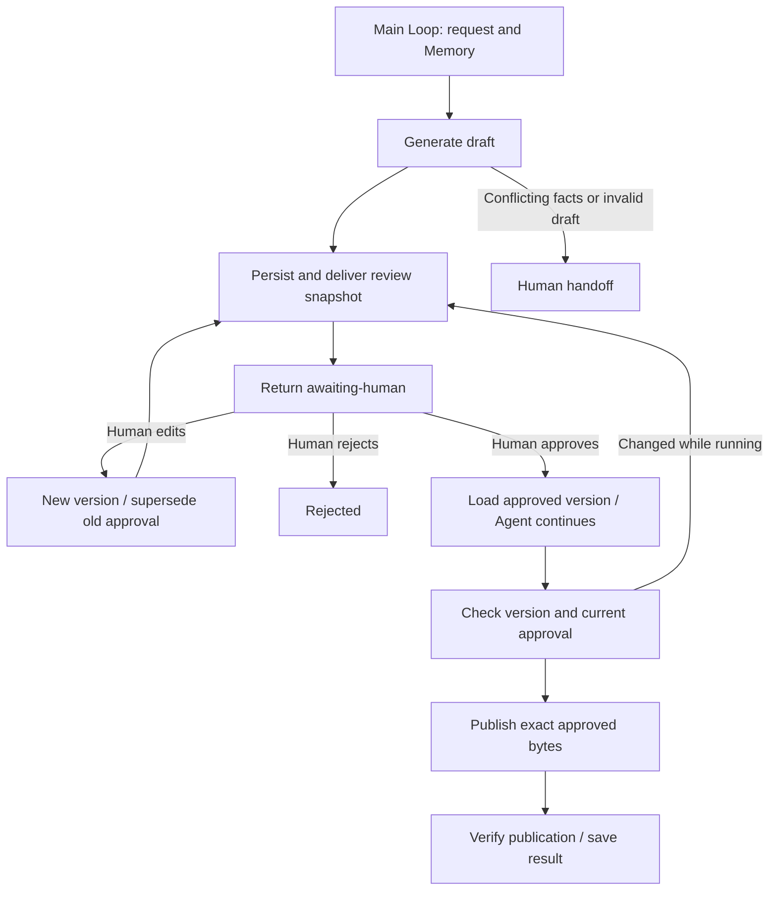

# Human-in-the-loop application

Agent processing → versioned intermediate result → human confirmation or editing → Agent continuation → verified publication. This example publishes a release notice to an application-owned directory. It demonstrates a complete human review boundary for publishing and approval tasks; it does not execute financial transactions or evaluate legal contracts.

## Runnable consumer

Copy `examples/patterns/human-in-the-loop`, `examples/_shared/tools/human-loop`, `examples/_shared/tools/human-review-store.ts`, `examples/_shared/tools/storage`, `examples/_shared/tools/evidence.ts` and `examples/_shared/tools/execution/files.ts` into the consumer. Install the Core tarball and the Redis dependency declared in `storage/dependencies/package.json`. Use Node 24, configured `ditto.yaml`, model credentials and real Redis (`DITTO_WORKER_CONTEXT_REDIS_URL`). The runnable example deliberately stops for a human; the exported controller handles subsequent authenticated decisions.

```ts
import { mkdtemp, rm } from "node:fs/promises";
import { tmpdir } from "node:os";
import { join } from "node:path";
import { loadRuntimeConfigFile } from "@ditto/core/runtime";
import {
  createDemo,
  request,
} from "./examples/_shared/tools/human-loop/adapters.ts";
import { openHumanLoop } from "./examples/patterns/human-in-the-loop/cli.ts";
import { runHumanLoop } from "./examples/patterns/human-in-the-loop/index.ts";

const config = loadRuntimeConfigFile("ditto.yaml", process.env);
const provider =
  process.env.EXAMPLE_HUMAN_LOOP_PROVIDER ?? config.model?.provider;
if (!provider || !config.providers[provider])
  throw new Error("Configure provider");
const model = config.providers[provider].model ?? config.model?.model;
if (!model) throw new Error("Configure model");
const selection = { provider, model };
const directory = await mkdtemp(join(tmpdir(), "ditto-human-loop-example-"));
try {
  const r = await createDemo(directory);
  const app = await openHumanLoop(directory, r, config);
  try {
    const result = await runHumanLoop(app.runtime, {
      request: r,
      model: selection,
    });
    console.log(JSON.stringify(result)); // awaiting-human: no publication
  } finally {
    await app.close();
  }
} finally {
  // Demo cleanup only. Keep the task directory when awaiting a real human.
  await rm(directory, { recursive: true, force: true });
}

// Application controller: invoke only after authenticating a human decision.
// Load persistedRequest from the trusted task directory. Derive actor from the
// verified session; never trust an actor supplied in the model or public body.
export async function onHumanDecision(
  taskDirectory: string,
  persistedRequest: unknown,
  actor: string,
  decision: {
    requestId: string;
    expectedToken: string;
    choice: "approve" | "reject";
  },
) {
  const r = request(persistedRequest);
  const app = await openHumanLoop(taskDirectory, r, config);
  try {
    await app.adapters.decide({ ...decision, actor });
    return await runHumanLoop(app.runtime, {
      request: r,
      model: selection,
    });
  } finally {
    await app.close();
  }
}
```

## One Loop, explicit review boundary



`runHumanLoop(runtime,input,options)` makes one `runtime.loop(runHumanLoopPlan, ...)` call. Each invocation advances the same persisted task until a human boundary or result. Generator helpers compose flat stage Graphs using `yield* graphStep`; Graphs contain public Worker nodes only, with no nested Graphs, external `runtime.run` sequence, direct Worker execution or I/O in the plan. `openHumanLoop` registers Infer, Interaction, Redis Context and SQLite Memory. The composition reuses the existing application `HumanReviewStore`; no new private Core API is needed.

| Stage           | Public node / API                                        | Contract                                                                               |
| --------------- | -------------------------------------------------------- | -------------------------------------------------------------------------------------- |
| Load / resume   | `MEMORY.GET`, `CONTEXT.LOAD`, `INTERACTION.ACT.TOOL`     | Fingerprinted request, unchanged source and current business review state              |
| Draft           | `CONTEXT.LOAD` → `INFER.REASONING.SAMPLE`                | Source-bound full release notice                                                       |
| Present review  | `human_request_review` → `INTERACTION.OUTPUT`            | Durable inbox contains exact version, content, source digest, operation and target     |
| Human action    | Trusted application controller                           | Separate decision/edit/claim methods; absent from model tools                          |
| Continue        | `CONTEXT.LOAD` → `INFER.REASONING.SAMPLE` → `hitl_check` | Uses the approved version; validates copied identity, date, title, version and digest  |
| Execute         | `human_apply` via Interaction                            | Rechecks approval, permissions and exact current version, then claims a durable effect |
| Verify / report | `hitl_verify`, `hitl_report`, `MEMORY.WRITE/UPDATE`      | Exact published JSON/Markdown and versioned result snapshots                           |

`Request` fixes task, tenant, principal, goal, source fingerprint, `maxModelCalls` (1–8) and `deadlineSeconds` (1–86400). Generation preserves release ID, title, first source date and the complete change sentence. Conflicting source dates produce a human handoff before inference. Malformed or fact-invalid drafts also produce a handoff. Model/provider outages propagate visibly; they do not grant approval.

`Result` has `status`, `reason`, `state: {job,artifact,request}` and persisted `usage`. Statuses are `awaiting-human`, `completed`, `rejected`, `escalated` and `partial`. `awaiting-human` releases runtime resources instead of holding a process open. Reopening the same directory and request resumes from the current business state. Approval is never inferred from source text, a model response, an output-delivery receipt, elapsed time or a repeated run.

## Human controller

`app.adapters.decide({requestId,expectedToken,choice,actor,note?})` accepts `approve` or `reject`. `edit` accepts a complete replacement `{releaseId,date,title,body}` plus the review ID/token, actor and note. `claim` assigns an escalated task to an authorized human and does not restart automatic execution. An approved publication uses the exact approved content, without model rewriting.

```ts
await app.adapters.edit({
  requestId: pending.state.request!.id,
  expectedToken: pending.state.request!.token,
  actor: authenticatedActor,
  replacement: { ...pending.state.artifact!.draft, date: "2026-12-18" },
  note: "Move publication to the approved rollout window",
});
const next = await runHumanLoop(app.runtime, input);
// next is awaiting-human with a NEW review ID/token. Editing is not approval.
// Present the full new snapshot, then handle a separate authenticated decision.
```

The application reuses `HumanReviewStore` versioning, atomic review decisions, review delivery and effect reconciliation. `expectedToken` is a digest binding the full snapshot, including task, version, source and target; it is not an authentication secret. Derive the actor from a verified session. The local CLI's explicit `--actor` is a development controller for an application-owned directory, not production authentication. Every tool rereads the task policy and source. Controller actions and execution also check current reviewer permissions. Approval cannot authorize another task or a superseded/undelivered draft. A duplicate decision is rejected; a controller retry can read the saved state and resume the workflow.

Editing while awaiting review or after approval creates a new version and supersedes the old request. The new review must be separately delivered and approved. If an edit occurs during continuation inference, its version check detects the change and returns the new human review. If a change races the subsequent effect call, the effect gate rejects it; reenter the workflow to present the latest version. Once an effect is claimed, editing is blocked and recovery reconciles that snapshot.

## Storage, limits and effects

Context uses real Redis. `memory.sqlite` stores requests, samples, model-call reservations, elapsed start time and latest task results through Memory Worker nodes. `reviews.sqlite` is a separate application business database containing jobs, immutable versions, review requests, events and effect receipts; it does not replace Memory. Redis absence/expiry is rebuilt from durable state. Redis/Memory outages, source changes and task identity changes fail visibly without fallback. Other Memory stores use the public adapter interface; this suite validates SQLite, not PostgreSQL/MySQL.

The model budget is reserved before each call and survives crashes. Generation and continuation count separately; each approved edited version has a different continuation cache key. A crash can consume an attempt without saving its response. The deadline includes human waiting time and prevents new model work or a new publication claim; `Options.signal` cancels active execution. An already claimed effect is reconciled even after the deadline to avoid leaving a half-published result. Budgets do not expire or automatically approve human reviews. The Loop bounds each invocation at 1024 Graphs and 8 state transitions. `max-model-calls`, `deadline` or malformed continuation yield `partial`; semantically mismatched continuation fields fail the tool check without publishing.

`stopAfter: "draft" | "continued" | "effect"` provides developer checkpoints. Normal use stops automatically at `awaiting-human`. One active Agent runner owns each task directory; the human controller can edit before effect claim. Model samples and generated drafts are not regenerated when reopening a completed stage. Failed immutable publication is retried against the same claimed version. Published-file conflicts are not overwritten; published-file tampering is detected on replay. Replaying completion uses no new model calls and rechecks actual files.

Artifacts: `inbox/<review-id>.json/.md`, `published/<task-id>.json/.md`, `reports/<hash>.json`, the request/source/policy files and both databases. `INTERACTION.OUTPUT` acceptance means the snapshot reached the local review inbox only. Publication writes real local files; no external website, email or financial system is touched. File writes are individually atomic and reconciled; the pair is not an atomic distributed transaction. Protect the directory and add provider-side idempotency, conditional writes, authentication and suitable transaction boundaries when adapting to real systems.

For contracts, finances, trades or other consequential operations, replace the publication tool and review policy with domain-specific checks. Preserve immutable reviewed parameters and require fresh review for changed content, amount, recipient or target. Human approval authorizes the specified snapshot, not arbitrary future actions.

## Commands and acceptance

```sh
export DITTO_WORKER_CONTEXT_REDIS_URL=redis://127.0.0.1:6379
npm run example:human-loop -- --provider deepseek
# Read the printed directory, review ID, token and inbox snapshot first.
npm run example:human-loop -- --provider deepseek --directory <task-directory>
npm run example:human-loop -- --provider deepseek --directory <task-directory> \
  --actor example-publisher --review-id <review-id> --token <token> --decision approve
npm run example:human-loop -- --provider deepseek --directory <task-directory> \
  --actor example-publisher --review-id <review-id> --token <token> \
  --edit-file <full-draft.json> --note "Adjust the release date"
npm run example:human-loop -- --provider deepseek --conflict
npm run check:examples:human-loop:package -- --provider deepseek
```

Use `--decision reject` to stop, or `--decision claim --actor example-triager --note ...` for handoff. Approve after reading the full inbox snapshot; an edit command returns a new pending review and never approves it.

The package gate installs the actual tarball outside the repo, typechecks without aliases, blocks source/private imports and checks silent imports. Full tests use real models, Redis, Memory, review databases, inbox files and published files. Test controllers explicitly simulate human decisions and are labeled in reports; the Agent never supplies its own approval. Cases cover waiting, approval, editing, rejection, escalation, stale/unauthorized decisions, edits during inference, storage outages, evidence/permission changes, process kills, cancellation and partial publication recovery.
