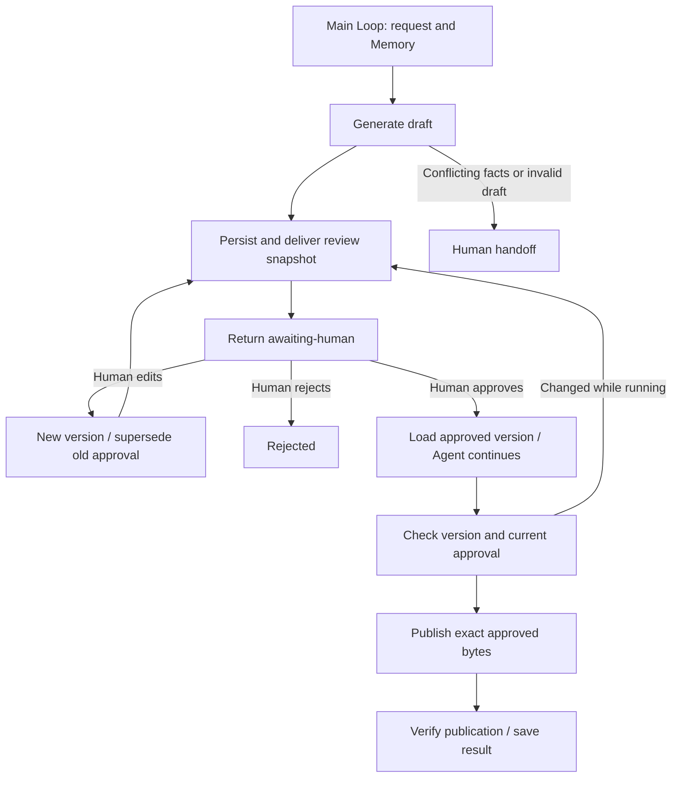

# Human-in-the-loop 人机协作

Agent 处理 → 版本化阶段结果 → 人工确认或编辑 → Agent 继续 → 核验发布。示例将发布公告写入应用管理的目录，完整展示发布和审批的人工边界；不执行真实金融交易，也不提供合同法律判断。

## 可运行调用

复制 `examples/patterns/human-in-the-loop`、`examples/_shared/tools/human-loop`、`examples/_shared/tools/human-review-store.ts`、`examples/_shared/tools/storage`、`examples/_shared/tools/evidence.ts` 与 `examples/_shared/tools/execution/files.ts` 到消费者项目，安装 Core tarball 与 `storage/dependencies/package.json` 指定的 Redis 依赖。使用 Node 24、`ditto.yaml`、模型凭证和真实 Redis（`DITTO_WORKER_CONTEXT_REDIS_URL`）。代码首先停在人工审核；导出的控制器处理之后来自已认证用户的决定。

```ts
import { mkdtemp, rm } from "node:fs/promises";
import { tmpdir } from "node:os";
import { join } from "node:path";
import { loadRuntimeConfigFile } from "@ditto/core/runtime";
import {
  createDemo,
  request,
} from "./examples/_shared/tools/human-loop/adapters.ts";
import { openHumanLoop } from "./examples/patterns/human-in-the-loop/cli.ts";
import { runHumanLoop } from "./examples/patterns/human-in-the-loop/index.ts";

const config = loadRuntimeConfigFile("ditto.yaml", process.env);
const provider =
  process.env.EXAMPLE_HUMAN_LOOP_PROVIDER ?? config.model?.provider;
if (!provider || !config.providers[provider])
  throw new Error("Configure provider");
const model = config.providers[provider].model ?? config.model?.model;
if (!model) throw new Error("Configure model");
const selection = { provider, model };
const directory = await mkdtemp(join(tmpdir(), "ditto-human-loop-example-"));
try {
  const r = await createDemo(directory);
  const app = await openHumanLoop(directory, r, config);
  try {
    const result = await runHumanLoop(app.runtime, {
      request: r,
      model: selection,
    });
    console.log(JSON.stringify(result)); // awaiting-human: no publication
  } finally {
    await app.close();
  }
} finally {
  // Demo cleanup only. Keep the task directory when awaiting a real human.
  await rm(directory, { recursive: true, force: true });
}

// Application controller: invoke only after authenticating a human decision.
// Load persistedRequest from the trusted task directory. Derive actor from the
// verified session; never trust an actor supplied in the model or public body.
export async function onHumanDecision(
  taskDirectory: string,
  persistedRequest: unknown,
  actor: string,
  decision: {
    requestId: string;
    expectedToken: string;
    choice: "approve" | "reject";
  },
) {
  const r = request(persistedRequest);
  const app = await openHumanLoop(taskDirectory, r, config);
  try {
    await app.adapters.decide({ ...decision, actor });
    return await runHumanLoop(app.runtime, {
      request: r,
      model: selection,
    });
  } finally {
    await app.close();
  }
}
```

## 一个主 Loop 与明确的审核边界



`runHumanLoop(runtime,input,options)` 通过一次 `runtime.loop(runHumanLoopPlan, ...)` 推进持久任务，遇到人工边界或最终结果后返回。生成器通过 `yield* graphStep` 组合各阶段 Graph，Graph 只包含公开 Worker 节点；计划不嵌套子图、不自行执行多个 `runtime.run`、不直接执行 Worker 或 I/O。`openHumanLoop` 注册 Infer、Interaction、Redis Context 和 SQLite Memory，复用已有应用侧 `HumanReviewStore`，无需增加 Core 私有接口。

| 阶段       | 公开节点 / API                                           | 契约                                               |
| ---------- | -------------------------------------------------------- | -------------------------------------------------- |
| 加载与恢复 | `MEMORY.GET`、`CONTEXT.LOAD`、`INTERACTION.ACT.TOOL`     | 固定请求、原始资料与当前审核状态                   |
| 生成草稿   | `CONTEXT.LOAD` → `INFER.REASONING.SAMPLE`                | 保留资料事实的完整发布公告                         |
| 呈现审核   | `human_request_review` → `INTERACTION.OUTPUT`            | 持久收件箱展示版本、全文、来源摘要、操作及目标     |
| 人工操作   | 可信应用控制器                                           | 决定、编辑、接管方法不注册为模型工具               |
| Agent 继续 | `CONTEXT.LOAD` → `INFER.REASONING.SAMPLE` → `hitl_check` | 使用人工批准版本，校验身份、日期、标题、版本和摘要 |
| 执行       | Interaction 调用 `human_apply`                           | 再检查当前审批与权限，持久认领副作用后执行         |
| 核验与报告 | `hitl_verify`、`hitl_report`、`MEMORY.WRITE/UPDATE`      | 核对实际 JSON/Markdown 和审核版本，保存结果        |

`Request` 固定任务、租户、身份、目标、资料摘要、`maxModelCalls`（1–8）和 `deadlineSeconds`（1–86400）。草稿保留发布 ID、标题、首个来源日期及完整变更句。来源日期冲突时先升级人工，不调用模型；模型草稿格式或事实不合法也升级人工。模型服务故障显式抛出，不转化为批准。

`Result` 包含 `status`、`reason`、`state: {job,artifact,request}` 和持久 `usage`。状态包括 `awaiting-human`、`completed`、`rejected`、`escalated`、`partial`。等待人工时返回并释放运行资源，之后重新打开同一目录即可恢复。来源文本、模型回复、消息送达回执、等待时间和重复运行都不能代表批准。

## 人工控制器

`app.adapters.decide({requestId,expectedToken,choice,actor,note?})` 支持 `approve` / `reject`。`edit` 接收完整替换稿 `{releaseId,date,title,body}`、审核 ID/token、操作者和备注；`claim` 将升级任务交给有权限的人，不自动恢复执行。发布始终采用人工批准的原文，不让模型在批准后重写。

```ts
await app.adapters.edit({
  requestId: pending.state.request!.id,
  expectedToken: pending.state.request!.token,
  actor: authenticatedActor,
  replacement: { ...pending.state.artifact!.draft, date: "2026-12-18" },
  note: "Move publication to the approved rollout window",
});
const next = await runHumanLoop(app.runtime, input);
// next is awaiting-human with a NEW review ID/token. Editing is not approval.
// Present the full new snapshot, then handle a separate authenticated decision.
```

复用 `HumanReviewStore` 的版本、事务化人工决定、审核送达与副作用核对。`expectedToken` 是绑定任务、版本、来源及操作目标的快照摘要，不是认证密钥。`actor` 应来自真实认证会话；本地 CLI 的 `--actor` 只用于应用自管目录中的开发控制器，不是生产身份认证。每个工具重新读取权限与来源；人工操作和执行还检查审核人的当前权限。旧版本、未送达、其他任务的审批都不能授权当前操作。重复决定被拒绝，控制器可读取已保存状态并继续任务。

等待期间或批准后再次编辑都会产生新版本并废止旧审批，必须重新展示并单独确认。Agent 继续推理期间发生编辑，会在版本检查后返回新的待审核结果；如果编辑发生在检查与执行之间，执行工具拒绝旧版本，重新进入流程即可展示最新版本。副作用一旦被认领，禁止编辑，恢复只处理该已认领快照。

## 存储、预算与副作用

Context 使用真实 Redis；`memory.sqlite` 通过 Memory Worker 保存请求、模型输出、调用预算、起始时间和最新任务结果。独立的业务库 `reviews.sqlite` 保存任务、不可变版本、审核请求、事件和副作用回执，不能代替 Memory。Redis 缺失/过期后从持久状态重建；Redis/Memory 故障、来源或任务变化显式失败，不静默降级。本例验证 SQLite，其他 Memory 数据库通过公开适配器接入，不代表已经验证 PostgreSQL/MySQL。

模型调用先预留预算再执行，生成和继续各占一次；人工编辑后的新版本使用不同缓存键。崩溃可能消耗一次额度但没有保存结果。截止时间包含人工等待时间，禁止超时后新增模型工作或认领发布；`Options.signal` 可取消执行。已认领副作用即使超时仍会进行恢复核对，避免遗留半完成发布。预算不会替代人工同意。每次主 Loop 限制 1024 个 Graph、8 次状态推进；调用数、截止时间或格式错误的继续结果返回 `partial`，继续结果字段与批准内容不一致则工具检查失败，不发布。

`stopAfter: "draft" | "continued" | "effect"` 提供开发检查点，普通使用会自动停在 `awaiting-human`。每个任务目录只运行一个 Agent 执行者，人工控制器可在副作用认领前编辑。已完成阶段无需重新调用模型；发布失败后核对原版本并重试。冲突文件不被覆盖，已发布文件篡改会在重放时被发现。完成结果重放不调用模型，但会重新核验实际文件。

产物包括 `inbox/<review-id>.json/.md`、`published/<task-id>.json/.md`、`reports/<hash>.json`、请求/资料/策略文件和两个数据库。`INTERACTION.OUTPUT` 的 accepted 只表示进入本地审核收件箱。发布是实际本地文件写入，不操作外部网站、邮件或金融系统。每个文件原子写入并可核对恢复，两个文件整体不是分布式事务。生产接入时应保护目录，在服务侧实现认证、幂等、条件写入和适当的事务边界。

用于合同、财务、交易等领域时，应替换业务操作及审核策略，绑定具体参数、金额、接收人和目标；内容或操作范围改变必须重新审核，不能把旧审批视为后续任意操作的授权。

## 运行与验收

```sh
export DITTO_WORKER_CONTEXT_REDIS_URL=redis://127.0.0.1:6379
npm run example:human-loop -- --provider deepseek
# Read the printed directory, review ID, token and inbox snapshot first.
npm run example:human-loop -- --provider deepseek --directory <task-directory>
npm run example:human-loop -- --provider deepseek --directory <task-directory> \
  --actor example-publisher --review-id <review-id> --token <token> --decision approve
npm run example:human-loop -- --provider deepseek --directory <task-directory> \
  --actor example-publisher --review-id <review-id> --token <token> \
  --edit-file <full-draft.json> --note "Adjust the release date"
npm run example:human-loop -- --provider deepseek --conflict
npm run check:examples:human-loop:package -- --provider deepseek
```

使用 `--decision reject` 拒绝；升级人工后可使用 `--decision claim --actor example-triager --note ...` 接管。审核完整收件箱快照后再批准，编辑命令只创建新的待审版本，不自动批准。

包验收在仓库外安装真实 tarball，使用无路径别名的严格类型配置，阻断源码/私有导入并检查静默导入。完整任务使用真实模型、Redis、Memory、审核数据库、收件箱和发布文件。测试控制器显式模拟人工决定并在报告标明，Agent 不自我批准。覆盖等待、批准、编辑、拒绝、升级、旧审批/越权、推理期间编辑、存储故障、资料和权限变化、进程终止、取消与部分发布恢复。
