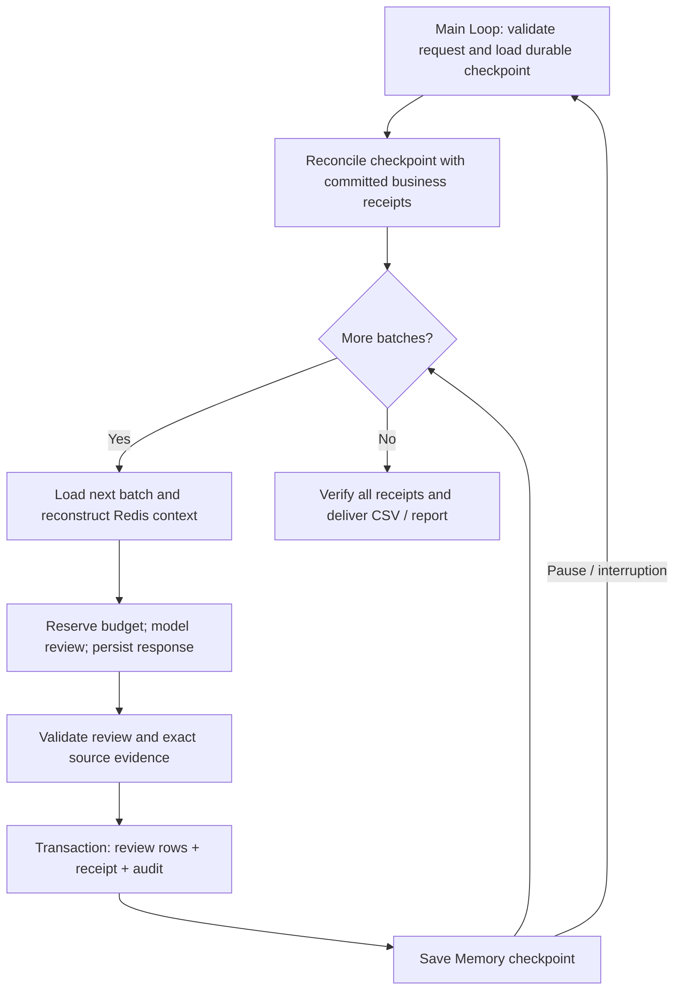

# Long tasks and recovery

Persist progress while processing batches, resume in a fresh process, reconcile actual business effects, and continue from the next unfinished batch. The example reviews six invoices against purchase orders and receiving records, writes real SQLite review rows, and delivers CSV/JSON/Markdown reports. It records review findings; it does not execute payments.

## Complete consumer

Copy `examples/patterns/long-running`, `examples/_shared/tools/long-running`, `examples/_shared/tools/storage`, `examples/_shared/tools/evidence.ts`, and `examples/_shared/tools/execution/files.ts` into the consumer. Install Core and the Redis dependency in `storage/dependencies/package.json`. Use Node 24, real Redis, `ditto.yaml`, and model credentials in the environment.

```ts
import { mkdtemp, rm } from "node:fs/promises";
import { tmpdir } from "node:os";
import { join } from "node:path";
import { loadRuntimeConfigFile } from "@codesoul-co/ditto/runtime";
import { createDemo } from "./examples/_shared/tools/long-running/adapters.ts";
import { openLongTask } from "./examples/patterns/long-running/cli.ts";
import { runLongTask } from "./examples/patterns/long-running/index.ts";

const config = loadRuntimeConfigFile("ditto.yaml", process.env);
const provider =
  process.env.EXAMPLE_LONG_RUNNING_PROVIDER ?? config.model?.provider;
if (!provider || !config.providers[provider])
  throw new Error("Configure provider");
const model = config.providers[provider].model ?? config.model?.model;
if (!model) throw new Error("Configure model");
const directory = await mkdtemp(join(tmpdir(), "ditto-long-task-example-"));
try {
  const request = await createDemo(directory);
  const input = { request, model: { provider, model } };
  const first = await openLongTask(directory, request, config);
  try {
    const paused = await runLongTask(first.runtime, input, {
      pauseAfterBatches: 1,
    });
    if (paused.status !== "paused" || paused.cursor !== 2)
      throw new Error("Expected checkpoint");
  } finally {
    await first.close();
  }
  // The new runtime reloads Memory and verifies actual database receipts.
  const resumed = await openLongTask(directory, request, config);
  try {
    const result = await runLongTask(resumed.runtime, input);
    console.log(JSON.stringify(result));
  } finally {
    await resumed.close();
  }
} finally {
  // Retain this directory in a real application to preserve reports/checkpoints.
  await rm(directory, { recursive: true, force: true });
}
```

## One Loop, resumable state



Each invocation of `runLongTask` makes one `runtime.loop(runLongTaskLoop, ...)` call. The plan uses `yield* graphStep` to compose flat Graphs whose nodes are public Workers. A resumed invocation starts another Loop using the same durable request/checkpoint; it does not depend on retaining an in-memory generator. No direct Worker executors, source/private imports, model HTTP calls, or plan I/O are used.

`CONTEXT.LOAD` supplies the current batch's messages to `INFER.REASONING.SAMPLE`. `MEMORY.GET/WRITE/UPDATE` persist progress and model responses in SQLite. `INTERACTION.ACT.TOOL` handles source reads, database reconciliation, review validation, business transactions and report writing. Existing public APIs supply this composition. The application owns checkpoint contracts and business idempotency; they are not hidden Core guarantees.

Redis holds a small working set: current batch, current cursor and latest receipt reference. It does not accumulate every prior batch's full text. The durable checkpoint and business receipts preserve the complete history.

## Scenario and acceptance

The default `mixed` input has six invoices, a 2000-cent amount mismatch on INV-103, and missing receiving evidence on INV-105. Other invoices match. `matched` supplies six matching invoices; `empty` completes without model calls or business commits. Default batch size is two; the last batch may be shorter.

For each batch, the model returns `{batchId,reviews:[{invoiceId,disposition,varianceCents,summary,nextAction,quote}]}`. Coverage must be exact, IDs must match, variance must equal invoice minus purchase-order cents, and the quote must reproduce the supplied fact exactly. Missing receiving evidence takes precedence over an amount mismatch; otherwise unequal amounts are `amount-mismatch` and equal amounts are `matched`. The model writes explanations and follow-up suggestions, but cannot set progress, waive validation or authorize payment. Natural-language descriptions remain model output; deterministic validation covers identity, coverage, numeric findings and source evidence.

## Checkpoint and reconciliation

The durable `Checkpoint` contains `protocol/requestDigest/cursor/receipts/status/usage/recoveredCommits/errors`. `cursor` is the number of source records already committed. Checkpoint status is running, paused, completed, partial, or needs-human; terminal status is preserved on replay and cross-checked against the report. Each receipt binds the request, stable batch ID, start/end offsets, predecessor receipt and validated reviews. Protocol, request digest, cursor, receipt chain and reserved budget are checked before continuing.

The application database `reviews.sqlite` is separate from `memory.sqlite`. One SQLite transaction writes the entire batch's review rows, receipt and audit row. A stable batch ID is derived from the request digest and batch boundaries. Repeating the same commit returns the same receipt; conflicting content with the same key fails. Out-of-order batches fail. Unique keys prevent duplicate review/audit rows.

Resume compares Memory against actual database rows, receipts and audit records:

| Situation                                                                                                          | Recovery                                                                                                                              |
| ------------------------------------------------------------------------------------------------------------------ | ------------------------------------------------------------------------------------------------------------------------------------- |
| Checkpoint and database agree                                                                                      | Start the next batch                                                                                                                  |
| Database is exactly one committed batch ahead                                                                      | Validate its receipt chain, adopt it into Memory, increment recoveredCommits, then continue without another model call for that batch |
| Model response persisted but no commit                                                                             | Reuse and validate the response, then commit                                                                                          |
| Budget reserved but response missing                                                                               | Keep the reservation spent; a new call needs another available reservation                                                            |
| Checkpoint ahead, missing Memory after a commit, inconsistent rows/receipts, or database more than one batch ahead | Fail for investigation; do not replay writes or silently rebuild a possibly incorrect history                                         |

The one-batch reconciliation window follows from saving a checkpoint after every transaction. It is not an arbitrary search for the furthest cursor. The task directory, Memory and application database are trusted infrastructure; digests detect inconsistency rather than authenticate against an attacker controlling all stores.

## API and stops

- `createDemo(directory, overrides?, scenario?)` creates immutable request/source/policy files and a business database. Scenarios: mixed/matched/empty.
- `openLongTask(directory, request, config)` registers public Workers and tools, opens Redis and SQLite, and returns `runtime/storage/adapters/close()`.
- `runLongTask(runtime, {request,model}, options?)` runs or resumes. `options.signal` cancels. `pauseAfterBatches` is a positive integer counting newly processed batches in this invocation; if all work finishes, it returns a completed report instead of pausing.
- `stopAfter: "sample" | "commit" | "report"` exposes persistence boundaries for recovery demonstrations. A commit pause happens before the Memory cursor is advanced; its returned cursor is the saved checkpoint cursor, and resume reconciles the business commit. Prefer pauseAfterBatches for routine pauses.
- `Paused` contains `status:"paused"/stage/cursor/total/checkpointKey`. It is resumable, not terminal. Read the durable checkpoint with public `MEMORY.GET` using `memoryKey(request,"checkpoint")` when building a status UI.
- `Report` contains `requestId/status/stopReason/cursor/total/receipts/usage/recoveredCommits/errors/generatedAt`. Reports are terminal: completed, partial on budget/deadline, or needs-human after review attempts are exhausted. Replaying a report verifies and returns it without more model calls. New inputs or a new budget require a new authorized task; do not modify a bound request.

Request fields are `id/tenant/principal/goal/sourceDigest/batchSize/maxModelCalls/maxAttempts/deadlineSeconds/protocol`. Defaults: batch size 2, 12 calls, 2 attempts per batch, 600 seconds, protocol 1. Limits: 1–10 items per batch, 1–60 calls, 1–3 attempts, 1–86400 seconds. The bounded example input permits up to 30 records. Tests use small real tasks and process interruption; they do not establish multi-day uptime or large-volume throughput.

Budget is persisted before each model call. The deadline includes paused/offline time and gates new inference and commits; a synchronous commit already in progress finishes atomically. Provider timeout and explicit cancellation govern in-flight inference. Failed reviews preserve previously committed batches; invalid JSON, provider errors or invalid evidence retry within the same durable budget.

## Persistence and operational boundaries

Redis scope: `long-task:<tenant>:<principal>:<task>`. Cache expiry reconstructs the current working set from Memory and source data. Redis/Memory/business database failure stops the invocation, retaining committed progress; it does not switch to ephemeral storage. Revoked authorization, changed input/request/protocol, checkpoint drift and database corruption prevent continuing.

Use one active Loop per task. This example has no distributed lease or fencing mechanism; transactional idempotency protects its business writes, not simultaneous model-budget updates by multiple runners. Add an application-owned lease before allowing concurrent resume. Different databases or remote systems must provide their own atomic effect/receipt transaction or equivalent idempotency and reconciliation contract. The example does not claim global exactly-once execution. An interrupted model response may be regenerated, and file publication is retried separately using immutable content checks.

`input` is `invoices.json`; `request.json/policy.json` bind scope and permissions. `memory.sqlite` stores checkpoint and per-attempt samples. `reviews.sqlite` holds review rows, receipts and audit. `output/reviews.csv`, `output/report.json` and `output/report.md` contain actual committed progress and evidence. Temporary pauses do not publish a final report. Runtime resources are closed explicitly; all generated task files are ignored by Git.

## Run and verify

```sh
export DITTO_WORKER_CONTEXT_REDIS_URL=redis://127.0.0.1:6379
npm run example:long-running -- --provider deepseek --pause-after-batches 1
npm run example:long-running -- --provider deepseek --directory .examples-long-running-tasks/cli-XXXXXX
npm run example:long-running -- --provider deepseek --scenario matched
npm run check:examples:long-running:package -- --provider deepseek
```

Resume with the actual printed directory. The package gate installs the real npm tarball outside the repository, uses strict types without path aliases, prohibits private/source imports, checks silent imports, and runs the complete pause/reopen/resume snippet above. Real model, Redis and SQLite task E2E covers batch boundaries, empty input, pauses, fresh processes, invalid reviews, exhausted budgets, cache expiry, store failures, permission/source/checkpoint/business corruption, transactional rollback, cancellation, SIGKILL after budget reservation/model sample/business commit/checkpoint/report, and publication retry. Fault tests explicitly inject failures. SQLite acceptance is not PostgreSQL/MySQL or remote-service acceptance.

[Example](../../examples/patterns/long-running/README.md) · [Application tools](../../examples/_shared/tools/long-running/README.md) · [简体中文](long-running-workflows.zh-CN.md)
