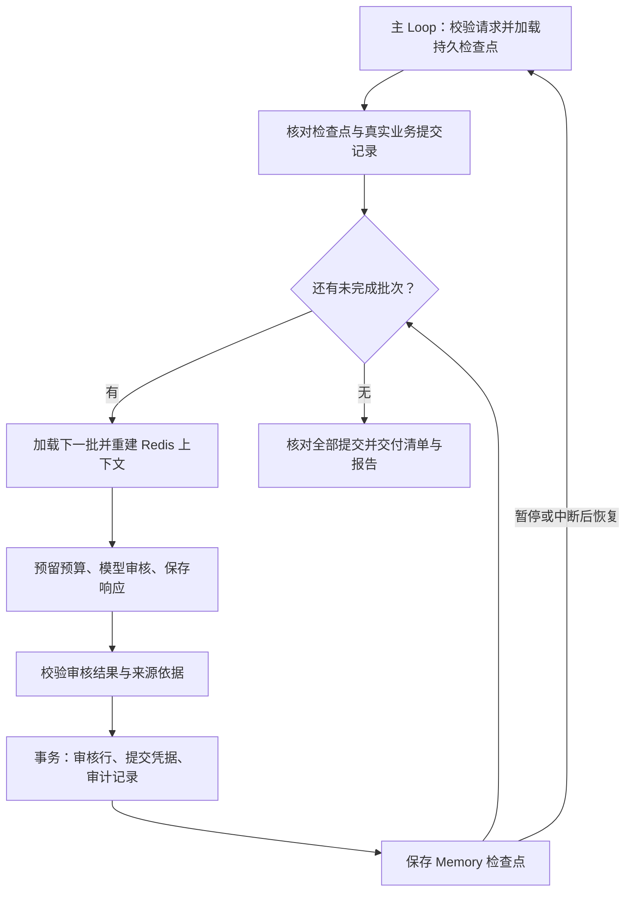

# 长任务与恢复

分批执行时保存进度，在新进程中恢复状态，核对实际业务写入后继续下一批。示例审核六份发票、采购订单和收货记录，将审核结果真正写入 SQLite，并生成 CSV/JSON/Markdown 报告。业务写入是审核记录，不执行付款。

## 完整调用

复制 `examples/patterns/long-running`、`examples/_shared/tools/long-running`、`examples/_shared/tools/storage`、`examples/_shared/tools/evidence.ts`、`examples/_shared/tools/execution/files.ts` 到消费者项目。安装 Core 和 `storage/dependencies/package.json` 声明的 Redis 依赖，配置 Node 24、真实 Redis、`ditto.yaml` 及环境中的模型凭证。

```ts
import { mkdtemp, rm } from "node:fs/promises";
import { tmpdir } from "node:os";
import { join } from "node:path";
import { loadRuntimeConfigFile } from "@ditto/core/runtime";
import { createDemo } from "./examples/_shared/tools/long-running/adapters.ts";
import { openLongTask } from "./examples/patterns/long-running/cli.ts";
import { runLongTask } from "./examples/patterns/long-running/index.ts";

const config = loadRuntimeConfigFile("ditto.yaml", process.env);
const provider =
  process.env.EXAMPLE_LONG_RUNNING_PROVIDER ?? config.model?.provider;
if (!provider || !config.providers[provider])
  throw new Error("Configure provider");
const model = config.providers[provider].model ?? config.model?.model;
if (!model) throw new Error("Configure model");
const directory = await mkdtemp(join(tmpdir(), "ditto-long-task-example-"));
try {
  const request = await createDemo(directory);
  const input = { request, model: { provider, model } };
  const first = await openLongTask(directory, request, config);
  try {
    const paused = await runLongTask(first.runtime, input, {
      pauseAfterBatches: 1,
    });
    if (paused.status !== "paused" || paused.cursor !== 2)
      throw new Error("Expected checkpoint");
  } finally {
    await first.close();
  }
  // The new runtime reloads Memory and verifies actual database receipts.
  const resumed = await openLongTask(directory, request, config);
  try {
    const result = await runLongTask(resumed.runtime, input);
    console.log(JSON.stringify(result));
  } finally {
    await resumed.close();
  }
} finally {
  // Retain this directory in a real application to preserve reports/checkpoints.
  await rm(directory, { recursive: true, force: true });
}
```

## 一个主 Loop 与可恢复状态



每次 `runLongTask` 只调用一次 `runtime.loop(runLongTaskLoop, ...)`，计划通过 `yield* graphStep` 组合平铺 Worker Graph。恢复调用启动新的 Loop，使用同一持久请求与检查点，不依赖仍留在内存中的生成器。没有直接执行 Worker、导入源码/私有模块、直接调用模型 HTTP，或在计划中执行 I/O。

`CONTEXT.LOAD` 向 `INFER.REASONING.SAMPLE` 提供当前批次消息；`MEMORY.GET/WRITE/UPDATE` 在 SQLite 保存进度和模型响应；`INTERACTION.ACT.TOOL` 完成资料读取、核对、校验、业务事务和报告写入。现有公开 API 已满足组合需求，检查点协议和业务幂等性属于应用，不是 Core 隐式提供的保证。

Redis 只保存当前批次、进度和最后提交引用，不不断累积所有历史全文；完整历史保存在持久检查点和业务凭据中。

## 场景与验收规则

默认 mixed 包含六份发票：INV-103 比采购订单多 2000 分，INV-105 缺少收货依据，其余匹配。matched 提供六份匹配记录；empty 无模型调用、无业务提交即可完成。默认每批两份，最后一批允许不足两份。

模型返回 `{batchId,reviews:[{invoiceId,disposition,varianceCents,summary,nextAction,quote}]}`。必须完整且仅覆盖当前批次，差额等于发票金额减采购订单金额，引文逐字匹配提供的事实。缺少收货依据优先标为 awaiting-receipt；否则金额不同为 amount-mismatch，相同为 matched。模型生成说明和后续建议，但不能设置游标、跳过校验或授权付款。自然语言仍是模型输出；确定性检查覆盖身份、完整性、数值与来源。

## 检查点与核对

Checkpoint 包含 `protocol/requestDigest/cursor/receipts/status/usage/recoveredCommits/errors`。cursor 为已提交的资料条数。检查点状态为 running、paused、completed、partial 或 needs-human；终态重放时保持状态，并与报告交叉核对。每份 receipt 绑定请求、稳定批次 ID、起止位置、前一份凭据及审核结果。继续前校验协议、请求摘要、游标、凭据链与已预留预算。

业务库 `reviews.sqlite` 与 `memory.sqlite` 分开。一个 SQLite 事务同时写入当前批次全部审核行、提交凭据和审计行。批次 ID 由请求摘要及起止位置确定；同键同内容重试返回原凭据，同键不同内容报错；禁止越序提交。唯一键防止重复审核行和重复审计记录。

恢复时将 Memory 与实际数据库行、提交凭据、审计记录交叉核对：

| 情况                                                                   | 恢复行为                                                                     |
| ---------------------------------------------------------------------- | ---------------------------------------------------------------------------- |
| 检查点与数据库一致                                                     | 从下一批开始                                                                 |
| 数据库恰好多提交一批                                                   | 校验凭据链，将该批补入 Memory，增加 recoveredCommits，不重新调用模型处理该批 |
| 模型响应已保存、尚未提交                                               | 复用并验证响应，再提交                                                       |
| 预算已预留、响应未保存                                                 | 保留已消耗预算，新调用需要再次获得预算                                       |
| 检查点领先、已有提交但 Memory 缺失、行与凭据不一致、数据库领先超过一批 | 停止并报告异常，不盲目重写或按最大游标猜测恢复                               |

最多领先一批来自“每次业务提交之后立即保存检查点”的顺序约束。任务目录、Memory、业务库及控制器是可信基础设施；摘要用于发现不一致，不抵抗同时控制全部存储的攻击者。

## 调用接口与停止语义

- `createDemo(directory, overrides?, scenario?)` 创建不可变请求、资料、权限文件及业务数据库；scenario 为 mixed/matched/empty。
- `openLongTask(directory, request, config)` 注册公开 Worker 与工具，打开真实 Redis/SQLite，返回 `runtime/storage/adapters/close()`。
- `runLongTask(runtime, {request,model}, options?)` 执行或恢复。signal 传递取消；pauseAfterBatches 为正整数，表示本次调用新完成多少批后暂停。若所有批次已完成，直接返回完成报告。
- `stopAfter: sample | commit | report` 用于演示持久化边界。commit 暂停发生在业务提交之后、Memory 游标更新之前，返回的是检查点中的旧游标，恢复时核对补齐。日常暂停优先用 pauseAfterBatches。
- Paused 包含 `status:"paused"/stage/cursor/total/checkpointKey`，是可恢复状态。构建状态界面时，可使用公开 MEMORY.GET 和 `memoryKey(request,"checkpoint")` 读取持久进度。
- Report 包含 `requestId/status/stopReason/cursor/total/receipts/usage/recoveredCommits/errors/generatedAt`。报告为终态：完成时 completed，预算/总时间耗尽时 partial，审核重试耗尽时 needs-human。再次调用核对并返回相同报告，不新增模型调用。新资料或新预算需创建新的获准任务，不能修改已绑定请求。

Request 字段为 `id/tenant/principal/goal/sourceDigest/batchSize/maxModelCalls/maxAttempts/deadlineSeconds/protocol`。默认每批 2 条、12 次模型调用、每批 2 次尝试、600 秒、协议 1；范围为每批 1–10 条、1–60 次调用、1–3 次尝试、1–86400 秒。示例最多接收 30 条资料。验收使用小规模真实任务和进程中断，不等同于多日稳定运行或大数据吞吐验收。

模型调用前先把预算写入 Memory。总时间包括暂停和离线时间，限制新推理及新提交；已经开始的同步事务会原子完成。运行中推理由 provider 超时和显式取消控制。失败审核保留此前已提交批次；无效 JSON、模型错误和依据校验失败共用持久预算重试。

## 存储与运行边界

Redis scope 为 `long-task:<tenant>:<principal>:<task>`。缓存过期后从 Memory 与来源重建当前工作集。Redis/Memory/业务库故障会停止调用并保留进度，不静默改用临时存储。权限撤销、请求或资料改变、协议变化、检查点偏移和数据库内容不一致都会阻止继续。

同一任务只运行一个主 Loop。本例没有分布式租约或 fencing；业务事务幂等性保护业务写入，不保护多个并发执行者的模型预算更新。开放并发恢复前需由应用增加租约。其他数据库或远程系统也必须提供自己的“副作用与回执原子提交”或等价的幂等/核对机制；本例不宣称全局恰好一次执行。中断时未保存的模型响应可能重新生成，文件报告发布则通过不可变内容校验独立重试。

`invoices.json` 是原始资料，`request.json/policy.json` 绑定范围和权限；`memory.sqlite` 保存检查点与逐次模型响应；`reviews.sqlite` 保存审核、凭据和审计；`output/reviews.csv/report.json/report.md` 反映实际已提交进度。临时暂停不发布终态报告。连接显式关闭，所有任务产物都被 Git 忽略。

## 运行与验收

```sh
export DITTO_WORKER_CONTEXT_REDIS_URL=redis://127.0.0.1:6379
npm run example:long-running -- --provider deepseek --pause-after-batches 1
npm run example:long-running -- --provider deepseek --directory .examples-long-running-tasks/cli-XXXXXX
npm run example:long-running -- --provider deepseek --scenario matched
npm run check:examples:long-running:package -- --provider deepseek
```

恢复时使用 CLI 打印的真实目录。包验收在仓库外安装实际 npm tarball，使用无路径别名的严格类型检查，禁止私有/源码入口，检查导入无副作用，并运行上面的“暂停—关闭—重开—继续”完整调用。

真实模型、Redis、SQLite 端到端验收覆盖分批边界、空输入、暂停、新进程、无效审核、预算耗尽、缓存过期、存储故障、权限/来源/检查点/业务记录异常、事务回滚、取消、预算预留/模型响应/业务提交/检查点/报告之后的 SIGKILL 恢复与发布重试。故障场景显式注入异常；SQLite 验收不等同于 PostgreSQL/MySQL 或远程服务验收。

[示例](../../examples/patterns/long-running/README.zh-CN.md) · [应用工具](../../examples/_shared/tools/long-running/README.zh-CN.md) · [English](long-running-workflows.md)
