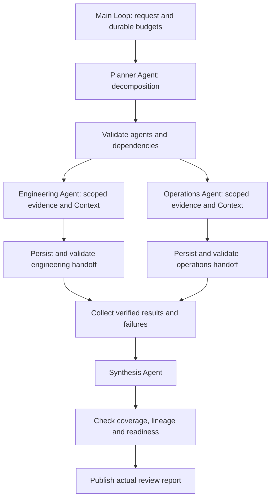

# Multi-Agent division of work

A release-readiness review follows goal decomposition → agent assignment → parallel or serial specialist execution → result collection → synthesis. It reads actual release evidence files, produces versioned specialist handoffs and writes a final review with traceable facts. A completed review can conclude that the release is blocked; the example never performs a release.

## Runnable consumer

Copy `examples/patterns/multi-agent`, `examples/_shared/tools/multi-agent`, `examples/_shared/tools/storage`, `examples/_shared/tools/evidence.ts` and `examples/_shared/tools/execution/files.ts` into a consumer project. Install the Core tarball and Redis dependency from `storage/dependencies/package.json`. Use Node 24, `ditto.yaml`, model credentials and a real Redis server (`DITTO_WORKER_CONTEXT_REDIS_URL`).

```ts
import { mkdtemp, rm } from "node:fs/promises";
import { tmpdir } from "node:os";
import { join } from "node:path";
import { loadRuntimeConfigFile } from "@codesoul-co/ditto/runtime";
import { createDemo } from "./examples/_shared/tools/multi-agent/adapters.ts";
import { openMultiAgent } from "./examples/patterns/multi-agent/cli.ts";
import { runMultiAgent } from "./examples/patterns/multi-agent/index.ts";

const config = loadRuntimeConfigFile("ditto.yaml", process.env);
const provider =
  process.env.EXAMPLE_MULTI_AGENT_PROVIDER ?? config.model?.provider;
if (!provider || !config.providers[provider])
  throw new Error("Configure provider");
const model = config.providers[provider].model ?? config.model?.model;
if (!model) throw new Error("Configure model");
const directory = await mkdtemp(join(tmpdir(), "ditto-team-example-"));
try {
  const request = await createDemo(directory, { mode: "parallel" });
  const app = await openMultiAgent(directory, request, config);
  try {
    const result = await runMultiAgent(app.runtime, {
      request,
      model: { provider, model },
      // Optional models: { engineering: { provider, model }, ... }
      // Keys: planner, engineering, operations, synthesis.
    });
    console.log(JSON.stringify(result));
  } finally {
    await app.close();
  }
} finally {
  // Use a persistent directory and omit cleanup to retain the report.
  await rm(directory, { recursive: true, force: true });
}
```

## Agents and composition



`runMultiAgent(runtime,input,options)` makes one `runtime.loop(runMultiAgentLoop, ...)` call. The Loop composes flat stage Graphs through `graphStep`; Graphs contain only public Worker nodes. There is no nested Graph execution, direct Worker execution or external `runtime.run` sequencing. The application defines logical Agents with role instructions, assignments, scoped tools/data, independent Context and configurable models. They share Runtime infrastructure; they are not separate OS processes or independently authenticated principals. This composition requires no new private Core interface.

| Agent       | Responsibility                                              | Inputs and allowed data                                                                |
| ----------- | ----------------------------------------------------------- | -------------------------------------------------------------------------------------- |
| planner     | Generate three actionable task assignments and dependencies | Goal, execution mode and fixed agent registry; no raw business records                 |
| engineering | Assess tests and critical defects                           | `team_read_engineering`, engineering facts and its own Redis scope                     |
| operations  | Assess rollback and on-call readiness                       | `team_read_operations`, operations facts; in serial mode, explicit engineering handoff |
| synthesis   | Combine results without losing blockers or gaps             | Validated specialist outputs with content-hash IDs; no raw source file access          |

The planner generates goals within a bounded registry, not an arbitrary population of self-created agents. The validator requires engineering, operations and synthesis exactly once, with approved edges. Unknown agents, duplicate IDs, cycles or unexpected dependencies stop before specialist execution. In **parallel** mode engineering and operations have no mutual dependency. Both real model requests can run simultaneously; Runtime and Infer concurrency are explicitly set to 4. In **serial** mode operations depends on the successful engineering handoff. Synthesis runs after collection in both modes. If a prerequisite fails, dependent operations is marked blocked rather than receiving an invented result. Independent successes are retained.

`Input.model` is the default; `Input.models` optionally selects configured models per role (`planner`, `engineering`, `operations`, `synthesis`). The real acceptance suite uses one provider/model across distinct calls and tests explicit per-role routing; it does not claim cross-provider acceptance. Changing model configuration does not invalidate already saved stage outputs.

| Stage                  | Public nodes / API                                         | Contract                                                                          |
| ---------------------- | ---------------------------------------------------------- | --------------------------------------------------------------------------------- |
| Load / resume          | `MEMORY.GET`, `CONTEXT.LOAD`, `INTERACTION.ACT.TOOL`       | Request identity, policy and source fingerprint                                   |
| Decompose / synthesize | `CONTEXT.LOAD` → `INFER.REASONING.SAMPLE`                  | Validated plan / evidence-bound summary                                           |
| Scope evidence         | `INTERACTION.ACT.TOOL`                                     | Fixed read tool per specialist, no model-selected path or foreign role parameter  |
| Specialist branch      | `CONTEXT.LOAD` → `INFER.REASONING.SAMPLE` → `MEMORY.WRITE` | Per-role context; persist each branch response before joining                     |
| Validate / collect     | `team_save`, `team_result` through Interaction             | Role, task, release, readiness, exact citations and explicit dependency IDs       |
| Deliver                | `team_publish`, Memory writes                              | Verified specialist records, complete coverage or named gaps, actual report files |

## Evidence and isolation

The fixture has 48/50 tests passed and zero open critical defects, while rollback and on-call are ready. Engineering therefore reports `blocked`; operations reports `ready`; synthesis must retain the blocker. `--ready` supplies 50/50 passed tests, yielding `ready`. Specialist output must include both exact scoped fact quotes. The adapter deterministically validates classifications and citations. Synthesis must reference each available result's exact hash, include each agent once and enumerate missing agents. Missing results force `incomplete`; otherwise any blocker forces `blocked`.

Context scopes include tenant, principal, task and agent. Agent models receive only the active working-set messages; another agent's raw evidence is not added to their inputs. Serial handoffs deliberately disclose the verified engineering result to operations. Model calls use `INFER.REASONING.SAMPLE`, not unrestricted model-selected tool invocation; the controller binds allowed read tools from the validated plan. These are application data boundaries, not OS isolation or a security boundary between untrusted plugins. Memory uses a task namespace with role/attempt stage keys in a real file-backed SQLite database. The controller can see all results to coordinate the workflow.

Requests, role assignments and source text are treated as data. The deterministic gates prove scope, the structured verdict, exact quotes and handoff lineage. Natural-language explanations remain model judgments; structural checks do not prove every prose assertion. The adapters and business files stay under `_shared/tools/multi-agent`; Core acquires no domain dependency.

## Failure, persistence and budgets

A malformed/failed specialist sample is persisted and retried up to `maxAgentAttempts` (1–3); retries receive prior error codes. Successful specialists are reused, not rerun because a sibling failed. An exhausted branch is reported explicitly. If at least one result is available and the budget allows it, synthesis produces a partial report naming missing agents. Invalid plan output yields `needs-human`; invalid synthesis preserves specialist outputs without an accepted synthesized conclusion. Storage or permission failures propagate and never become fabricated branch results.

`maxModelCalls` (1–10) is shared across planner, specialists, retries and synthesis. Budget reservations are written before calls, including before parallel fan-out; process termination may consume reserved calls without saving responses. Each branch has its own Memory save node, so a committed sibling response survives a crash. `deadlineSeconds` (1–3600) includes paused time and prevents new calls; it is an admission limit, not a hard timeout for in-flight requests. `Options.signal` cancels active Runtime work. The Loop also limits each invocation to 1024 Graphs.

Context uses real Redis; only missing/expired cache is rebuilt from persisted samples and task data. Redis/Memory outages fail visibly without an in-memory fallback. Memory uses `memory.sqlite`; business sources and artifacts are separate real files. This validates SQLite rather than PostgreSQL/MySQL. Other stores can use public Memory adapters.

`stopAfter: "plan" | "specialists" | "report"` returns a checkpoint. Reopen the same directory and immutable request without `stopAfter` to continue. One active runner owns a task directory. Completed/partial/handoff reports are terminal snapshots: replay verifies persisted artifacts and performs no new model calls. A changed request, source or budget requires a new task. Conflicting publication files are not overwritten; publication can be retried after resolving the conflict. Immutable result files are hash-checked before handoff and publication; changed sources or role results fail explicitly.

Artifacts: `request.json`, `sources.json`, `policy.json`, `memory.sqlite`, `results/<hash>.json`, `output/report.json` and `output/report.md`. The Markdown includes readiness, missing/failed agents and exact evidence; JSON retains the plan, attempts, errors, lineage IDs, synthesis and budget. No production deployment, email or other external business write occurs. The example's local policy is a trusted-controller integration fixture, not authentication; protect the task directory and derive identities from authenticated application state.

## Commands and acceptance

```sh
export DITTO_WORKER_CONTEXT_REDIS_URL=redis://127.0.0.1:6379
npm run example:multi-agent -- --provider deepseek --mode parallel
npm run example:multi-agent -- --provider deepseek --mode serial
npm run example:multi-agent -- --provider deepseek --ready
npm run example:multi-agent -- --provider deepseek --stop-after specialists
npm run example:multi-agent -- --provider deepseek --directory .examples-multi-agent-tasks/cli-XXXXXX
npm run check:examples:multi-agent:package -- --provider deepseek
```

The package gate installs the actual npm tarball outside the repository, typechecks without path aliases, blocks private/source imports, checks silent module imports and executes the documented consumer. Task acceptance checks actual specialist model-call overlap and serial ordering, scoped prompts, exact handoff lineage, written reports, retries/partial failures, invalid plans/results/citations, budgets, Redis expiry/outage, Memory failures, tampering, cancellation, process kills and publication retry. Model-output substitutions are explicitly labeled fault injections; normal tasks use unmodified real provider responses.
