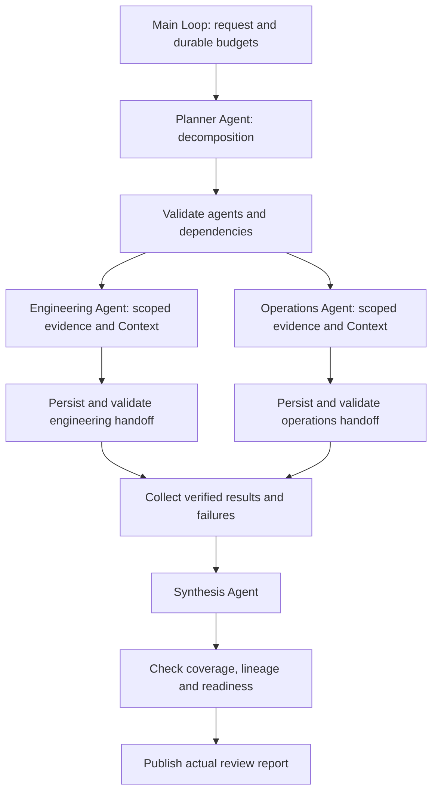

# 多 Agent 分工

完整场景为版本发布准备度评审：目标拆分 → Agent 分工 → 并行或串行分析 → 收集结果 → 汇总。流程读取实际资料文件，保存版本化的专职 Agent 结果，并生成带依据的评审报告。评审任务完成不等于版本可以发布；本例不执行发布操作。

## 可运行调用

复制 `examples/patterns/multi-agent`、`examples/_shared/tools/multi-agent`、`examples/_shared/tools/storage`、`examples/_shared/tools/evidence.ts` 与 `examples/_shared/tools/execution/files.ts` 到消费者项目，安装 Core tarball 和 `storage/dependencies/package.json` 指定的 Redis 依赖。使用 Node 24、`ditto.yaml`、模型凭证和真实 Redis（`DITTO_WORKER_CONTEXT_REDIS_URL`）。

```ts
import { mkdtemp, rm } from "node:fs/promises";
import { tmpdir } from "node:os";
import { join } from "node:path";
import { loadRuntimeConfigFile } from "@codesoul-co/ditto/runtime";
import { createDemo } from "./examples/_shared/tools/multi-agent/adapters.ts";
import { openMultiAgent } from "./examples/patterns/multi-agent/cli.ts";
import { runMultiAgent } from "./examples/patterns/multi-agent/index.ts";

const config = loadRuntimeConfigFile("ditto.yaml", process.env);
const provider =
  process.env.EXAMPLE_MULTI_AGENT_PROVIDER ?? config.model?.provider;
if (!provider || !config.providers[provider])
  throw new Error("Configure provider");
const model = config.providers[provider].model ?? config.model?.model;
if (!model) throw new Error("Configure model");
const directory = await mkdtemp(join(tmpdir(), "ditto-team-example-"));
try {
  const request = await createDemo(directory, { mode: "parallel" });
  const app = await openMultiAgent(directory, request, config);
  try {
    const result = await runMultiAgent(app.runtime, {
      request,
      model: { provider, model },
      // Optional models: { engineering: { provider, model }, ... }
      // Keys: planner, engineering, operations, synthesis.
    });
    console.log(JSON.stringify(result));
  } finally {
    await app.close();
  }
} finally {
  // Use a persistent directory and omit cleanup to retain the report.
  await rm(directory, { recursive: true, force: true });
}
```

## Agent 与流程组装



`runMultiAgent(runtime,input,options)` 只调用一次 `runtime.loop(runMultiAgentLoop, ...)`。主 Loop 通过 `graphStep` 组合阶段 Graph；Graph 只包含公开 Worker 节点，不嵌套子图、不直接执行 Worker、不在外部串联多个 `runtime.run`。应用侧 Agent 具有职责、任务、限定工具/资料、独立 Context 和可配置模型，共享 Runtime 基础设施，并非独立操作系统进程或独立认证主体。无需增加 Core 私有接口。

| Agent       | 职责                         | 输入和可用资料                                               |
| ----------- | ---------------------------- | ------------------------------------------------------------ |
| planner     | 拆分三项可执行任务并确定依赖 | 目标、执行模式和固定 Agent 注册表，不读取原始业务资料        |
| engineering | 分析测试与严重缺陷           | `team_read_engineering`、工程事实、独立 Redis scope          |
| operations  | 分析回滚与值班准备           | `team_read_operations`、运维事实；串行时接收显式工程交接结果 |
| synthesis   | 汇总并保留阻塞项和缺口       | 经校验且具有内容摘要 ID 的结果，不直接读取原始资料           |

规划 Agent 在限定注册表内生成任务目标，不任意创建 Agent。校验要求工程、运维、汇总各出现一次，且只能使用批准的依赖关系；未知 Agent、重复 ID、循环和意外依赖都会在执行前停止。**并行模式**下工程和运维互不依赖，实际模型请求同时执行，Runtime 与 Infer 并发均配置为 4。**串行模式**下运维依赖工程成功结果，接收其完整交接。两种模式都先收集结果再汇总；前置任务失败时后续依赖标记 blocked，独立成功结果仍保留。

`Input.model` 为默认模型，`Input.models` 可按 `planner`、`engineering`、`operations`、`synthesis` 配置已注册模型。真实验收使用同一 provider/model 的独立调用，并验证按角色显式配置的路径，不声称已经完成跨供应商验收。改变模型配置不会重新执行已保存的阶段。

| 阶段         | 公开节点 / API                                             | 契约                                                          |
| ------------ | ---------------------------------------------------------- | ------------------------------------------------------------- |
| 加载与恢复   | `MEMORY.GET`、`CONTEXT.LOAD`、`INTERACTION.ACT.TOOL`       | 任务身份、权限和来源摘要                                      |
| 拆分 / 汇总  | `CONTEXT.LOAD` → `INFER.REASONING.SAMPLE`                  | 校验后的计划 / 绑定结果的汇总                                 |
| 限定资料     | `INTERACTION.ACT.TOOL`                                     | 每个专职 Agent 使用固定读取工具，不接受任意路径或其他角色参数 |
| 专职执行分支 | `CONTEXT.LOAD` → `INFER.REASONING.SAMPLE` → `MEMORY.WRITE` | 独立上下文，每个分支在汇合前保存自己的模型结果                |
| 校验与收集   | Interaction 调用 `team_save`、`team_result`                | 角色、任务、版本、准备度、精确引用及依赖结果 ID               |
| 交付         | `team_publish` 与 Memory 写入                              | 核验结果、覆盖范围和缺口，写入真实报告                        |

## 依据与隔离

默认资料为 50 项测试中 48 项通过、0 个严重缺陷，回滚和值班均就绪。因此工程结果必须为 `blocked`，运维为 `ready`，汇总不得抹去阻塞项。`--ready` 提供 50/50 测试通过的资料，最终为 `ready`。每份专职结果必须完整引用本角色两项事实的原文；适配器确定性校验分类与引文。汇总必须引用每份结果的准确摘要 ID，各 Agent 不重复，并列出全部缺失角色；有缺失则为 `incomplete`，无缺失但存在阻塞则为 `blocked`。

Context scope 包含租户、身份、任务和 Agent。模型只接收当前 working-set 消息，不注入另一角色的原始资料；串行交接会明确披露已验证的工程结果给运维 Agent。模型使用 `INFER.REASONING.SAMPLE`，不进行不受限的自主工具调用；可信控制器根据已验证计划绑定允许的工具。这是应用资料边界，不是操作系统隔离，也不用于隔离不可信插件。Memory 使用任务命名空间下的角色/尝试键，协调者可读取全部结果完成汇总。

请求、任务描述和资料均作为数据处理。确定性检查证明对象范围、结构化结论、原文引用和交接关系；自然语言解释仍是模型判断，结构校验不能证明每句话都正确。适配器和业务资料放在 `_shared/tools/multi-agent`，不向 Core 添加领域依赖。

## 失败、持久化与预算

专职模型失败或结果无效时保存尝试，并按 `maxAgentAttempts`（1–3）重试，下一次输入包含之前的错误码。成功 Agent 不因其他 Agent 失败而重跑。重试耗尽后明确保留失败；有至少一个成功结果且预算允许时，继续汇总并列出缺失项。无效计划返回 `needs-human`；无效汇总保留专职结果但不形成已接受的综合结论。存储和权限故障显式抛出，不伪装成业务结果。

`maxModelCalls`（1–10）由规划、专职、重试和汇总共享；调用前先保存预算，并行分发前统一预留。进程终止可能消耗额度但未保存结果，每个并行分支独立的 Memory 保存节点可保留已完成部分。`deadlineSeconds`（1–3600）包含暂停时间，在新增模型调用前检查，不是强制终止正在运行请求的超时；`Options.signal` 用于取消执行。主 Loop 每次调用还受 1024 个 Graph 的上限约束。

Context 使用真实 Redis，缺失或过期时从持久样本及任务数据重建所需上下文；Redis/Memory 不可用时显式失败，不退化到内存。Memory 使用 `memory.sqlite`，业务输入和产物是独立文件。本例验证 SQLite，不代表已经验证 PostgreSQL/MySQL；其他存储通过公开 Memory 适配器接入。

`stopAfter: "plan" | "specialists" | "report"` 返回检查点。以同一目录和请求重新进入、移除 `stopAfter` 即可继续，每个目录只运行一个 Agent 执行者。completed、partial、needs-human 报告是终态快照；重放时验证保存产物，不新增模型调用。修改任务、资料或预算需要新任务。发布冲突不覆盖原文件，解决冲突后可重试；交接和交付前核验结果摘要，来源或结果变化显式失败。

产物包括 `request.json`、`sources.json`、`policy.json`、`memory.sqlite`、`results/<hash>.json`、`output/report.json` 和 `output/report.md`。Markdown 展示准备度、失败/缺失 Agent 和原文依据，JSON 保留计划、尝试、错误、交接 ID、汇总和预算。流程不进行生产部署、发信或外部系统写入。本地策略是可信控制器接入示例，不是身份认证；部署时保护目录并从认证会话注入身份。

## 运行与验收

```sh
export DITTO_WORKER_CONTEXT_REDIS_URL=redis://127.0.0.1:6379
npm run example:multi-agent -- --provider deepseek --mode parallel
npm run example:multi-agent -- --provider deepseek --mode serial
npm run example:multi-agent -- --provider deepseek --ready
npm run example:multi-agent -- --provider deepseek --stop-after specialists
npm run example:multi-agent -- --provider deepseek --directory .examples-multi-agent-tasks/cli-XXXXXX
npm run check:examples:multi-agent:package -- --provider deepseek
```

包验收在仓库外安装真实 npm tarball，以无路径别名的严格类型配置执行，阻断源码/私有导入，检查静默导入并运行上述文档调用。任务验收核对实际模型调用重叠与串行顺序、限定提示输入、交接关系、实际报告、重试/部分失败、无效计划/角色/引用、预算、Redis 过期/故障、Memory 故障、篡改、取消、进程终止及发布重试。模型输出替换明确标记为故障注入，正常场景使用未修改的真实模型输出。
