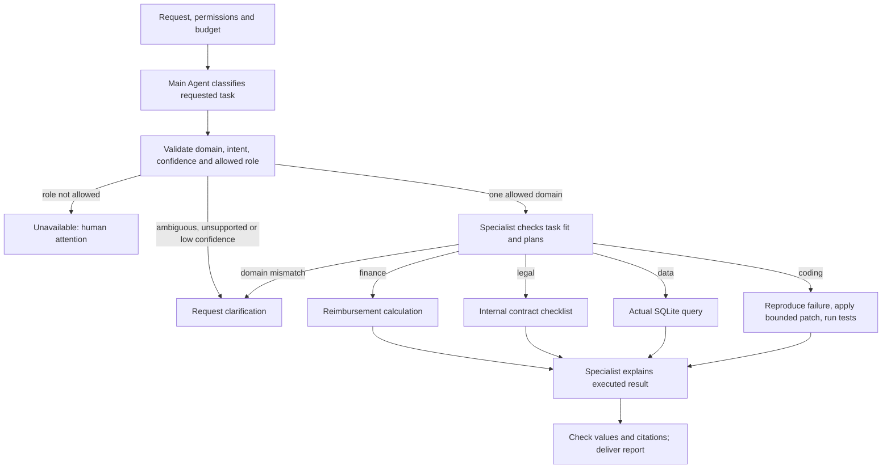

# Specialist Agent routing

The main Agent identifies the user's requested task and selects a specialist for one supported domain. That specialist independently checks task fit, reads scoped evidence, executes a bounded tool and explains the actual result. The main Agent does not perform domain work. Routing neither transfers persistent ticket ownership nor automatically combines several specialist workflows.

Four complete paths demonstrate reimbursement calculation, sample-contract review, SQLite sales analysis and a fixture code repair with executed tests.

## Runnable consumer

Copy `examples/patterns/specialist-routing`, `examples/_shared/tools/specialist-routing`, `examples/_shared/tools/storage`, `examples/_shared/tools/evidence.ts` and `examples/_shared/tools/execution/files.ts` into the consumer project. Install Core and the Redis dependency from `storage/dependencies/package.json`. Use Node 24, real Redis, `ditto.yaml` and model environment credentials.

```ts
import { mkdtemp, rm } from "node:fs/promises";
import { tmpdir } from "node:os";
import { join } from "node:path";
import { loadRuntimeConfigFile } from "@ditto/core/runtime";
import { createDemo } from "./examples/_shared/tools/specialist-routing/adapters.ts";
import { openSpecialistRouting } from "./examples/patterns/specialist-routing/cli.ts";
import { runSpecialistRouting } from "./examples/patterns/specialist-routing/index.ts";

const config = loadRuntimeConfigFile("ditto.yaml", process.env);
const provider =
  process.env.EXAMPLE_SPECIALIST_ROUTING_PROVIDER ?? config.model?.provider;
if (!provider || !config.providers[provider])
  throw new Error("Configure provider");
const model = config.providers[provider].model ?? config.model?.model;
if (!model) throw new Error("Configure model");
const directory = await mkdtemp(
  join(tmpdir(), "ditto-specialist-routing-example-"),
);
try {
  const request = await createDemo(directory, {}, "data");
  const app = await openSpecialistRouting(directory, request, config);
  try {
    const result = await runSpecialistRouting(app.runtime, {
      request,
      model: { provider, model },
      // Optional models: { data: { provider, model }, ... }
      // Role keys: router, finance, legal, data, coding.
    });
    console.log(JSON.stringify(result));
  } finally {
    await app.close();
  }
} finally {
  // Keep a persistent directory instead when retaining reports/checkpoints.
  await rm(directory, { recursive: true, force: true });
}
```

## Main Loop and specialist branches



`runSpecialistRouting` calls `runtime.loop(runSpecialistRoutingLoop, ...)` once. The main Loop composes flat stage Graphs through `yield* graphStep`, using public `CONTEXT.LOAD`, `INFER.REASONING.SAMPLE`, `MEMORY.GET/WRITE/UPDATE` and `INTERACTION.ACT.TOOL`. Plans do not call Workers, HTTP, SQL, files or subprocesses directly and never import Core source.

The router and specialists are logical roles with distinct instructions, configurable models and Redis scopes on one Runtime. A normal complete task uses three model calls: routing, specialist planning and explanation of actual tool results. One request selects at most one domain; semantic role routing is separate from Worker instance scheduling.

## Tasks and actual artifacts

| Role / intent               | Allowed operation         | Fixture result                                                                                                    |
| --------------------------- | ------------------------- | ----------------------------------------------------------------------------------------------------------------- |
| `finance` / `reimbursement` | `calculate-reimbursement` | EXP-204: meal 58000 cents, travel 12000, meal cap 50000; approved 62000, excess 8000                              |
| `legal` / `contract-review` | `check-contract`          | CONTRACT-204: 30-day notice satisfies the internal checklist; data-return deadline is missing                     |
| `data` / `sales-summary`    | `query-sales`             | SQLite query excludes cancelled orders: 3 paid orders, 240000 cents total; writes `sales.csv`                     |
| `coding` / `discount-fix`   | `repair-discount`         | Reproduces 2 failing tests caused by percent/basis-point confusion; the allowed correction yields 3 passing tests |

Operations persist `result.json` and a hashed `receipt.json`; delivery writes `output/report.json` and `report.md`. Coding preserves original input, creates corrected function/tests in `solution/`, and writes `baseline-tests.txt` and `patched-tests.txt`. The model selects an approved repair action; it cannot submit arbitrary commands or source code. Actual child-process tests use fixed files, an empty environment, a ten-second timeout and bounded output.

Finance applies internal arithmetic without making a payment. Legal checks a synthetic agreement against an internal checklist, not jurisdictional law or a legal opinion. Coding demonstrates a bounded fixture repair, not arbitrary repository repair. Data uses a fixed read-only query after matching actual database rows to the request-bound snapshot.

## Interfaces and contracts

- `createDemo(directory, overrides?, scenario?)` initializes source records, policy, sales SQLite and fixture code. Default `data`; other scenarios are `finance/legal/coding/ambiguous/unsupported`. Resume existing directories rather than reinitializing them.
- `openSpecialistRouting(directory, request, config)` registers public Workers and application tools, returning `runtime/storage/adapters/close()`. Close connections after use.
- `runSpecialistRouting(runtime, {request,model,models?}, options?)` supports per-role model overrides for `router/finance/legal/data/coding`.
- `options.signal` forwards cancellation; `stopAfter` accepts `route/operation/report` and returns `{status:"checkpoint",stage}`. Resume the same request with default options.
- `Report` contains `requestId/status/stopReason/clarification/route/receiptId/answer/errors/usage/generatedAt`. Incomplete specialist tasks have `answer:null`; a completed operation retains its receipt even if answer validation fails.

`Request` includes `id/tenant/principal/question/sourceDigest/allowedRoles/minConfidence/maxModelCalls/maxAttempts/deadlineSeconds`. Defaults are all four specialist roles, confidence threshold 0.75, ten calls, two attempts per stage and 600 seconds. Calls are bounded to 1–20, attempts to 1–3 and deadline to 1–3600 seconds. The question, source digest and role permissions are bound to the task and cannot change during resume.

`Route` stores model `domains/intent/confidence/reason/question`; the application derives `status/selected`. A single domain must match its catalog intent and satisfy confidence and permission rules. Multiple domains, unsupported tasks and low confidence require a clarification question. A matching but disallowed role returns unavailable without silent substitution. Unknown roles, duplicated domains, mismatched intents and malformed output receive bounded retries.

Classification follows the requested activity, not incidental vocabulary: fixing financial discount code is coding; querying sales amounts is data. Specialist planning independently supplies `matchesRequest`; a mismatch returns `specialist-route-mismatch` and requests clarification before any operation. Both semantic checks and confidence are model judgments. The threshold is not a calibrated correctness guarantee, and the second check cannot prove classification accuracy.

`Plan` contains `matchesRequest:true/role/intent/action/target/summary/citations`. Execution checks the selected role, exact operation/target and all verbatim evidence. `Answer` contains `role/summary/values/citations`. Values must deeply match the executed result, including nested regional aggregates; all citations must be complete and exact. Prose still requires appropriate business evaluation: matching structured fields does not validate every sentence.

## Tools and scope

Application tools live under `examples/_shared/tools/specialist-routing`, outside Core dependencies. The router receives only the question, catalog and routing policy, not finance/contract/sales/code records. Specialists receive only the selected role's evidence and result. Tools verify the persisted routeId and role before reading or executing and reject cross-role calls. The trusted controller supplies role identifiers; these are not process isolation or independent authentication principals.

Every call validates enabled/principals in `policy.json`, the immutable request and source digest. Sales queries compare rows inside a read-only transaction; code execution verifies original function and tests. Route, receipt and files are hash-bound and rechecked on recovery/delivery. These hashes detect integrity changes; the task directory and application process remain trusted infrastructure.

To add another specialist, extend the role catalog, request/output validation, fixed application tool and end-to-end acceptance. Business rules do not belong in Worker scheduling. Arbitrary code execution or writable SQL requires a separately permissioned application execution service; neither is enabled here.

## Persistence and stopping

Redis scopes use `specialist-routing:<tenant>:<principal>:<task>:<role>`. SQLite `memory.sqlite`, accessed through Memory Worker, persists samples, reserved budgets, request binding, route, operation receipt and report. `sales.sqlite` is an application data source and does not replace Memory. Expired Context is reconstructed from durable stages, the request and verified evidence. Store failures propagate without in-memory fallback.

Calls reserve budget before inference; samples persist before tool execution. Recovery reuses durable responses and verifies receipts/artifacts instead of creating another output. Code artifacts are fixed and immutable; interruption before receipt persistence may rerun tests and retain the first successful logs. Run one complete Loop per task: there is no cross-process budget lease, and checkpoints must not be resumed after changing protocol versions.

Deadline and call limits govern new inference admission; in-flight calls use provider timeouts or explicit cancellation, and fixture tests have their own ten-second limit. Limits return partial, exhausted validation retries need human attention, and ambiguous tasks need clarification. Delivered reports are terminal: reruns validate and return them without new inference. A trusted controller creates a new request from the user's clarified question rather than modifying the bound request or treating a model's proposed question as the user's answer.

## Running and acceptance

```sh
export DITTO_WORKER_CONTEXT_REDIS_URL=redis://127.0.0.1:6379
npm run example:specialist-routing -- --provider deepseek --scenario data
npm run example:specialist-routing -- --provider deepseek --scenario coding
npm run example:specialist-routing -- --provider deepseek --question 'Calculate reimbursement for EXP-204 under the supplied policy.'
npm run example:specialist-routing -- --provider deepseek --stop-after route
npm run example:specialist-routing -- --provider deepseek --directory .examples-specialist-routing-tasks/cli-XXXXXX
npm run check:examples:specialist-routing:package -- --provider deepseek
```

The package gate installs the actual npm tarball outside the repository, checks strict types without paths aliases, dynamically rejects source/private Core entries, checks silent imports and runs the complete consumer above. Fixture test subprocesses receive no inherited environment or Core dependencies.

Real task acceptance covers four domain artifacts; ambiguity/unsupported/low-confidence cases; disabled/unknown roles and mismatched intents; specialist fit rejection; tampered plans/answers; cross-role access; retries; budgets/deadlines; cache expiry; Redis/Memory/sales-store failures; changed requests/sources/code/permissions; artifact tampering; cancellation; SIGKILL after route/sample/operation/report persistence; and delivery retry. Normal paths use a real model, Redis, SQLite, test subprocesses and actual files. Fault cases explicitly inject errors. Per-role model configuration is exercised with one provider, not claimed as acceptance for other databases or providers.

[Example](../../examples/patterns/specialist-routing/README.md) · [Application tools](../../examples/_shared/tools/specialist-routing/README.md)
