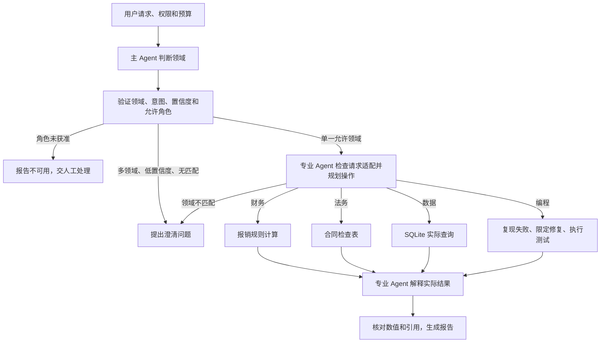

# 专业 Agent 路由

主 Agent 识别用户希望完成的任务，将单一领域任务交给对应专业 Agent。专业 Agent 独立检查请求是否属于自身范围，读取限定资料、执行工具并解释实际结果。主 Agent 不直接处理专业业务；路由不转移持久工单责任，也不把多个专业领域自动合并执行。

示例提供四条完整路径：财务计算报销金额、法务检查演示合同、数据查询 SQLite、编程修复演示函数并运行测试。

## 可运行调用

复制 `examples/patterns/specialist-routing`、`examples/_shared/tools/specialist-routing`、`examples/_shared/tools/storage`、`examples/_shared/tools/evidence.ts`、`examples/_shared/tools/execution/files.ts` 到消费者项目。安装 Core 包和 `storage/dependencies/package.json` 中的 Redis 依赖，使用 Node 24、真实 Redis、`ditto.yaml` 和模型环境凭证。

```ts
import { mkdtemp, rm } from "node:fs/promises";
import { tmpdir } from "node:os";
import { join } from "node:path";
import { loadRuntimeConfigFile } from "@ditto/core/runtime";
import { createDemo } from "./examples/_shared/tools/specialist-routing/adapters.ts";
import { openSpecialistRouting } from "./examples/patterns/specialist-routing/cli.ts";
import { runSpecialistRouting } from "./examples/patterns/specialist-routing/index.ts";

const config = loadRuntimeConfigFile("ditto.yaml", process.env);
const provider =
  process.env.EXAMPLE_SPECIALIST_ROUTING_PROVIDER ?? config.model?.provider;
if (!provider || !config.providers[provider])
  throw new Error("Configure provider");
const model = config.providers[provider].model ?? config.model?.model;
if (!model) throw new Error("Configure model");
const directory = await mkdtemp(
  join(tmpdir(), "ditto-specialist-routing-example-"),
);
try {
  const request = await createDemo(directory, {}, "data");
  const app = await openSpecialistRouting(directory, request, config);
  try {
    const result = await runSpecialistRouting(app.runtime, {
      request,
      model: { provider, model },
      // Optional models: { data: { provider, model }, ... }
      // Role keys: router, finance, legal, data, coding.
    });
    console.log(JSON.stringify(result));
  } finally {
    await app.close();
  }
} finally {
  // Keep a persistent directory instead when retaining reports/checkpoints.
  await rm(directory, { recursive: true, force: true });
}
```

## 主 Loop 与专业分支



入口 `runSpecialistRouting` 只调用一次 `runtime.loop(runSpecialistRoutingLoop, ...)`，主 Loop 用 `yield* graphStep` 串联分类、专业规划、执行和答复的平铺 Graph。节点使用公开 `CONTEXT.LOAD`、`INFER.REASONING.SAMPLE`、`MEMORY.GET/WRITE/UPDATE`、`INTERACTION.ACT.TOOL`。计划不直接运行 Worker、HTTP、SQL、文件或子进程，也不导入 Core 源码。

`router` 与专业角色共享 Runtime，但具有独立指令、可配置模型和 Redis scope。默认完整任务通常调用模型三次：路由、专业规划、基于工具结果作答。一次请求最多执行一个专业领域；业务语义路由与 Runtime 的 Worker 实例调度是不同职责。

## 四类任务与真实产物

| 角色 / 意图                 | 允许操作                  | 演示任务结果                                                                                     |
| --------------------------- | ------------------------- | ------------------------------------------------------------------------------------------------ |
| `finance` / `reimbursement` | `calculate-reimbursement` | EXP-204 餐费 58000 分、交通费 12000 分，餐费上限 50000 分；可报销 62000 分、超额 8000 分         |
| `legal` / `contract-review` | `check-contract`          | CONTRACT-204 通知期 30 天符合内部检查表；缺少数据返还期限                                        |
| `data` / `sales-summary`    | `query-sales`             | 实际查询 SQLite，排除取消订单：3 笔已支付订单，总额 240000 分；输出 `sales.csv`                  |
| `coding` / `discount-fix`   | `repair-discount`         | 原函数把基点当百分比，先执行测试得到 2 项失败；应用允许的修复后 3 项通过，输出修复文件和测试日志 |

每次操作保存 `result.json`、带摘要的 `receipt.json`；最终输出 `output/report.json` 和 `report.md`。编程分支保留原输入，在 `solution/` 写入修复后的函数和测试，保存 `baseline-tests.txt` 与 `patched-tests.txt`。模型选择受支持的修复操作，不生成任意可执行命令或源码。测试由工具实际运行，工具限制固定文件、10 秒执行时间和输出大小。

财务分支执行内部规则计算，不提交付款；法务分支审查合成合同与内部检查表，不提供法律意见或声称完成司法辖区合规审查。编程分支演示限定缺陷修复，不代表任意仓库自动修复。数据 SQL 使用固定只读查询，输入数据与请求绑定的快照一致后才执行。

## 调用契约

- `createDemo(directory, overrides?, scenario?)` 初始化资料、权限、销售库和演示代码。默认 `data`；其他场景为 `finance/legal/coding/ambiguous/unsupported`。已建任务使用原目录恢复，不重新初始化。
- `openSpecialistRouting(directory, request, config)` 注册公开 Worker 和应用工具，返回 `runtime/storage/adapters/close()`；使用后关闭连接。
- `runSpecialistRouting(runtime, {request,model,models?}, options?)` 执行任务，`models` 可分别配置 `router/finance/legal/data/coding`。
- `options.signal` 支持取消，`stopAfter` 为 `route/operation/report`，返回 `{status:"checkpoint",stage}`；默认 options 恢复同一请求。
- `Report` 包含 `requestId/status/stopReason/clarification/route/receiptId/answer/errors/usage/generatedAt`。没有完成专业任务时 `answer:null`；已执行操作但答复校验失败时保留 receipt。

`Request` 字段为 `id/tenant/principal/question/sourceDigest/allowedRoles/minConfidence/maxModelCalls/maxAttempts/deadlineSeconds`。默认全部四个专业角色、置信度门槛 0.75、10 次模型调用、每阶段 2 次尝试、600 秒。调用次数范围 1–20，尝试次数 1–3，截止时间 1–3600 秒。问题、资料摘要和权限范围共同绑定当前任务，不能在恢复时更换问题。

`Route` 保存模型返回的 `domains/intent/confidence/reason/question`，应用派生 `status/selected`。单一已知领域必须匹配目录中的意图；达到门槛且角色获准时才能选择。多个领域、低置信度和不支持的请求必须提供澄清问题。已知角色未获准返回 unavailable，不自动换用另一角色。未知角色、重复领域、错配意图和无效结构进入有限重试。

路由依据用户请求的活动而非个别词语，例如“修复财务折扣代码”属于编程，“查询销售金额”属于数据。专业规划还须给出 `matchesRequest`；若专业模型报告请求不属于自身能力，则返回 `specialist-route-mismatch` 并请求澄清，不执行操作。语义判断和置信度均来自模型，门槛不是校准过的正确率保证，双重检查也不能证明分类一定正确。

`Plan` 包含 `matchesRequest:true/role/intent/action/target/summary/citations`。执行器核对角色、操作、目标和全部逐字引文。`Answer` 包含 `role/summary/values/citations`；`values` 必须与执行结果深层一致，含嵌套地区汇总，引用必须完整且逐字匹配。自然语言总结仍需按业务要求评估，字段一致不保证每句话都正确。

## 工具、权限与数据范围

工具定义位于 `examples/_shared/tools/specialist-routing`，不加入 Core 依赖。主 Agent 只获得请求、角色目录和路由策略，不读取财务、合同、销售行或代码资料。专业 Agent 获得选中角色的 Evidence 与执行结果；工具必须核对保存的 routeId 和角色，拒绝跨角色读取及执行。角色标识由可信应用控制器传入，不构成独立进程或用户认证边界。

每次工具调用检查 `policy.json` 的 enabled/principals、不可变请求和来源摘要；数据查询前在只读事务中比对真实数据行，代码执行前检查原始函数和测试。路由、receipt 和产物相互绑定摘要；恢复和交付重新核对文件。摘要用于完整性检测，任务目录和应用进程仍属于可信基础设施。

为接入新的专业领域，应扩展角色目录、请求与输出校验、固定工具及端到端验收；无需把业务规则加进 Worker 调度器。若接入任意代码执行或可写 SQL，应在应用执行服务中实现独立沙箱与权限控制，本示例不放开这些能力。

## 持久化、恢复与停止

Redis Context 按 `specialist-routing:<tenant>:<principal>:<task>:<role>` 隔离；SQLite `memory.sqlite` 通过 Memory Worker 保存模型响应、预算、请求、路由、执行 receipt 和报告。`sales.sqlite` 只是应用数据源，不能代替 Memory。缓存过期后根据持久阶段、请求和已校验资料重建当前角色上下文；存储故障直接失败，不转用内存替代。

模型调用前持久预留预算，响应先保存再执行工具。重启可复用已持久响应；操作根据 receipt 和文件摘要幂等恢复，不重复创建另一份产物。代码修复输出固定、不可变；receipt 提交前中断可以重新跑测试并保留第一份成功日志。请为同一任务只启动一个完整 Loop；示例没有跨进程预算租约，也不允许跨版本修改协议后复用旧检查点。

截止时间与调用预算控制新推理阶段的启动；运行中请求使用 provider 超时或显式取消，代码测试另有 10 秒超时。额度耗尽输出 partial；结构校验重试耗尽输出 needs-human；需要澄清时输出 needs-clarification。报告交付后，该请求为终态，重复运行只校验并返回。用户提供澄清后，由可信控制器用更新后的问题创建新的请求，不直接改写已绑定请求或把模型提出的问题当作用户答案。

## 运行与验收

```sh
export DITTO_WORKER_CONTEXT_REDIS_URL=redis://127.0.0.1:6379
npm run example:specialist-routing -- --provider deepseek --scenario data
npm run example:specialist-routing -- --provider deepseek --scenario coding
npm run example:specialist-routing -- --provider deepseek --question '请依据规则核算 EXP-204 的报销金额。'
npm run example:specialist-routing -- --provider deepseek --stop-after route
npm run example:specialist-routing -- --provider deepseek --directory .examples-specialist-routing-tasks/cli-XXXXXX
npm run check:examples:specialist-routing:package -- --provider deepseek
```

包验收在仓库外安装实际 npm tarball，以无 paths 别名的严格配置检查类型，动态禁止源码与私有入口，验证导入不执行任务，并运行英文文档首个完整调用。

真实任务验收覆盖四类实际产物、歧义/不支持/低置信度、禁用角色、未知角色/错配意图、专业适配复核、规划及答复篡改、跨角色调用、重试、预算/截止时间、缓存过期、Redis/Memory/销售库故障、请求/资料/代码/权限变化、产物篡改、取消、路由/模型样本/操作/报告后的 SIGKILL 恢复及交付重试。正常路径使用真实模型、Redis、SQLite、测试子进程和文件；异常场景显式注入错误。验收使用单一 provider 的各角色配置，不声称其他数据库或不同供应商均已验收。

[运行示例](../../examples/patterns/specialist-routing/README.zh-CN.md) · [应用工具](../../examples/_shared/tools/specialist-routing/README.zh-CN.md)
