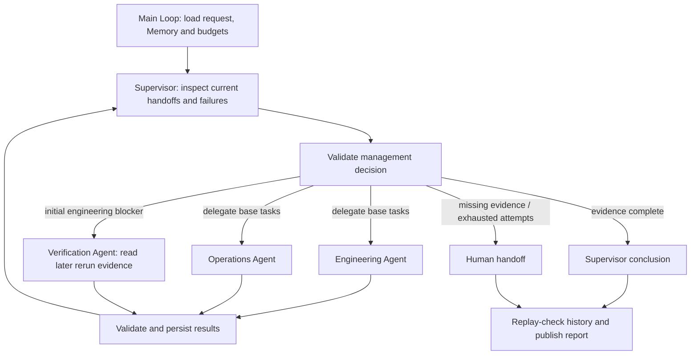

# Supervisor-managed Agent workflows

The supervisor understands the goal, delegates tasks to registered specialists, inspects their actual results, and decides whether to delegate again, conclude or escalate. This release-readiness example includes a real second delegation: initial engineering evidence reports failed tests; the supervisor commissions a verification Agent to read an existing later rerun record before reaching a conclusion. No tests are executed and no deployment is performed by this example.

## Runnable consumer

Copy `examples/patterns/supervisor`, `examples/_shared/tools/supervisor`, `examples/_shared/tools/multi-agent/domain.ts`, `examples/_shared/tools/storage`, `examples/_shared/tools/evidence.ts` and `examples/_shared/tools/execution/files.ts` into the consumer. The shared multi-agent domain module supplies existing evidence/schema helpers, not another workflow. Install the Core tarball and Redis dependency declared in `storage/dependencies/package.json`. Use Node 24, configured `ditto.yaml`, model credentials and real Redis (`DITTO_WORKER_CONTEXT_REDIS_URL`).

```ts
import { mkdtemp, rm } from "node:fs/promises";
import { tmpdir } from "node:os";
import { join } from "node:path";
import { loadRuntimeConfigFile } from "@codesoul-co/ditto/runtime";
import { createDemo } from "./examples/_shared/tools/supervisor/adapters.ts";
import { openSupervisor } from "./examples/patterns/supervisor/cli.ts";
import { runSupervisor } from "./examples/patterns/supervisor/index.ts";

const config = loadRuntimeConfigFile("ditto.yaml", process.env);
const provider =
  process.env.EXAMPLE_SUPERVISOR_PROVIDER ?? config.model?.provider;
if (!provider || !config.providers[provider])
  throw new Error("Configure provider");
const model = config.providers[provider].model ?? config.model?.model;
if (!model) throw new Error("Configure model");
const directory = await mkdtemp(join(tmpdir(), "ditto-supervisor-example-"));
try {
  const request = await createDemo(directory, {}, "recheck");
  const app = await openSupervisor(directory, request, config);
  try {
    const result = await runSupervisor(app.runtime, {
      request,
      model: { provider, model },
      // Optional models: { supervisor: { provider, model }, ... }
      // Specialist keys: engineering, operations, verification.
    });
    console.log(JSON.stringify(result));
  } finally {
    await app.close();
  }
} finally {
  // Keep a persistent directory instead when retaining reports/checkpoints.
  await rm(directory, { recursive: true, force: true });
}
```

## Control model and public APIs



`runSupervisor(runtime,input,options)` makes one `runtime.loop(runSupervisorLoop, ...)` call. The main Loop composes flat Graphs through `yield* graphStep`. All Graph nodes are public Workers; plans do no filesystem, network, database or direct Worker execution. The supervisor is a logical application Agent with its own instructions and Context. Specialists also have distinct instructions, assignments, scoped evidence, Context and optional models. They share Runtime infrastructure, not independent OS processes or authenticated principals. No new Core private API is required.

| Role         | Responsibility                                                                | Evidence access                                                                    |
| ------------ | ----------------------------------------------------------------------------- | ---------------------------------------------------------------------------------- |
| supervisor   | Choose `delegate`, `finish` or `escalate` after reviewing all current results | Goal, latest verified handoffs, attempt/error history and allowed actions          |
| engineering  | Assess initial test and defect status                                         | Fixed engineering read tool                                                        |
| operations   | Assess rollback and on-call readiness                                         | Fixed operations read tool                                                         |
| verification | Resolve an initial engineering blocker using a later test record              | Fixed verification read tool, requiring a hash-verified blocked engineering parent |

The supervisor generates actionable delegation text and chooses a nonempty subset of eligible specialists. It normally groups independent base roles together; an individual assignment is also valid. Eligibility, dependencies, attempt limits and conclusion rules belong to the application validator. The supervisor cannot add agents, repeat a successful task, use another task's result, skip the initial engineering evidence or overrule deterministic evidence checks. Each management decision must list every current result hash in `reviewedIds`. This binds review and completion to the current handoffs.

| Stage               | Public nodes / API                                                                 | Contract                                                                     |
| ------------------- | ---------------------------------------------------------------------------------- | ---------------------------------------------------------------------------- |
| Load and resume     | `MEMORY.GET`, `CONTEXT.LOAD`, Interaction tools                                    | Immutable request/source binding and current permissions                     |
| Supervisor decision | `CONTEXT.LOAD` → `INFER.REASONING.SAMPLE`                                          | Structured action, reviewed IDs, assignments, reason and optional conclusion |
| Specialist branch   | `INTERACTION.ACT.TOOL`, `CONTEXT.LOAD` → `INFER.REASONING.SAMPLE` → `MEMORY.WRITE` | Scoped evidence; separate response checkpoint for every branch               |
| Validate handoff    | `sup_save`, `sup_result` via Interaction                                           | Assignment ID, role, release, verdict, exact source quotes and parent ID     |
| Next round          | Main Loop                                                                          | Supervisor receives successes, failures and remaining permitted work         |
| Deliver             | `sup_publish`, `MEMORY.WRITE/UPDATE`                                               | Replay-validate management history and write a real report                   |

`Input.model` is the default model; `Input.models` optionally overrides `supervisor`, `engineering`, `operations` and `verification`. Runtime and Infer concurrency are 4, permitting simultaneous independent specialists. The acceptance suite uses one real provider/model across roles, including explicit per-role routing; it does not claim cross-provider validation. Cached stages are reused when a model configuration changes.

## Business decisions and result lineage

The default source file has 48/50 initial tests passed, no open critical defects, and ready rollback/on-call coverage. Engineering reports blocked; operations reports ready. After both base results, verification becomes eligible. The fixture's later `RERUN-205` record has 50/50 tests passed and zero critical defects. The supervisor may conclude ready only after reviewing this result. The initial blocked result remains in the history and is not rewritten to ready. The verifier reads the supplied record; it does not run tests, repair code or certify the source system itself. The adapter rejects reruns with a different total test count. A production source provider must additionally establish the same release revision, test suite and temporal ordering; matching counts do not prove those properties.

Scenarios are `recheck`, `ready`, `still-blocked`, `missing-verification` and `operations-blocked`. A ready initial engineering result needs no verification delegation. A later rerun with a remaining failed test leads to a completed assessment with a blocked conclusion. Missing rerun data produces an unknown verification result and human escalation. An operations blocker cannot be cleared by a successful engineering rerun.

`Decision` contains `action`, `reviewedIds`, `assignments: {agent,task}[]`, public `reason` and `conclusion`. Delegate/escalate requires a null conclusion; finish returns `{verdict,summary}` from the model. The controller adds `evidenceIds` from validated `reviewedIds`, binding the stored conclusion to all current results. An explicitly supplied evidenceIds list must also match exactly. `Finding` contains role, assignment ID (`r<round>-<role>`), release, verdict, summary and exact citations. Immutable result files bind the request digest and, for verification, the parent engineering result ID. Publication reconstructs state from ordered decisions and outcomes, validates every action and rejects altered lineage, unexpected results, duplicate outcomes or decisions after an incomplete/terminal round.

Deterministic checks verify evidence scope, typed verdicts, complete quoted facts, parent lineage and final readiness rules. Natural-language reasons and summaries are model judgments, not proof that every prose statement is correct. Role prompts treat goals and handoffs as data; a specialist cannot grant management authority through its response. Tools remain application-owned under `_shared/tools/supervisor`.

## Recovery, isolation and budgets

Each Agent has a Redis scope containing tenant, principal, task and role. Specialist inference receives only its scoped evidence and an explicitly permitted parent; the supervisor sees verified handoffs rather than unrestricted raw files. Model calls use `INFER.REASONING.SAMPLE`; the controller chooses the fixed tool from a validated assignment, without unrestricted model-selected paths/tools. This is an application data boundary, not isolation against untrusted plugins sharing the process.

Memory uses real `memory.sqlite` through public Memory nodes. It saves requests, call reservations, supervisor decisions, individual branch responses, completed rounds and final reports. Business evidence and immutable result files are separate. Missing/expired Redis context is rebuilt when required from Memory and task state; Redis/Memory outages fail visibly without a memory-only fallback. SQLite acceptance is not PostgreSQL/MySQL acceptance; other stores use public adapters.

A failed/invalid specialist response is preserved and shown to the supervisor. The supervisor can reassign only that unfinished role, up to `maxAgentAttempts` (1–3); successful roles are reused. There is no hidden local specialist retry that bypasses supervisor review. Exhausted required roles or missing verification evidence allow escalation. A malformed, stale, premature or unauthorized supervisor decision stops with `needs-human` / `invalid-supervisor-decision` and retains completed results. Storage/policy failures propagate rather than being misreported as specialist findings.

`maxRounds` (1–8) counts supervisor decisions, including the final review. `maxModelCalls` (1–20) is shared by supervisor calls, specialists and reassignments. Reservations are persisted before calls; a delegated batch is admitted only if all its new calls fit. Process termination can consume reservations without saved responses. Branch Memory saves occur independently before the join, so saved sibling responses survive a process kill. `deadlineSeconds` (1–3600) includes paused time and prevents new calls; it is not a hard timeout for running requests. `Options.signal` cancels active work. The Loop additionally permits at most 1024 Graph executions per invocation.

`stopAfter: "decision" | "delegation" | "report"` returns a checkpoint. Resume the same directory/request without `stopAfter`. One active runner owns the directory. Terminal completed/partial/human-handoff reports replay without model calls and recheck actual result files. Changed goals, budgets, source data or identities require a new task. Failed publication can be retried, but conflicting artifacts are never overwritten. These recovery controls support durable tasks; the fixture is a bounded review, not a claim of days-long soak testing.

Artifacts are `request.json`, `sources.json`, `policy.json`, `memory.sqlite`, `results/<hash>.json`, `output/report.json` and `output/report.md`. Reports include supervisor decisions, reasons, assignments, failures, parent references, exact evidence, shared usage and the accepted conclusion if any. A partial report does not pretend to have a final readiness decision. Local policy files demonstrate a trusted-controller integration, not authentication; protect the task directory and obtain identities from authenticated application state.

## Commands and acceptance

```sh
export DITTO_WORKER_CONTEXT_REDIS_URL=redis://127.0.0.1:6379
npm run example:supervisor -- --provider deepseek
npm run example:supervisor -- --provider deepseek --scenario ready
npm run example:supervisor -- --provider deepseek --scenario still-blocked
npm run example:supervisor -- --provider deepseek --scenario missing-verification
npm run example:supervisor -- --provider deepseek --stop-after delegation
npm run example:supervisor -- --provider deepseek --directory .examples-supervisor-tasks/cli-XXXXXX
npm run check:examples:supervisor:package -- --provider deepseek
```

The package gate installs an actual npm tarball outside the repository, uses strict types without aliases, blocks source/private imports, checks silent imports and executes the documented consumer. Real task tests verify second delegation, review ordering, concurrent base specialists, successful-role reuse, exhausted attempts, missing evidence, premature/stale/unknown-agent decisions, forged citations, budget stops, Redis expiry/outage, Memory failure, tampering, cancellation, process kills and publication retry. Model-output substitutions are explicitly labeled fault injections; ordinary cases use unmodified real model responses and actual report files.
