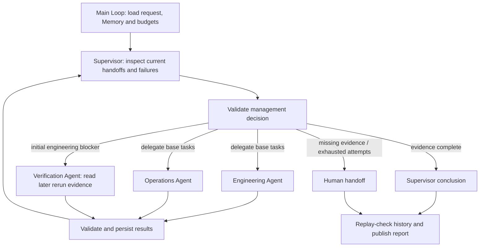

# Supervisor 主管模式

主管理解目标、委派专业任务、检查实际交接结果，并决定再次委派、汇总或升级人工。示例采用版本发布准备度评审：工程结果暴露初始测试缺口后，主管新增核验任务，读取已有的后续复测记录，再形成结论。流程不执行测试，也不进行部署。

## 可运行调用

复制 `examples/patterns/supervisor`、`examples/_shared/tools/supervisor`、`examples/_shared/tools/multi-agent/domain.ts`、`examples/_shared/tools/storage`、`examples/_shared/tools/evidence.ts` 和 `examples/_shared/tools/execution/files.ts` 到消费者项目。复用的 multi-agent domain 只提供资料/schema 辅助函数，不调用另一个工作流。安装 Core tarball 与 `storage/dependencies/package.json` 中的 Redis 依赖，使用 Node 24、`ditto.yaml`、模型凭证和真实 Redis（`DITTO_WORKER_CONTEXT_REDIS_URL`）。

```ts
import { mkdtemp, rm } from "node:fs/promises";
import { tmpdir } from "node:os";
import { join } from "node:path";
import { loadRuntimeConfigFile } from "@ditto/core/runtime";
import { createDemo } from "./examples/_shared/tools/supervisor/adapters.ts";
import { openSupervisor } from "./examples/patterns/supervisor/cli.ts";
import { runSupervisor } from "./examples/patterns/supervisor/index.ts";

const config = loadRuntimeConfigFile("ditto.yaml", process.env);
const provider =
  process.env.EXAMPLE_SUPERVISOR_PROVIDER ?? config.model?.provider;
if (!provider || !config.providers[provider])
  throw new Error("Configure provider");
const model = config.providers[provider].model ?? config.model?.model;
if (!model) throw new Error("Configure model");
const directory = await mkdtemp(join(tmpdir(), "ditto-supervisor-example-"));
try {
  const request = await createDemo(directory, {}, "recheck");
  const app = await openSupervisor(directory, request, config);
  try {
    const result = await runSupervisor(app.runtime, {
      request,
      model: { provider, model },
      // Optional models: { supervisor: { provider, model }, ... }
      // Specialist keys: engineering, operations, verification.
    });
    console.log(JSON.stringify(result));
  } finally {
    await app.close();
  }
} finally {
  // Keep a persistent directory instead when retaining reports/checkpoints.
  await rm(directory, { recursive: true, force: true });
}
```

## 主管控制与公开 API



`runSupervisor(runtime,input,options)` 仅调用一次 `runtime.loop(runSupervisorLoop, ...)`。主 Loop 通过 `yield* graphStep` 组合平铺的阶段 Graph，节点全部使用公开 Worker API；计划不直接执行文件、网络、数据库或 Worker。主管和专业 Agent 具有各自的指令、任务、资料范围、Context 和可配置模型，共享 Runtime 基础设施，并非独立进程或独立认证主体；无需增加 Core 私有入口。

| 角色         | 职责                                                  | 资料范围                                                     |
| ------------ | ----------------------------------------------------- | ------------------------------------------------------------ |
| supervisor   | 检查全部交接与失败，选择 delegate / finish / escalate | 目标、已验证结果、尝试和错误记录、允许的动作                 |
| engineering  | 分析初始测试与严重缺陷                                | 固定工程读取工具                                             |
| operations   | 分析回滚和值班准备                                    | 固定运维读取工具                                             |
| verification | 依据后续复测记录核验工程阻塞项                        | 固定核验读取工具，必须提供摘要校验通过的工程阻塞结果作为父级 |

主管生成可执行的委派内容，并选择非空的合格 Agent 子集；通常将独立的基础任务一起分配，也允许单独分配。角色资格、依赖、尝试上限和结论规则由应用验证器控制。主管不能创建未知 Agent、重复分配已成功任务、使用其他任务结果、跳过初始检查或覆盖确定性证据。每次决定的 `reviewedIds` 必须覆盖所有当前结果摘要，绑定本次检查及结束决定。

| 阶段       | 公开节点 / API                                                                     | 契约                                           |
| ---------- | ---------------------------------------------------------------------------------- | ---------------------------------------------- |
| 加载与恢复 | `MEMORY.GET`、`CONTEXT.LOAD`、Interaction 工具                                     | 不可变请求/资料绑定及最新权限                  |
| 主管决定   | `CONTEXT.LOAD` → `INFER.REASONING.SAMPLE`                                          | 动作、已审结果 ID、任务、原因、可选结论        |
| 专业分支   | `INTERACTION.ACT.TOOL`、`CONTEXT.LOAD` → `INFER.REASONING.SAMPLE` → `MEMORY.WRITE` | 限定资料，每个分支独立保存响应                 |
| 交接校验   | Interaction 调用 `sup_save`、`sup_result`                                          | 任务 ID、角色、版本、结论、原文引用与父结果 ID |
| 下一轮     | 主 Loop                                                                            | 主管收到成功结果、失败原因及剩余可分配任务     |
| 交付       | `sup_publish`、`MEMORY.WRITE/UPDATE`                                               | 重放校验管理历史，写入真实报告                 |

`Input.model` 为默认模型，`Input.models` 可覆盖 `supervisor`、`engineering`、`operations`、`verification`。Runtime 和 Infer 并发均为 4，允许独立专业任务同时执行。验收使用同一真实 provider/model 的不同角色调用，并覆盖显式按角色配置路径，不声称已经完成跨供应商验收。更改模型配置不会使已保存阶段失效。

## 业务判断与交接关系

默认资料为初始 50 项测试中 48 项通过、0 个严重缺陷，回滚和值班就绪。工程报告 blocked，运维报告 ready；主管检查两份基础结果后，核验角色才变为可分配。已有后续记录 `RERUN-205` 为 50/50 通过且无严重缺陷，主管必须查看核验结果后才可得出 ready。原始 blocked 结果完整保留，不改写成通过；核验 Agent 只阅读提供的记录，不执行测试、不修复代码，也不为上游记录系统背书。适配器拒绝复测总数与初始测试不同的记录；生产资料提供方还须验证同一版本、用例集合及先后时间，数量相同不能证明这些条件。

场景包括 `recheck`、`ready`、`still-blocked`、`missing-verification`、`operations-blocked`。初始工程资料已经就绪则无需新增核验；复测仍有失败项时，评审任务可以完成但结论为 blocked；复测缺失产生 unknown 并升级人工；工程复测通过也不能消除运维阻塞。

`Decision` 包含 `action`、`reviewedIds`、`assignments: {agent,task}[]`、公开 `reason` 和 `conclusion`。delegate/escalate 的结论必须为 null；finish 的模型输出为 `{verdict,summary}`，应用从已验证的 `reviewedIds` 填入最终报告的 `evidenceIds`，绑定全部当前结果；若提供显式 evidenceIds，也必须精确匹配。`Finding` 保存角色、任务 ID（`r<轮次>-<角色>`）、发布 ID、状态、说明及精确引用。不可变结果文件绑定请求摘要，核验结果还绑定父工程结果 ID。交付时从有序决定和执行结果重建状态，逐步验证动作，拒绝关系变化、意外结果、重复结果和未完成/终态之后的决定。

确定性规则验证资料范围、结构化判断、完整引文、父子关系和最终准备度；自然语言原因及总结仍是模型判断，不保证每句话都正确。提示将目标和交接正文视为数据，专业 Agent 不能通过回复为自己授予主管权限。工具位于 `_shared/tools/supervisor`，不混入 Core。

## 恢复、隔离与预算

每个 Agent 的 Redis scope 包含租户、身份、任务和角色。专业推理只接收所属资料与显式允许的父交接，主管接收已验证结果而非任意原始文件。调用使用 `INFER.REASONING.SAMPLE`，可信控制器从已验证委派中选择固定工具，不接受模型指定的任意路径或工具。这是应用资料边界，不是针对同进程不可信插件的安全隔离。

Memory 通过公开节点使用真实 `memory.sqlite`，保存请求、调用预留、主管决定、各分支响应、轮次和最终报告。业务资料及不可变结果文件独立存放。Redis 缺失/过期时按需从 Memory 和任务状态重建上下文；Redis/Memory 故障显式失败，不降级为内存执行。SQLite 验收不代表 PostgreSQL/MySQL 验收，其他数据库通过公开适配器接入。

失败或无效专业响应会被保存并交给主管，主管可以重新委派尚未成功的角色，受 `maxAgentAttempts`（1–3）约束；成功角色复用原结果。不存在绕过主管检查的隐式本地重试。必要角色重试耗尽或核验资料缺失时可升级人工。主管响应格式错误、使用过期结果、提前结束或越权时返回 `needs-human` / `invalid-supervisor-decision`，保留已完成结果；存储和策略故障显式抛出。

`maxRounds`（1–8）计算主管决定轮数，包含最终复核；`maxModelCalls`（1–20）由主管、专业执行和重新委派共享。调用前预留预算，整批新专业调用均满足额度才允许分发；进程终止可能消耗额度但尚未保存响应。各分支在汇合前独立写入 Memory，保存成功的分支可以跨进程复用。`deadlineSeconds`（1–3600）包括暂停时间，在新增调用前检查，不是对已执行请求的强制超时；`Options.signal` 可取消执行。每次主 Loop 上限为 1024 个 Graph。

`stopAfter: "decision" | "delegation" | "report"` 提供检查点，使用原目录/请求、移除 `stopAfter` 即可恢复。每个目录只允许一个活跃执行者。completed、partial、needs-human 终态重放不新增模型调用，会重新检查实际结果文件。改变目标、预算、资料或身份需要新任务；发布失败可重试，但不覆盖冲突产物。这些机制支持持久任务恢复；本例是有界评审，不声称已经完成数日持续运行测试。

产物包括 `request.json`、`sources.json`、`policy.json`、`memory.sqlite`、`results/<hash>.json`、`output/report.json` 和 `output/report.md`，保留主管决定、理由、委派、失败、父结果引用、原文依据、共享预算和已接受的结论。partial 报告不会伪装成最终准备度判断。本地策略展示可信控制器接入，不代替认证；部署时保护目录并从认证会话注入身份。

## 运行与验收

```sh
export DITTO_WORKER_CONTEXT_REDIS_URL=redis://127.0.0.1:6379
npm run example:supervisor -- --provider deepseek
npm run example:supervisor -- --provider deepseek --scenario ready
npm run example:supervisor -- --provider deepseek --scenario still-blocked
npm run example:supervisor -- --provider deepseek --scenario missing-verification
npm run example:supervisor -- --provider deepseek --stop-after delegation
npm run example:supervisor -- --provider deepseek --directory .examples-supervisor-tasks/cli-XXXXXX
npm run check:examples:supervisor:package -- --provider deepseek
```

包验收在仓库外安装真实 npm tarball，使用无路径别名的严格类型检查，阻断源码/私有导入，检查静默导入并运行文档调用。完整任务验证再次委派、主管检查时序、基础任务并发、成功结果复用、重试耗尽、资料缺失、提前/过期/未知角色决定、伪造引用、预算、Redis 过期/故障、Memory 故障、篡改、取消、进程终止和发布重试。模型输出替换明确标记为故障注入，正常场景使用未修改的真实模型响应与实际报告文件。
