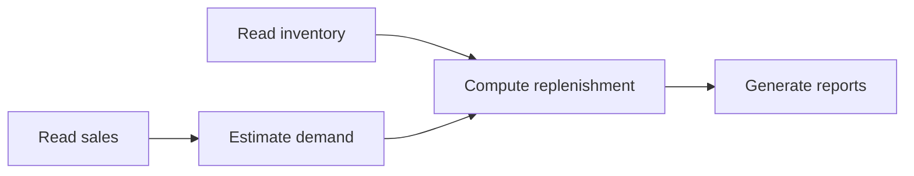

# 3.2 Planning and task management

[简体中文](README.zh-CN.md) · [Capabilities](../README.md) · [Public APIs](../../../docs/worker-api/planning.md)

These examples turn an inventory replenishment goal into a validated, executable, recoverable plan. The model selects tasks and tools. Application rules validate dependencies, budgets, and resources; Ditto Graph executes actual file reads, demand calculations, and reports.

## Five capabilities

| Capability | File / export | Behavior |
| --- | --- | --- |
| Task planning | [plan.ts](plan.ts) / `runPlan` | Propose and execute five tasks, or persist a plan before continuing |
| Task decomposition | [decompose.ts](decompose.ts) / `runDecomposition` | Split sales reading, stock reading, demand estimation, replenishment, and reporting into checkpointed tasks |
| Dependency analysis | [dependencies.ts](dependencies.ts) / `runDependencies` | Validate IDs, prerequisites, and data contracts; build a topological graph |
| Budget planning | [budget.ts](budget.ts) / `runBudget` | Account for time, model/tool calls, reference cost, concurrency, IO/CPU slots, and working-set units |
| Tool planning | [tools.ts](tools.ts) / `runTools` | Select JSON/CSV readers and demand tools using input format, quality, budget, and the allowlist |

All entries share the complete execution path. `tools` defaults to CSV; others default to JSON. Completion produces a validated plan and actual reports.



The model supplies task IDs, roles, tools, dependencies, and reasons. The application computes cost and resource usage from its catalog. Plans cannot add shell, purchasing, payment, or publication operations.

## Run

Use Node.js 24+, start Redis using the [storage guide](../../_shared/tools/storage/README.md), and configure a model Provider plus `DITTO_WORKER_CONTEXT_REDIS_URL` in `.env`.

```sh
npm ci --prefix examples/_shared/tools/storage/dependencies
npm run example:planning:plan
npm run example:planning:decompose
npm run example:planning:dependencies
npm run example:planning:budget
npm run example:planning:tools
```

Each invocation creates a directory and prints `{ directory, result }`. To inspect a plan before execution:

```sh
npm run example:planning:plan -- --plan-only
npm run example:planning:plan -- --directory /path/to/job
```

`--plan-only` archives the plan through Memory, writes `artifacts/plan.json`, and delivers the plan without business execution. Continuing does not call the model again. `--provider <name>` selects a configured provider.

Applications prepare `request.json`, `sales.json` or `sales.csv`, and `stock.json`, then call `PlanningStore.create(mode)`. See the API guide for initialization. Requests are immutable after creation; source digests are checked during execution. Changed inputs require a new job.

## Plan and budget

`request.json` contains `goal`, `salesFormat`, `analysis`, `horizonDays`, `allowedTools`, and `budget`.

| Field | Meaning |
| --- | --- |
| `analysis` | `basic` uses average daily sales; `detailed` uses peak daily sales; `best_available` prefers detailed when feasible |
| `maxModelCalls` / `maxToolCalls` | Model attempt and business-tool attempt limits; retries consume budget |
| `maxCostCents` | Combined reference cost, in integer cents |
| `maxElapsedMs` | Actual time since job creation, including waiting, model, storage, and tools |
| `concurrency` | Maximum simultaneous tasks per execution wave |
| `ioSlots` / `cpuSlots` | IO and compute capacity |
| `memoryUnits` | Logical working-set units from the tool catalog |

Planning reserves 20 cents and estimates 2000 ms. JSON costs total 36 cents for basic and 44 for detailed; CSV adds 2 cents. These are application reference rates, not provider billing, and no payment occurs.

The scheduler returns `waves`, `costCents`, `toolCalls`, `estimatedMs`, `criticalPathMs`, and `peakMemoryUnits`. Estimates support admission; actual deadlines use cancellation and pre-commit checks. Wave barriers provide conservative resource scheduling, not global optimality or OS memory isolation.

Infeasible requests are blocked before model invocation. Model proposals are revalidated. Execution admission checks remaining budget, and each attempt reserves cost in a transaction. Replaying successful checkpoints does not charge again. Changed sources, missing dependencies, duplicate IDs, unknown tools, incompatible readers, and prohibited quality downgrades fail validation.

## Actual outputs

Sales JSON is `{ sku, daily: number[] }[]`; stock JSON is `{ sku, available: number }[]`. CSV has the fixed header `sku,day,quantity`, with contiguous days starting at 1 per SKU. This intentionally limited parser does not support general quoted CSV.

Replenishment is `max(0, ceil(dailyDemand × horizonDays) - available)`. Both demand methods calculate from actual files; the model does not fill business results.

```text
<job-directory>/
  request.json
  sales.json / sales.csv
  stock.json
  planning.sqlite                  # Business state, budget, task checkpoints, events
  memory.sqlite                    # MEMORY request, plan, and result archives
  artifacts/plan.json
  artifacts/replenishment.json
  artifacts/replenishment.md
  inbox/<status>-<tools>-<model>.json
  results/job.json
```

Context lives in real Redis under a UUID session scope. Business storage does not retain a complete Context. Request, plan, and result archives use `MEMORY.WRITE`; `MEMORY.GET` restores them. Cache expiry rebuilds from database Memory. Connection failures never silently switch to local Context snapshots.

## State and recovery

Job states are `received`, `planning`, `planned`, `running`, `completed`, `blocked`, `failed`, and `cancelled`. Checkpoints are `running` or `completed`; dependent tools only consume completed outputs.

Plans must reach Memory before execution. Retrying a failed archive preserves the accepted plan without another model call. Report delivery retries preserve completed calculations. Stable Memory keys make interruptions between commit and acknowledgement idempotent.

After repairing a tool failure:

```sh
npm run example:planning:plan -- --directory /path/to/job --retry
```

If a process stops during `planning` or `running`, the trusted controller must confirm the old executor has stopped before providing its saved owner:

```sh
npm run example:planning:plan -- --directory /path/to/job --retry --stopped-owner <owner>
```

Active ownership is never automatically stolen. Recovery keeps completed tasks and charges unfinished attempts against remaining budgets. Cancellation does not roll back saved checkpoints. Retain both the task ledger and Memory database; Redis can expire via TTL.

## Verification

```sh
npm run check
npm run check:examples:planning:tasks
npm run check:examples:planning:tasks:package
```

Twenty-nine complete experiments use real models, Redis, persistent SQLite, and actual files. They cover all five entries, cost-driven quality selection, resource serialization, allowlists, infeasible budgets, source changes, invalid plans, tool/delivery faults, cache expiry, process interruption, and Memory commit recovery. Test controllers inject faults.

Package verification installs an npm tarball and Redis SDK outside the repository, typechecks without aliases, and blocks repository-source and private-Core module access. It checks silent imports, report values, dependency ordering, Redis values and TTL, Memory records, and idempotent reentry.

Reports are `.examples-planning-package-live-results.json` and `.examples-planning-tasks-live-results.json`; task files live in `.examples-planning-tasks/`. Git ignores these generated outputs.

## Graph / Loop composition

`shared.ts` exports the full-task `run*Loop`. The `run*()` entry invokes `runtime.loop()` once; its plan yields stage Graphs for Loop-owned scheduling. Reusable subplans share a 1024-Graph execution budget, including recovery and repetitions. Graphs retain node dependencies; all source, model and business effects use public Workers. See [Graph / Loop API](../../../docs/worker-api/graph-loops.md).
