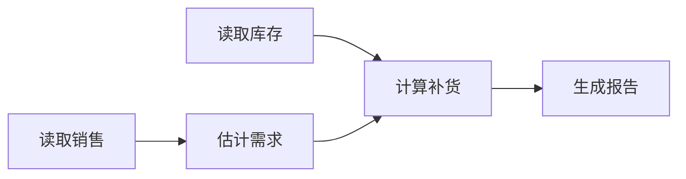

# 3.2 规划与任务管理

[English](README.md) · [基础能力](../README.zh-CN.md) · [公开 API 与调用协议](../../../docs/worker-api/planning.zh-CN.md)

这组示例将“根据销售和库存生成补货建议”转成可校验、可执行、可恢复的计划。模型选择任务与工具，应用校验依赖、预算和资源，再通过 Ditto Graph 执行实际文件读取、需求计算和报告生成。

## 五项能力

| 能力 | 文件 / 导出函数 | 行为 |
| --- | --- | --- |
| 任务规划 | [plan.ts](plan.ts) / `runPlan` | 将目标转成五个任务，校验后执行；也可先生成计划再续跑 |
| 任务分解 | [decompose.ts](decompose.ts) / `runDecomposition` | 拆成销售读取、库存读取、需求估计、补货计算和报告生成，保存各任务结果 |
| 依赖分析 | [dependencies.ts](dependencies.ts) / `runDependencies` | 校验任务 ID、前置关系和数据契约，按拓扑顺序构图 |
| 预算规划 | [budget.ts](budget.ts) / `runBudget` | 同时考虑时间、模型/工具调用次数、参考成本、并发、IO/CPU 槽位和工作集容量 |
| 工具规划 | [tools.ts](tools.ts) / `runTools` | 按 JSON/CSV 输入选择解析工具，按质量与预算选择需求估计工具；只接受允许的工具 |

五个入口共用完整执行链路。`tools` 默认使用 CSV，其余默认使用 JSON。所有示例都输出可执行计划和实际报告，不以生成计划文本作为完成条件。



模型提供任务 ID、角色、工具、依赖与理由。应用从工具目录计算成本和资源，不采信模型自报的预算。模型不得新增 Shell、采购、支付或发布操作。

## 运行

使用 Node.js 24+，按[存储接入](../../_shared/tools/storage/README.zh-CN.md)启动 Redis，并在 `.env` 配置模型 Provider 和 `DITTO_WORKER_CONTEXT_REDIS_URL`。

```sh
npm ci --prefix examples/_shared/tools/storage/dependencies
npm run example:planning:plan
npm run example:planning:decompose
npm run example:planning:dependencies
npm run example:planning:budget
npm run example:planning:tools
```

每次创建独立目录并输出 `{ directory, result }`。先查看计划再执行：

```sh
npm run example:planning:plan -- --plan-only
npm run example:planning:plan -- --directory /path/to/job
```

`--plan-only` 将计划存入数据库 Memory、写出 `artifacts/plan.json` 并交付计划，不执行业务任务。第二条命令恢复同一任务，不重新调用模型。`--provider <name>` 选择已配置 Provider。

应用接入时准备 `request.json`、`sales.json` 或 `sales.csv`、`stock.json`，再调用 `PlanningStore.create(mode)`；完整初始化见 API 文档。请求一经创建即固定，执行时核对源文件摘要，修改资料后应创建新任务。

## 计划与预算

`request.json` 包含 `goal`、`salesFormat`、`analysis`、`horizonDays`、`allowedTools` 和 `budget`。

| 字段 | 含义 |
| --- | --- |
| `analysis` | `basic` 使用日均销量；`detailed` 使用最高日销量；`best_available` 在预算内优先详细方案 |
| `maxModelCalls` / `maxToolCalls` | 模型尝试次数与业务工具尝试次数上限；重试计入消耗 |
| `maxCostCents` | 规划模型与业务工具的参考成本总额，整数分 |
| `maxElapsedMs` | 从任务创建开始的实际总耗时上限；包含等待、模型、存储和工具执行 |
| `concurrency` | 每个执行批次的最大并发任务数 |
| `ioSlots` / `cpuSlots` | IO 与计算任务槽位 |
| `memoryUnits` | 工具目录定义的逻辑工作集容量单位 |

规划预留 20 分，估计时间为 2000 毫秒。JSON 基础方案总成本为 36 分，详细方案为 44 分；CSV 方案增加 2 分。它们是演示业务的计费规则，不代表模型供应商账单，也不执行支付。

调度器输出 `waves`、`costCents`、`toolCalls`、`estimatedMs`、`criticalPathMs` 和 `peakMemoryUnits`。估算用于准入，真实截止时间通过取消信号及提交前检查执行。资源以批次屏障控制；这是保守可行的调度，不承诺全局最优，也不提供操作系统级内存限制。

预算不可能满足时，在调用模型前返回 `blocked`。模型计划仍需二次验证。执行前会检查剩余预算，每个工具尝试再以事务扣减；已成功任务重入不重复扣减。源资料变化、缺失依赖、重复 ID、未知工具、不匹配的解析器以及非法质量降级均被拒绝。

## 实际任务产物

销售 JSON 为 `{ sku, daily: number[] }[]`；库存 JSON 为 `{ sku, available: number }[]`。CSV 采用固定 `sku,day,quantity` 表头，每个 SKU 的日期序号从 1 连续排列；该解析器面向此受限数据格式，不处理带引号的通用 CSV。

补货量为 `max(0, ceil(dailyDemand × horizonDays) - available)`。两种分析方法都基于实际文件计算，模型不直接填写业务结果。

```text
<job-directory>/
  request.json
  sales.json / sales.csv
  stock.json
  planning.sqlite                  # 业务状态、预算消耗、任务检查点、事件
  memory.sqlite                    # MEMORY Worker 的请求、计划和结果归档
  artifacts/plan.json               # 已验证计划与调度
  artifacts/replenishment.json      # 实际补货结果
  artifacts/replenishment.md        # 可读报告
  inbox/<status>-<tools>-<model>.json
  results/job.json
```

Context 使用真实 Redis，以独立 UUID 作为会话 scope；业务库不保存完整 Context。请求、计划和结果分别通过 `MEMORY.WRITE` 归档，后续通过 `MEMORY.GET` 恢复。Redis 过期只从数据库 Memory 重建，不因连接故障退回本地 Context 快照。

## 状态与恢复

状态包括 `received`、`planning`、`planned`、`running`、`completed`、`blocked`、`failed`、`cancelled`。任务检查点分别记录 `running` 或 `completed`，依赖只能读取已完成的前置结果。

计划必须成功归档到 Memory 才能执行。Memory 写入失败后重新运行，可补写归档；已经接受的计划不重新推理。报告生成后交付失败，重新运行只补交付和归档，不重复业务计算。记忆使用固定 key；提交成功但确认前中断时，重复写入返回原记录。

工具故障修复后，可显式续跑：

```sh
npm run example:planning:plan -- --directory /path/to/job --retry
```

若进程在 `planning` 或 `running` 时被强制结束，可信控制器必须先确认旧执行进程已经停止，再提交保存的 owner：

```sh
npm run example:planning:plan -- --directory /path/to/job --retry --stopped-owner <owner>
```

不会自动抢占活跃任务。恢复保留已完成任务，重新尝试未完成任务并继续计费；剩余预算不足则停止。取消不回滚已保存的检查点。SQLite 任务账本和 Memory 需要同时保留，Redis 数据可按 TTL 过期。

## 验证

```sh
npm run check
npm run check:examples:planning:tasks
npm run check:examples:planning:tasks:package
```

29 个完整任务实验使用真实模型、Redis、持久化 SQLite 和实际文件。覆盖五个入口、预算降级、资源串行化、工具白名单、不可行预算、源文件变化、非法计划、工具与交付故障、缓存过期、计划和执行中断，以及 Memory 提交后恢复。故障注入由测试控制器执行。

包验收在仓库外安装 npm tarball 和 Redis SDK，禁用路径别名，以模块边界限制禁止加载仓库源码或 Core 私有路径。检查五个入口静默导入、实际报告数值、任务依赖顺序、Redis 值与 TTL、Memory 记录以及重入幂等。

报告为 `.examples-planning-package-live-results.json` 或 `.examples-planning-tasks-live-results.json`，任务文件位于 `.examples-planning-tasks/`；均由 Git 忽略规则排除。

## Graph / Loop 组合

本模块在 `shared.ts` 导出完整任务的 `run*Loop`。`run*()` 入口只调用一次 `runtime.loop()`，阶段 Graph 通过执行计划交给 Loop 统一调度；子计划复用同一个 1024 次 Graph 执行预算，检查点恢复、分支和重复不会另起调度器。Graph 内保留节点依赖，资料、模型和业务操作仍经过公开 Worker。详见 [Graph / Loop API](../../../docs/worker-api/graph-loops.zh-CN.md)。
