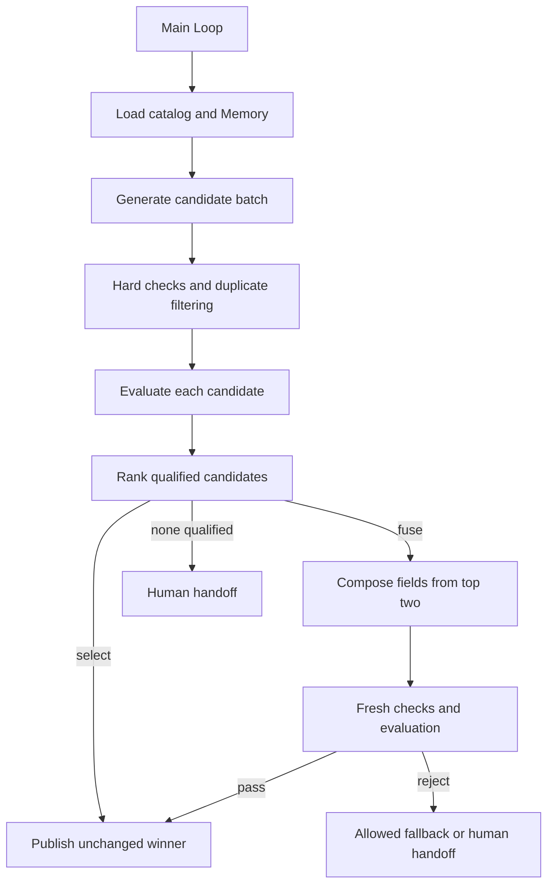

# 4.7 Multiple candidates and selection

Generate multiple candidates → evaluate individually → select or combine → verify and deliver. The example creates distinct product-copy options from a real catalog and preserves candidates, grades, exclusion reasons and fusion lineage.



One main Loop schedules flat stage Graphs through `graphStep`. Graphs contain public Worker nodes; arrows show Loop decisions. Context uses Redis, Memory uses file-backed SQLite and catalog/artifact tools remain application-owned.

## Run

Use Node 24, real Redis, configured `ditto.yaml` and model credentials in the environment. Artifacts are stored under the ignored `.examples-candidates-tasks/` directory.

```sh
export DITTO_WORKER_CONTEXT_REDIS_URL=redis://127.0.0.1:6379
npm run example:candidates -- --provider deepseek
npm run example:candidates -- --provider deepseek --mode fuse
npm run example:candidates -- --provider deepseek --mode fuse --no-fallback
npm run example:candidates -- --provider deepseek --stop-after assessment
npm run example:candidates -- --provider deepseek --directory .examples-candidates-tasks/cli-XXXXXX
npm run check:examples:candidates:package -- --provider deepseek
```

`--count` requests 2–4 candidates, `--score` sets the minimum (0–25), `--calls` limits model attempts and `--goal` supplies the objective. Fusion is re-evaluated; fallback uses an original candidate only when allowed. `output/copy.md` is the delivered copy; `output/report.json` and `output/report.md` retain comparison evidence and provenance.

[API, runnable consumer and recovery contracts](../../../docs/worker-api/candidate-workflows.md) · [Application tools](../../_shared/tools/candidates/README.md).
