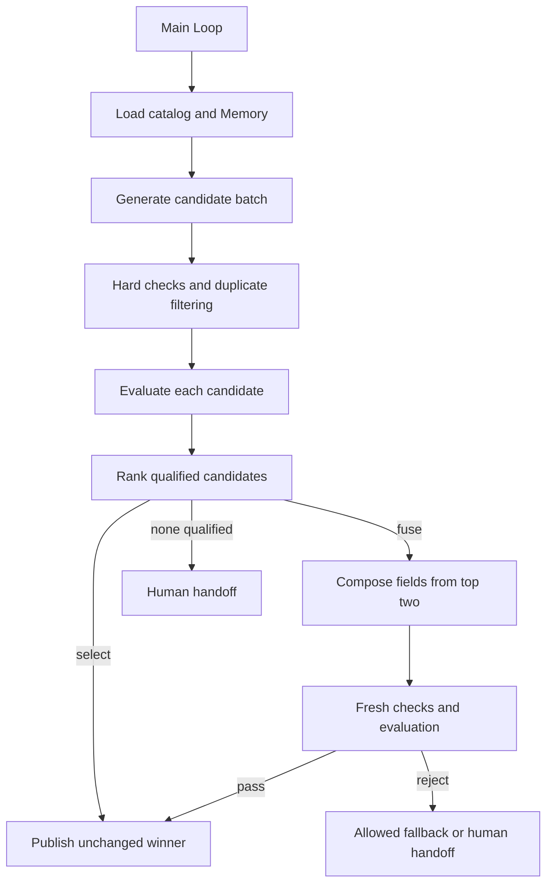

# 4.7 多候选生成与选择

生成多个候选 → 分别评估 → 选择或融合 → 核对后输出。示例基于产品资料生成不同角度的文案，保存候选、评分、淘汰原因与融合来源。



阶段 Graph 由同一主 Loop 通过 `graphStep` 调度，Graph 内只有公开 Worker 节点；箭头表示 Loop 决策。Context 使用 Redis，Memory 使用文件 SQLite，资料与产物工具位于应用目录。

## 运行

Node 24、真实 Redis，以及配置好模型凭据的 `ditto.yaml` 和环境变量。产物位于已忽略的 `.examples-candidates-tasks/`。

```sh
export DITTO_WORKER_CONTEXT_REDIS_URL=redis://127.0.0.1:6379
npm run example:candidates -- --provider deepseek
npm run example:candidates -- --provider deepseek --mode fuse
npm run example:candidates -- --provider deepseek --mode fuse --no-fallback
npm run example:candidates -- --provider deepseek --stop-after assessment
npm run example:candidates -- --provider deepseek --directory .examples-candidates-tasks/cli-XXXXXX
npm run check:examples:candidates:package -- --provider deepseek
```

`--count` 指定 2–4 个候选，`--score` 指定最低分（0–25），`--calls` 限制模型调用，`--goal` 指定目标。融合结果重新评价；失败时只有允许回退才输出原候选。`output/copy.md` 为交付文案，`output/report.json` 和 `output/report.md` 保留比较与来源。

[API、完整调用与恢复契约](../../../docs/worker-api/candidate-workflows.zh-CN.md) · [业务工具接入](../../_shared/tools/candidates/README.zh-CN.md)。
