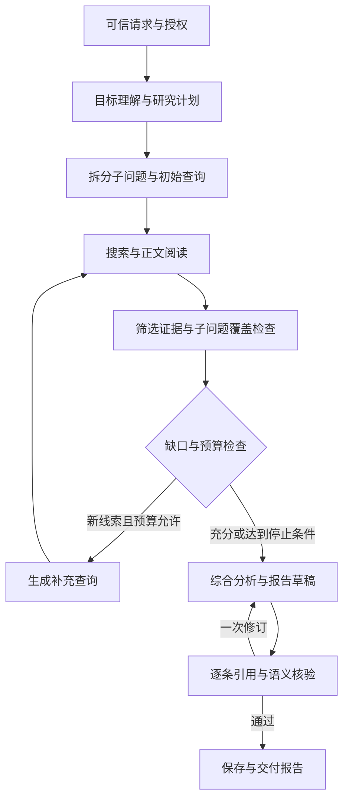

# 4.3 深度研究

[English](README.md) · [API 与调用方法](../../../docs/worker-api/research-workflows.zh-CN.md)

将复杂问题拆成子问题，通过多轮搜索、正文阅读、缺口识别和交叉核验，生成有原文引用的研究报告。适用于市场、行业、学术、竞争和政策资料研究；数据访问范围由搜索提供方、允许的来源和应用工具决定。

## 执行结构



整个链路只有一个主 `Loop`；它通过 `yield* graphStep(...)` 调度阶段 Graph，负责轮次、条件、恢复与停止。Graph 内只包含 Worker 节点。不存在外层函数手工串接多个 `runtime.run`、嵌套执行器或直接调用源码。

| 阶段                 | 输入与输出                                                                                      |
| -------------------- | ----------------------------------------------------------------------------------------------- |
| 目标理解、规划、拆分 | 问题、受众、范围 → 目标、最多三个子问题、初始查询；主题不明时输出澄清问题                       |
| 多轮搜索与阅读       | 新查询 → 搜索结果 → 实际 HTML 快照与正文片段；摘要不能充当证据                                  |
| 缺口识别与补检       | 累积证据 → 每个子问题的 covered/gap/conflict、证据 ID、缺口和下一查询                           |
| 交叉核验             | 保留冲突双方；区分日期、版本和条件；可要求不同来源 origin（协议、主机和端口）对同一结论提供支持 |
| 综合与报告           | 原文引用、综合结论、未解决事项、停止原因、逐轮轨迹、预算计数 → Markdown/JSON                    |

## 运行

使用 Node 24+，安装仓库依赖、存储和检索工具依赖，配置 `ditto.yaml` 与 `.env` 中的模型及 Redis：

```sh
npm install
npm install --prefix examples/_shared/tools/storage/dependencies
npm install --prefix examples/_shared/tools/retrieval/dependencies
npm run example:research -- --provider deepseek
```

默认任务研究 SQLite 部署架构与写并发限制，实际访问搜索服务和 SQLite 官方资料。默认 MediaWiki 仅搜索配置的 wiki；全网搜索可设置 `DITTO_EXAMPLE_WEB_SEARCH_ENGINE=brave` 和 `DITTO_WORKER_INTERACTION_BRAVE_SEARCH_API_KEY`。来源白名单独立于搜索提供方配置。

```sh
npm run example:research -- --provider deepseek --stop-after round
npm run example:research -- --provider deepseek --directory .examples-research-tasks/cli-任务目录
npm run example:research -- --provider deepseek --question '研究指定产品的能力和限制' --origins https://example.com --references https://example.com/docs
```

程序调用见 [完整可运行示例](../../../docs/worker-api/research-workflows.zh-CN.md)。使用 `defaultRequest({...})` 设置研究类型、受众、范围、查询/网页/模型/轮次预算；可信应用创建请求，模型不能增加权限。`--cross-check` 开启严格的不同来源 origin（协议、主机和端口）引用要求。恢复只能使用保存的请求；变更需求请新建任务。

## 状态与产物

- Redis Context：原始请求和当前工作集。过期后由数据库 Memory 重建。
- SQLite Memory：请求指纹、调用预算、冻结的轮次计划、查询/阅读结果、覆盖矩阵、报告。预算在操作前登记，中断可能保守多计，不会重置。
- 任务目录：`research-request.json`、研究权限和网页权限、搜索缓存、原始 HTML 快照、`memory.sqlite`。
- `output/report.md`：面向用户的结论、引用、缺口与研究轨迹。
- `output/report.json`：结构化计划、轮次、证据、核验记录和停止原因。

可在计划、轮次或报告检查点停止。每次恢复都重新授权、核对请求和引用快照；完成的报告可无新增模型/网络调用地重放发布。Redis/数据库故障直接报告，不回退内存。单个任务目录同时仅允许一个执行者。

研究时间预算限制新研究工作调度，包含暂停时间；不代表整项任务的硬超时，后续报告生成可继续。立即终止使用 `AbortSignal`。没有新证据、没有新查询、预算耗尽或问题已覆盖均会停止；无法回答的部分明确标为不足，不根据检索不到推断事实不存在。

## 工具与验收

第三方实现位于 [research](../../_shared/tools/research/README.zh-CN.md)，复用网页工具和数据库适配器；只通过公开 `INTERACTION.ACT.TOOL` 派发。正文阅读支持 HTML，PDF、动态页面、付费论文或专业数据源需额外应用工具。不同 origin 不等于独立出版方；模型核验也不能保证来源本身正确。抓取时间不冒充文献发表时间。

```sh
npm run check:examples:research:types
npm run check:examples:research:tasks -- --provider deepseek
npm run check:examples:research:package -- --provider deepseek
npm run check:examples:research:package -- --provider deepseek --docs-only
```

包外验收安装实际 npm tarball，无源码映射，检查公开 API、严格类型、静默导入和文档调用。真实网络案例与可控 HTTP 语料分别报告，两者均使用真实模型、Redis 和文件 SQLite。可控语料要求先从正文发现附录名，再用后续查询找到遗漏的保留期限，并验证冲突、注入文本、停止条件、缓存过期、存储故障、进程强制终止和交付重试。测试报告与运行产物被忽略，不进入发布包。

CLI 也支持 `--scope`、`--audience`、`--research-type`、`--rounds`、`--searches`、`--pages`、`--model-calls`、`--research-seconds`；自定义问题默认使用围绕该问题的通用研究范围，不沿用演示任务的 SQLite 范围。
