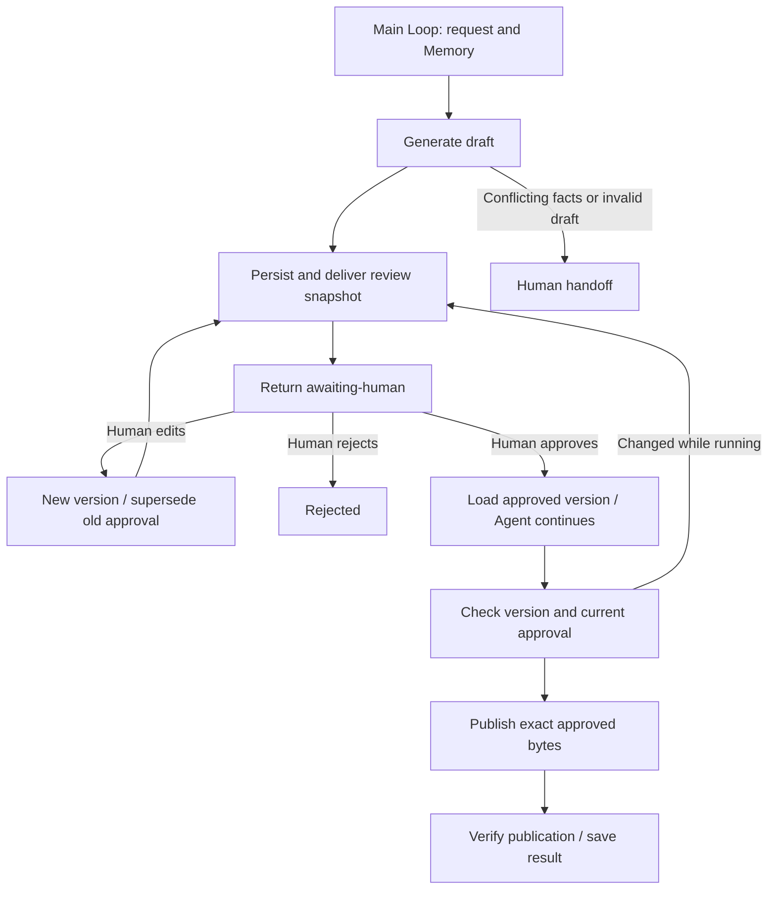

# 4.9 Human-in-the-loop

Generate a release notice → deliver a versioned human review → confirm or edit → continue from the approved version → publish and verify. Editing creates a new review; the Agent never grants its own approval.



One main Loop composes public Worker Graphs. Context uses Redis, Memory uses SQLite, and an independent review database stores business approvals. The effect is an actual local publication, not a production website or financial transaction.

## Run

Use Node 24, real Redis, configured `ditto.yaml` and model credentials. The first command returns a persistent review in `.examples-human-loop-tasks/`. Read its inbox files before supplying a decision. Keep the directory for later continuation.

```sh
export DITTO_WORKER_CONTEXT_REDIS_URL=redis://127.0.0.1:6379
npm run example:human-loop -- --provider deepseek
# Read the printed directory, review ID, token and inbox snapshot first.
npm run example:human-loop -- --provider deepseek --directory <task-directory>
npm run example:human-loop -- --provider deepseek --directory <task-directory> \
  --actor example-publisher --review-id <review-id> --token <token> --decision approve
npm run example:human-loop -- --provider deepseek --directory <task-directory> \
  --actor example-publisher --review-id <review-id> --token <token> \
  --edit-file <full-draft.json> --note "Adjust the release date"
npm run example:human-loop -- --provider deepseek --conflict
npm run check:examples:human-loop:package -- --provider deepseek
```

Reject with `--decision reject`. An edit file must contain the full `{releaseId,date,title,body}`; approve the resulting new review separately. `--stop-after draft|continued|effect` provides recovery checkpoints. Artifacts and databases are ignored by Git.

[API, authenticated controller and recovery](../../../docs/worker-api/human-loop-workflows.md) · [Application adapters](../../_shared/tools/human-loop/README.md) · [简体中文](README.zh-CN.md).
