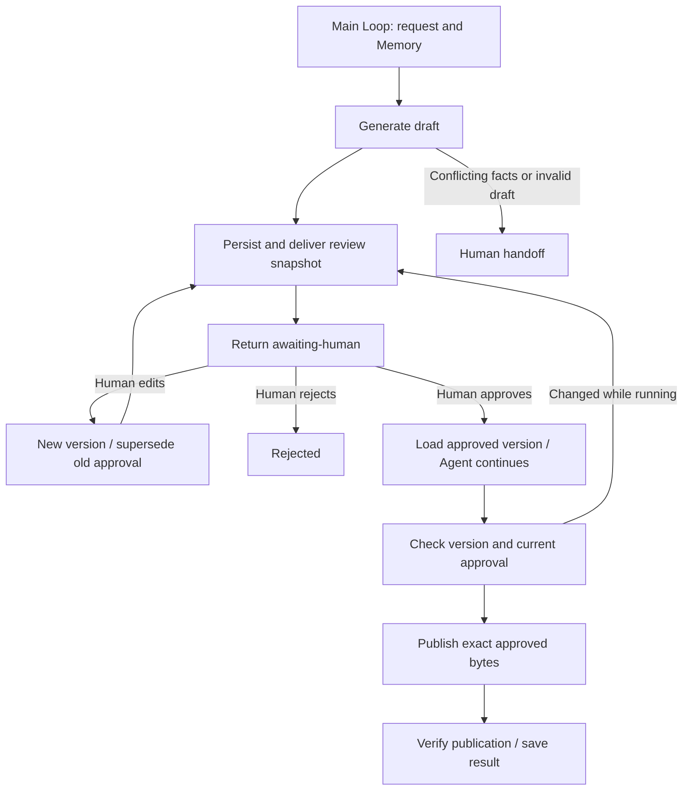

# 4.9 Human-in-the-loop 人机协作

生成发布公告 → 展示版本化审核快照 → 人工确认或编辑 → 基于批准版本继续 → 发布并核验。编辑后必须重新审核，Agent 不能给自己批准。



一个主 Loop 组合公开 Worker Graph。Context 使用 Redis，Memory 使用 SQLite，独立审核业务库存储人工决定。实际副作用为本地文件发布，不操作生产网站或金融系统。

## 运行

使用 Node 24、真实 Redis、配置好的 `ditto.yaml` 和模型凭证。首次运行返回 `.examples-human-loop-tasks/` 中的持久审核请求；先读取 inbox 快照，再提供人工决定，保留目录以便恢复。

```sh
export DITTO_WORKER_CONTEXT_REDIS_URL=redis://127.0.0.1:6379
npm run example:human-loop -- --provider deepseek
# Read the printed directory, review ID, token and inbox snapshot first.
npm run example:human-loop -- --provider deepseek --directory <task-directory>
npm run example:human-loop -- --provider deepseek --directory <task-directory> \
  --actor example-publisher --review-id <review-id> --token <token> --decision approve
npm run example:human-loop -- --provider deepseek --directory <task-directory> \
  --actor example-publisher --review-id <review-id> --token <token> \
  --edit-file <full-draft.json> --note "Adjust the release date"
npm run example:human-loop -- --provider deepseek --conflict
npm run check:examples:human-loop:package -- --provider deepseek
```

使用 `--decision reject` 拒绝。编辑文件必须包含完整 `{releaseId,date,title,body}`，并对新审核请求单独批准。`--stop-after draft|continued|effect` 提供恢复检查点。数据库与任务产物已被 Git 忽略。

[API、可信人工控制器与恢复](../../../docs/worker-api/human-loop-workflows.zh-CN.md) · [应用适配器](../../_shared/tools/human-loop/README.zh-CN.md) · [English](README.md)。
