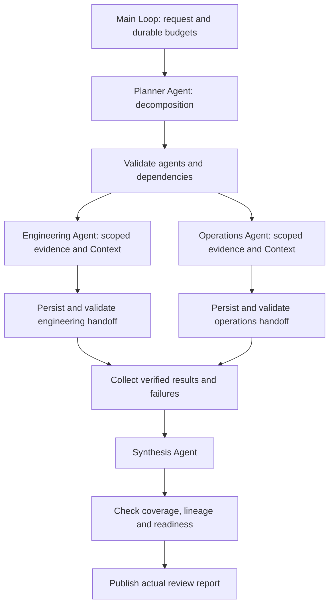

# 4.10 Multi-Agent division of work

A planner assigns release-readiness tasks to engineering and operations Agents, then a synthesis Agent combines verified handoffs. Separate Context scopes and role-specific tools preserve explicit data boundaries.



One main Loop composes public Worker Graphs. The diagram shows parallel mode; serial mode adds engineering → operations with a validated handoff. Context uses real Redis, Memory uses SQLite, and actual reports are written under the ignored `.examples-multi-agent-tasks/` directory. Use Node 24, model configuration and real Redis. A completed assessment may conclude blocked; it never deploys the release.

```sh
export DITTO_WORKER_CONTEXT_REDIS_URL=redis://127.0.0.1:6379
npm run example:multi-agent -- --provider deepseek --mode parallel
npm run example:multi-agent -- --provider deepseek --mode serial
npm run example:multi-agent -- --provider deepseek --ready
npm run example:multi-agent -- --provider deepseek --stop-after specialists
npm run example:multi-agent -- --provider deepseek --directory .examples-multi-agent-tasks/cli-XXXXXX
npm run check:examples:multi-agent:package -- --provider deepseek
```

[API and runnable consumer](../../../docs/worker-api/multi-agent-workflows.md) · [Application adapters](../../_shared/tools/multi-agent/README.md).
