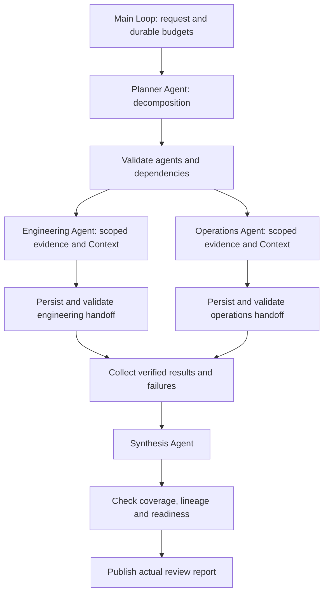

# 4.10 多 Agent 分工

规划 Agent 拆分发布准备度评审任务，工程与运维 Agent 分别执行，汇总 Agent 收集经过校验的交接结果。各角色有独立 Context scope 和限定读取工具。



一个主 Loop 组合公开 Worker Graph。图中为并行模式；串行模式增加“工程 → 运维”交接依赖。Context 使用真实 Redis，Memory 使用 SQLite，实际报告写入已忽略的 `.examples-multi-agent-tasks/`。使用 Node 24、已配置模型和真实 Redis。评审任务完成可能得出“存在阻塞”的结论，不会执行发布。

```sh
export DITTO_WORKER_CONTEXT_REDIS_URL=redis://127.0.0.1:6379
npm run example:multi-agent -- --provider deepseek --mode parallel
npm run example:multi-agent -- --provider deepseek --mode serial
npm run example:multi-agent -- --provider deepseek --ready
npm run example:multi-agent -- --provider deepseek --stop-after specialists
npm run example:multi-agent -- --provider deepseek --directory .examples-multi-agent-tasks/cli-XXXXXX
npm run check:examples:multi-agent:package -- --provider deepseek
```

[API 与完整调用](../../../docs/worker-api/multi-agent-workflows.zh-CN.md) · [应用适配器](../../_shared/tools/multi-agent/README.zh-CN.md)。
