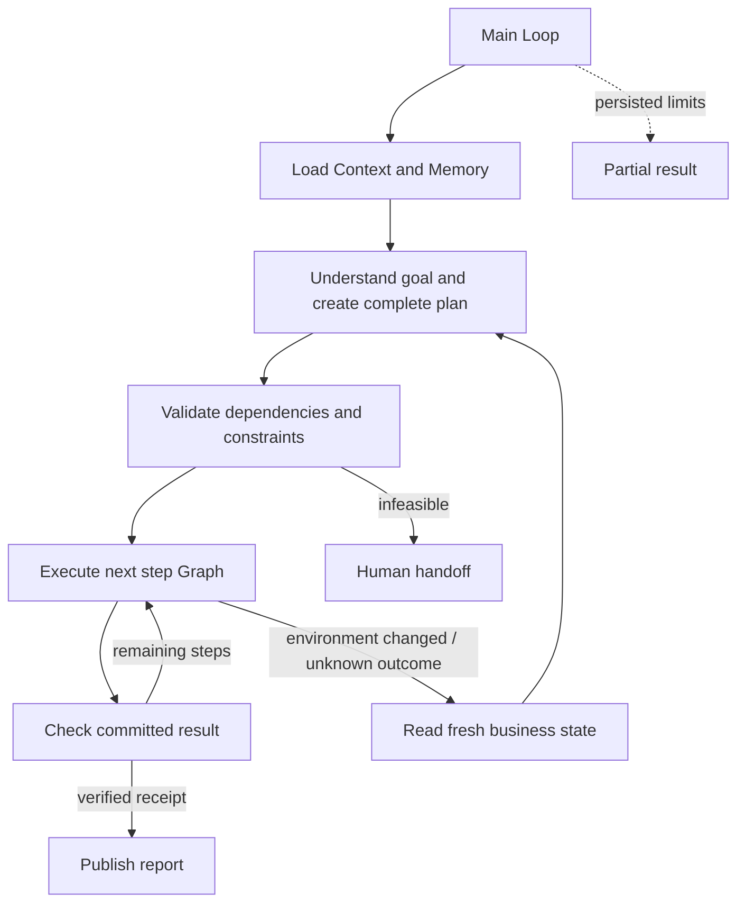

# 4.5 Plan-and-Execute

Generate a complete executable plan, then execute and verify each step. Replan remaining work when the environment changes.

The order-fulfillment example interprets the goal and budget, plans inventory reservation, packing, shipment and receipt retrieval, then executes and verifies them before publishing a report. The default scenario changes carrier prices after packing, requiring a revised shipping plan while preserving completed effects.



One main Loop schedules all stage Graphs using `graphStep`; each Graph contains only public Worker nodes. Diagram arrows describe Loop decisions, not nested Graphs. Context uses Redis; Memory and business state use separate persistent SQLite files.

## Run

Use Node 24, start Redis and configure `ditto.yaml` and model environment variables using the [configuration guide](../../../docs/worker-api/configuration.md). Artifacts are stored in the ignored `.examples-plan-execute-tasks/` directory.

```sh
export DITTO_WORKER_CONTEXT_REDIS_URL=redis://127.0.0.1:6379
npm run example:plan-execute -- --provider deepseek
npm run example:plan-execute -- --provider deepseek --scenario stable
npm run example:plan-execute -- --provider deepseek --scenario unavailable
npm run example:plan-execute -- --provider deepseek --scenario lost-response
npm run example:plan-execute -- --provider deepseek --stop-after plan
npm run example:plan-execute -- --provider deepseek --directory .examples-plan-execute-tasks/cli-XXXXXX
npm run check:examples:plan-execute:package -- --provider deepseek
```

Options include `--goal`, `--plans`, `--actions` and `--stop-after plan|step|report`. Resume preserves the original request and constraints. `shipment.json` contains the receipt; `output/report.json` and `output/report.md` contain plans, changes, evidence and verified results.

[API, runnable consumer, failure and recovery contracts](../../../docs/worker-api/plan-execute-workflows.md) · [Business tool adapters](../../_shared/tools/plan-execute/README.md).
