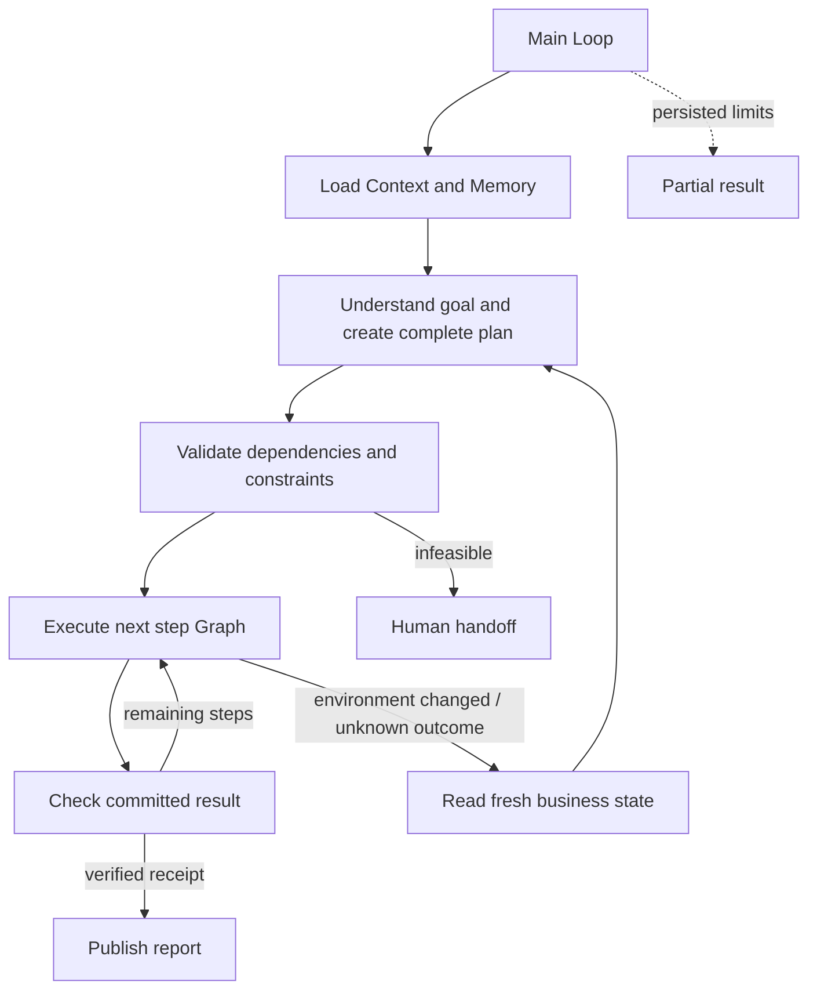

# 4.5 Plan-and-Execute

先生成可执行的整体计划，再逐步执行并核对结果；环境变化时只重规划剩余工作。

示例完成订单履约：理解订单目标与预算 → 规划库存预留、打包、订运、回执读取 → 执行并核对 → 输出业务报告。默认场景在打包后涨价，触发承运商切换；已完成步骤保持不变。



所有阶段由同一主 Loop 通过 `graphStep` 调度，Graph 内只包含公开 Worker 节点；图中箭头表示 Loop 决策，不是嵌套 Graph。Context 使用 Redis；Memory 与业务状态分别保存在独立 SQLite 文件中。

## 运行

Node 24，先准备 Redis，并按 [配置文档](../../../docs/worker-api/configuration.zh-CN.md) 设置 `ditto.yaml` 和模型环境变量。运行产物保存在已忽略的 `.examples-plan-execute-tasks/`。

```sh
export DITTO_WORKER_CONTEXT_REDIS_URL=redis://127.0.0.1:6379
npm run example:plan-execute -- --provider deepseek
npm run example:plan-execute -- --provider deepseek --scenario stable
npm run example:plan-execute -- --provider deepseek --scenario unavailable
npm run example:plan-execute -- --provider deepseek --scenario lost-response
npm run example:plan-execute -- --provider deepseek --stop-after plan
npm run example:plan-execute -- --provider deepseek --directory .examples-plan-execute-tasks/cli-XXXXXX
npm run check:examples:plan-execute:package -- --provider deepseek
```

支持 `--goal`、`--plans`、`--actions`，以及 `--stop-after plan|step|report`。恢复时使用原请求，不更改业务约束。回执写入 `shipment.json`，计划、变更、证据与核对结果写入 `output/report.json` 和 `output/report.md`。

[API、完整可运行调用、失败与恢复契约](../../../docs/worker-api/plan-execute-workflows.zh-CN.md) · [业务工具接入](../../_shared/tools/plan-execute/README.zh-CN.md)。
