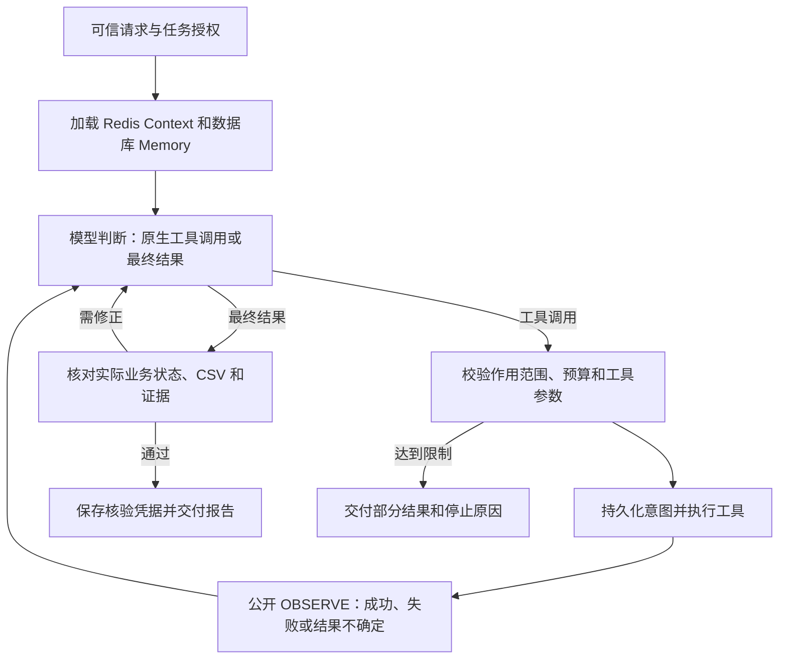

# 4.4 ReAct

[English](README.md) · [API 与完整调用](../../../docs/worker-api/react-workflows.zh-CN.md)

Agent 根据实际环境反复执行 **判断 → 行动 → 观察 → 再判断**，直到结果经过验证、需要人工介入或达到停止条件。示例任务是诊断一个失败的导出任务：查询状态、读取日志、检索处理手册，自主选择恢复动作，最后读取 CSV 并核对总额。

## 执行结构



一个主 Loop 用 `graphStep` 组合阶段 Graph；Graph 只包含 Worker 节点。模型原生 `actionRequests` 决定工具和参数，后续判断接收实际 `INTERACTION.OBSERVE` 结果，不由应用预写固定动作顺序。

## 运行

需要 Node 24+、真实 Redis，以及在 `ditto.yaml` / `.env` 中配置的模型。业务服务由示例启动，使用独立的 SQLite 数据库。

```sh
npm install
npm install --prefix examples/_shared/tools/storage/dependencies
npm run example:react -- --provider deepseek
npm run example:react -- --provider deepseek --scenario permanent
npm run example:react -- --provider deepseek --scenario disconnect
npm run example:react -- --provider deepseek --inspect
```

网页路径使用真实 Chromium，完成输入任务 ID、点击查询、点击下载、保存 CSV 和截图：

```sh
npm install --prefix examples/_shared/tools/operations/dependencies
examples/_shared/tools/operations/dependencies/node_modules/.bin/playwright install chromium
npm run example:react -- --provider deepseek --browser
```

可用场景：`transient`、`permanent`、`completed`、`disconnect`、`timeout`、`persistent`、`hostile`。`--goal` 设置目标，`--steps` / `--actions` 设置预算。

```sh
npm run example:react -- --provider deepseek --stop-after observation
npm run example:react -- --provider deepseek --directory .examples-react-tasks/cli-任务目录
```

恢复使用相同请求、权限和预算；修改目标或预算请新建任务。检查点支持 `decision`、`observation`、`report`。

## 动作与结果

| 工具               | 真实操作                                       |
| ------------------ | ---------------------------------------------- |
| job_status         | HTTP 查询业务任务状态，核对不确定的写入结果    |
| job_logs           | 读取诊断日志，保留错误码                       |
| runbook_search     | 搜索本地处理手册中匹配错误码的条目             |
| job_retry          | 在允许的范围内恢复瞬时故障，先核对幂等操作记录 |
| job_result         | 通过 HTTP 读取已完成任务的 CSV                 |
| job_result_browser | 操作浏览器页面并下载 CSV                       |

`inspect` 不提供恢复工具。恢复操作必须具备真实日志和手册依据，并且错误允许重试；永久权限问题转人工。响应丢失或取消不表示服务端回滚。恢复前先查操作记录，服务端在事务内写入效果和幂等凭据，因此进程重启不会重复产生恢复效果。

最终结果不能只依据模型自述。控制器重新读取业务状态，核验 CSV 算术和证据，生成验证凭据；错误总额或过早完成会作为反馈进入下一轮。报告摘要由已验证业务字段生成，不把未经核验的自由文本作为成功依据。`needs-human` 是交给宿主处理的持久化结果，示例不会向他人发送消息。

## 状态与边界

- Redis Context 保存当前对话；文件 SQLite Memory 保存模型决策、动作结果、Observation、预算和报告。
- `service.sqlite` 保存独立业务状态，不能代替 Memory。Redis 过期后从 Memory 重建；存储故障直接返回错误。
- `output/report.md` / `output/report.json` 保存用户结果、公开动作轨迹、观察、证据与停止原因。
- `evidence/`、`verification/` 保存内容哈希绑定的证据和验证凭据；浏览器路径另有 `download.csv` 和 `browser.png`。

达到模型步数、动作数、截止时间，或动作与结果持续重复时停止。预算在派发前登记，恢复后不重置；未知的中断尝试可能保守多计。控制器授权、结果验证与交付不计入模型动作数。整个动作批次先校验，再顺序执行；新副作用需要留出后续模型观察轮次。

`deadlineSeconds` 控制新工作调度，包含暂停时间，不是整项任务的硬超时。立即取消使用 `AbortSignal`；它会传给支持取消的工具，但不会撤销已发生的外部效果。单任务目录同时只运行一个实例。

所有框架调用均来自公开 `@codesoul-co/ditto/...` 入口。第三方实现位于 [ReAct 工具](../../_shared/tools/react/README.zh-CN.md)，浏览器 SDK 复用已有工具配置。Core 的 `runReactFlow` 是较轻量的临时执行便捷入口；本示例通过相同公开节点建立有持久化状态的主 Loop，不在 Graph 内嵌套这个入口。

## 端到端验收

```sh
npm run check:examples:react:types
npm run check:examples:react:tasks -- --provider deepseek
npm run check:examples:react:package -- --provider deepseek
npm run check:examples:react:package -- --provider deepseek --docs-only
```

测试使用真实模型、Redis、数据库、HTTP 服务和 Chromium，核对业务写入次数、下载内容和报告。覆盖正常恢复、人工升级、读权限任务、未知结果、恶意日志、预算停止、非法工具/参数、错误总额修正、缓存过期、存储故障、权限撤销、进程强制结束、取消后核对和交付重试。故障注入的模型输出单独标记。

包外验收安装实际 npm tarball，无 paths 映射，检查公开入口、严格类型、静默导入与运行时边界，并实际执行 API 文档例子。HTTP/浏览器测试作用于受控本地任务环境，不声称覆盖任意第三方网站或生产系统。测试产物与报告被忽略，不进入发布包。
