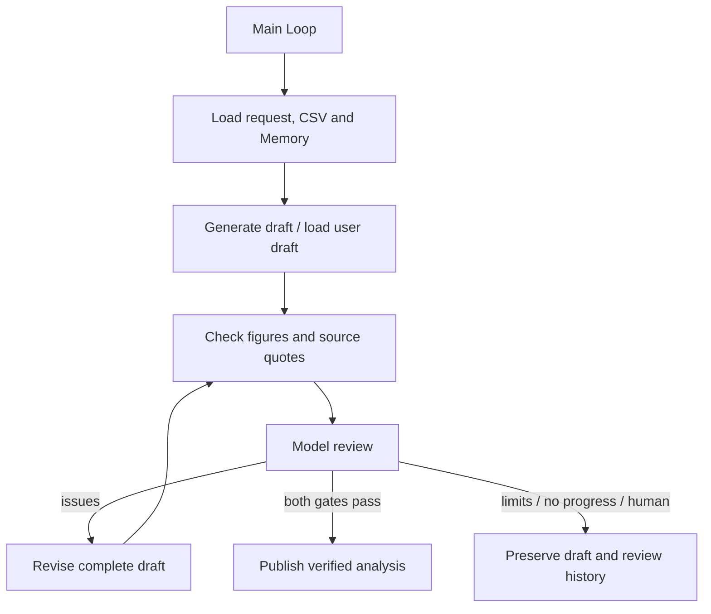

# 4.6 Reflection / Self-Refine

Generate → inspect → identify problems → revise → recheck. Create a monthly business report from real CSV data or refine an existing draft. Accept a result only after both model review and deterministic checks pass.



The main Loop composes stage Graphs using `graphStep`; Graphs contain only public Worker nodes. Arrows show Loop decisions. Context uses Redis and Memory uses persistent SQLite. CSV, calculation, citation and artifact tools live outside Core.

## Run

Use Node 24, real Redis, `ditto.yaml` and model credentials in the environment. Artifacts are saved under the ignored `.examples-reflection-tasks/` directory.

```sh
export DITTO_WORKER_CONTEXT_REDIS_URL=redis://127.0.0.1:6379
npm run example:reflection -- --provider deepseek
npm run example:reflection -- --provider deepseek --scenario flawed-draft
npm run example:reflection -- --provider deepseek --scenario missing-data
npm run example:reflection -- --provider deepseek --stop-after review
npm run example:reflection -- --provider deepseek --directory .examples-reflection-tasks/cli-XXXXXX
npm run check:examples:reflection:package -- --provider deepseek
```

`--rounds` limits draft versions, `--calls` limits model attempts and `--goal` supplies the task goal. Checkpoints support `draft|review|report`; resume preserves the request. A generated draft may pass immediately; the seeded-draft scenario demonstrates revision of wrong calculations and missing citations.

[API, runnable consumer and failure/recovery contracts](../../../docs/worker-api/reflection-workflows.md) · [Application tools](../../_shared/tools/reflection/README.md).
