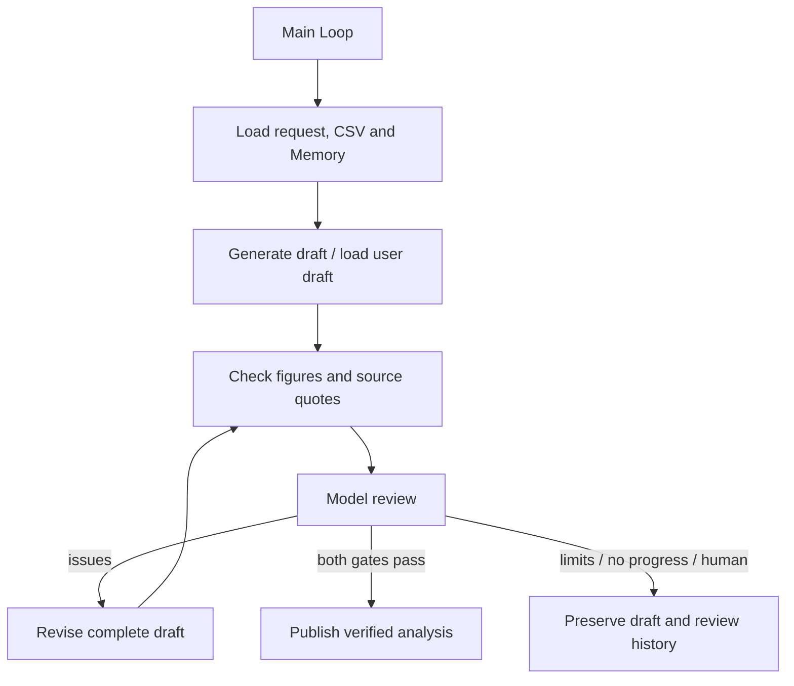

# 4.6 Reflection / Self-Refine

生成 → 检查 → 发现问题 → 修改 → 再检查。示例从真实 CSV 生成月度经营分析，或改进已有初稿；只有模型审阅和工具核对均通过才交付分析结果。



主 Loop 通过 `graphStep` 组合阶段 Graph，Graph 内仅含公开 Worker 节点。图中箭头表示 Loop 决策。Context 使用 Redis，Memory 使用文件 SQLite；CSV 读取、计算、引用核对和产物保存位于独立应用工具目录。

## 运行

使用 Node 24、真实 Redis，以及配置好模型凭据的 `ditto.yaml` 和环境变量。产物保存到已忽略的 `.examples-reflection-tasks/`。

```sh
export DITTO_WORKER_CONTEXT_REDIS_URL=redis://127.0.0.1:6379
npm run example:reflection -- --provider deepseek
npm run example:reflection -- --provider deepseek --scenario flawed-draft
npm run example:reflection -- --provider deepseek --scenario missing-data
npm run example:reflection -- --provider deepseek --stop-after review
npm run example:reflection -- --provider deepseek --directory .examples-reflection-tasks/cli-XXXXXX
npm run check:examples:reflection:package -- --provider deepseek
```

`--rounds` 限制草稿版本数，`--calls` 限制模型调用次数，`--goal` 指定任务目标。检查点支持 `draft|review|report`，恢复时沿用原请求。新生成任务第一版通过即可完成；已有初稿示例包含错误计算和缺失引用，展示实际修改闭环。

[完整 API、调用方法与失败/恢复契约](../../../docs/worker-api/reflection-workflows.zh-CN.md) · [业务工具接入](../../_shared/tools/reflection/README.zh-CN.md)。
