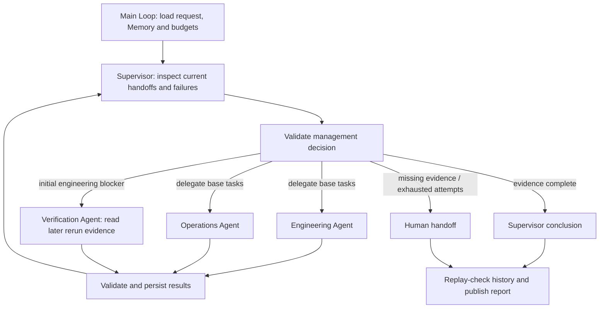

# 4.11 Supervisor

The supervisor delegates release-readiness work, checks every handoff, requests verification when initial engineering evidence shows a blocker, and concludes or escalates. Specialists cannot finish the overall task themselves.



One main Loop composes public Worker Graphs. Context uses Redis and Memory uses SQLite. Use Node 24, configured models and real Redis. Outputs are under the ignored `.examples-supervisor-tasks/` directory. Verification reads an existing rerun record; the task does not execute tests or deploy a release.

```sh
export DITTO_WORKER_CONTEXT_REDIS_URL=redis://127.0.0.1:6379
npm run example:supervisor -- --provider deepseek
npm run example:supervisor -- --provider deepseek --scenario ready
npm run example:supervisor -- --provider deepseek --scenario still-blocked
npm run example:supervisor -- --provider deepseek --scenario missing-verification
npm run example:supervisor -- --provider deepseek --stop-after delegation
npm run example:supervisor -- --provider deepseek --directory .examples-supervisor-tasks/cli-XXXXXX
npm run check:examples:supervisor:package -- --provider deepseek
```

[API and runnable consumer](../../../docs/worker-api/supervisor-workflows.md) · [Application tools](../../_shared/tools/supervisor/README.md).
