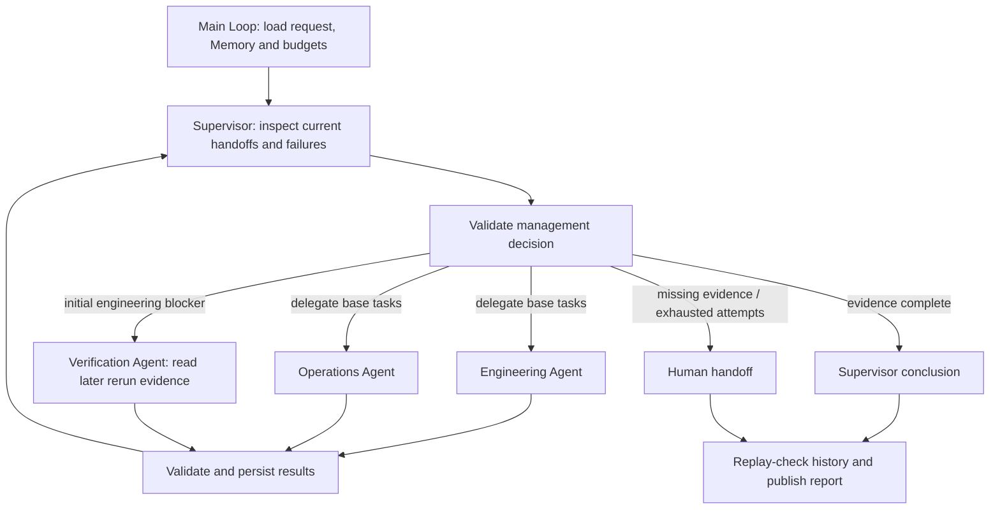

# 4.11 Supervisor 主管模式

主管分配发布准备度评审任务，检查每份交接；初始工程证据出现阻塞后再委派核验，最终汇总或升级人工。专业 Agent 不能自行宣布整个任务完成。



一个主 Loop 组合公开 Worker Graph，Context 使用 Redis，Memory 使用 SQLite。使用 Node 24、已配置模型和真实 Redis。产物位于已忽略的 `.examples-supervisor-tasks/`。核验只读取已有复测记录，不执行测试或部署。

```sh
export DITTO_WORKER_CONTEXT_REDIS_URL=redis://127.0.0.1:6379
npm run example:supervisor -- --provider deepseek
npm run example:supervisor -- --provider deepseek --scenario ready
npm run example:supervisor -- --provider deepseek --scenario still-blocked
npm run example:supervisor -- --provider deepseek --scenario missing-verification
npm run example:supervisor -- --provider deepseek --stop-after delegation
npm run example:supervisor -- --provider deepseek --directory .examples-supervisor-tasks/cli-XXXXXX
npm run check:examples:supervisor:package -- --provider deepseek
```

[API 与完整调用](../../../docs/worker-api/supervisor-workflows.zh-CN.md) · [应用工具](../../_shared/tools/supervisor/README.zh-CN.md)。
