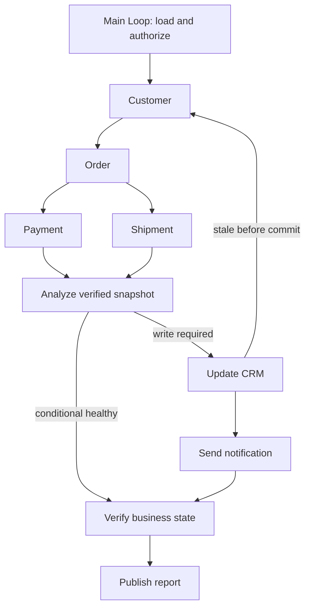

# 4.8 Tool-chain execution

Customer lookup → order lookup → payment/shipment analysis → CRM update → notification → verification. The same task demonstrates serial dependencies, actual parallel reads and conditional writes.



The diagram shows parallel/conditional mode. Serial mode adds payment → shipment. A single Loop composes stage Graphs; all nodes use public Workers. Redis stores Context, SQLite stores Memory and a separate HTTP service owns business data and its notification inbox. The example does not send production email.

## Run

Use Node 24, configured `ditto.yaml`, model credentials and real Redis. Generated files go to the ignored `.examples-tool-chain-tasks/` directory.

```sh
export DITTO_WORKER_CONTEXT_REDIS_URL=redis://127.0.0.1:6379
npm run example:tool-chain -- --provider deepseek --mode serial
npm run example:tool-chain -- --provider deepseek --mode parallel
npm run example:tool-chain -- --provider deepseek --mode conditional --scenario healthy
npm run example:tool-chain -- --provider deepseek --scenario crm-disconnect
npm run example:tool-chain -- --provider deepseek --stop-after crm
npm run example:tool-chain -- --provider deepseek --directory .examples-tool-chain-tasks/cli-XXXXXX
npm run check:examples:tool-chain:package -- --provider deepseek
```

`--no-write` and `--no-notify` exercise missing permissions; `--goal` supplies the task objective. Other scenarios: `exception`, `stale`, `racing-read`, `notify-disconnect`, `notify-fails`, `payment-fails`, `change-after-crm`. Resume retains the saved request. Read `output/report.md`, `output/report.json` and, when delivered, `output/notification.json`.

[API and runnable consumer](../../../docs/worker-api/tool-chain-workflows.md) · [Application tools](../../_shared/tools/tool-chain/README.md) · [简体中文](README.zh-CN.md).
