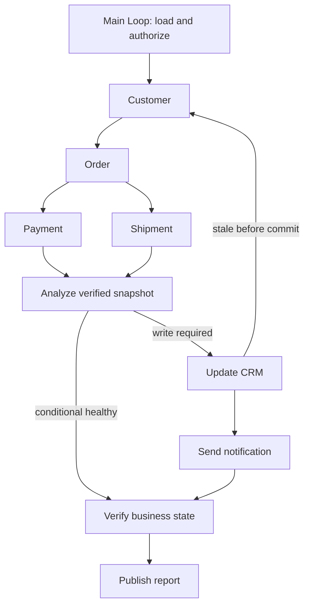

# 4.8 工具链执行

查询客户 → 获取订单 → 分析付款与物流 → 更新 CRM → 发送通知 → 核验真实结果。同一业务场景展示串行依赖、实际并发和条件写入。



图中为并行/条件模式；串行模式增加“付款 → 物流”依赖。一个主 Loop 组合各阶段 Graph，所有节点均通过公开 Worker API 执行。Context 使用 Redis，Memory 使用 SQLite；业务 HTTP 服务使用独立数据库，通知实际进入该服务的持久收件箱，不发送生产邮件。

## 运行

使用 Node 24、已配置的 `ditto.yaml`、模型凭证与真实 Redis。任务产物保存到已忽略的 `.examples-tool-chain-tasks/`。

```sh
export DITTO_WORKER_CONTEXT_REDIS_URL=redis://127.0.0.1:6379
npm run example:tool-chain -- --provider deepseek --mode serial
npm run example:tool-chain -- --provider deepseek --mode parallel
npm run example:tool-chain -- --provider deepseek --mode conditional --scenario healthy
npm run example:tool-chain -- --provider deepseek --scenario crm-disconnect
npm run example:tool-chain -- --provider deepseek --stop-after crm
npm run example:tool-chain -- --provider deepseek --directory .examples-tool-chain-tasks/cli-XXXXXX
npm run check:examples:tool-chain:package -- --provider deepseek
```

`--no-write` / `--no-notify` 演示权限不足，`--goal` 设置目标。其他场景包括 `exception`、`stale`、`racing-read`、`notify-disconnect`、`notify-fails`、`payment-fails`、`change-after-crm`。恢复时使用原请求。查看 `output/report.md`、`output/report.json`，以及通知确认后生成的 `output/notification.json`。

[API、完整调用与恢复契约](../../../docs/worker-api/tool-chain-workflows.zh-CN.md) · [应用工具](../../_shared/tools/tool-chain/README.zh-CN.md) · [English](README.md)。
