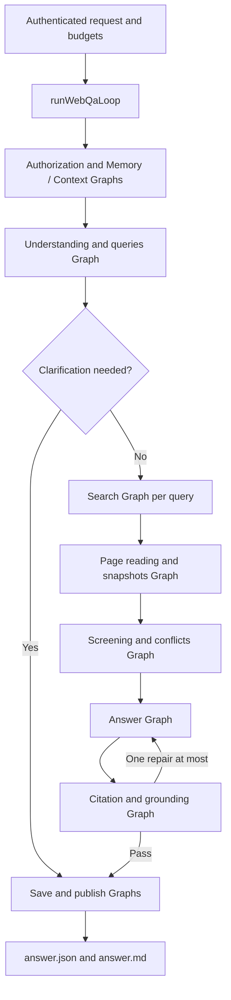

# 4.2 Web search question answering

[简体中文](README.zh-CN.md) · [Patterns](../README.md) · [API and runnable consumer](../../../docs/worker-api/web-search-workflows.md)

Understand a question, generate queries, search, read authorized pages, select actual evidence and deliver a cited answer. Optional multi-source corroboration and conflict analysis operate on page text, not search snippets.

## Loop and Graph composition



One runWebQaLoop schedules every stage Graph with graphStep. Graphs contain Worker nodes, not nested Graphs. Checkpoint and recovery subplans share the same 128-Graph budget; the execution plan performs no direct file/database/network effects. runWebQa calls runtime.loop once.

The stages transform the trusted request into a query plan; search results into allowed URLs; pages into versioned HTML/body snapshots; evidence into selected facts, missing facets and conflicts; and a verified answer into immutable output files. Each factual claim has exact quotations and a separate model grounding check.

## Run

Use Node.js 24+, a configured model, Redis and the [search tool settings](../../_shared/tools/web-search/README.md). From the repository root:

```sh
npm run build
npm install --prefix examples/_shared/tools/storage/dependencies
npm install --prefix examples/_shared/tools/retrieval/dependencies
npm run example:web-search -- --provider deepseek
npm run example:web-search -- --provider deepseek --cross-check
npm run example:web-search -- --provider deepseek --stop-after read
npm run example:web-search -- --provider deepseek --directory .examples-web-search-tasks/cli-TASK
```

The demo searches Wikipedia for SQLite and reads an explicitly supplied SQLite reference page. MediaWiki covers that wiki's index; choose brave and configure its key for general web search. For a new task use --question, --origins and --references; update default references when changing allowed origins. Resume reads the saved request and cannot modify its question or network permissions. Results are output/answer.json and output/answer.md in the printed directory.

## Contracts

- At most three queries, six pages, four ranked chunks per page, eight selected chunks, and one answer repair. A complete uninterrupted run uses at most six model calls.
- Citations bind the final URL, retrieval timestamp, HTML SHA256, normalized paragraph position and exact source text. Snippets are never answer evidence.
- crossCheck requires different origins and different supporting text per ordinary claim. This is not proof of independent publishers. Conflicts cite both sides rather than selecting an unsupported winner.
- Ambiguous questions request clarification. Successful search without evidence returns insufficient-evidence. Total search/read failure throws; allowPartial preserves successes with explicit failure and omission records.
- Redis stores Context; MEMORY.* stores checkpoints in file SQLite. Cache expiry is recoverable, connection failures are not silently replaced by in-memory storage. Snapshot files do not replace Memory.
- Recovery reuses completed searches, verified snapshots and stored reports; authorization is rechecked before work and delivery. Refreshing current web content requires a new task ID.

index.ts contains the complete Loop/Graph flow, cli.ts registers Workers and closes resources, and fixtures.ts provides the demo request. External adapters live under examples/_shared/tools/web-search and reuse common storage, HTML decoding and citation validators. The [API guide](../../../docs/worker-api/web-search-workflows.md) shows an installed-package consumer without source imports or path aliases.

## End-to-end acceptance

```sh
npm run check
npm run check:examples:web-search:types
npm run check:examples:web-search:package -- --provider deepseek
```

The package gate installs a real tarball outside the repository, checks strict public types, silent imports and a resolver guard, then runs real models, Redis, SQLite and file delivery. Reports distinguish live-internet cases from controlled-http cases. The latter still use actual HTTP servers, models and storage to exercise misleading snippets, hostile pages, conflict, throttling, redirect escapes, invalid citations, unsupported claims, revoked policy, corrupt snapshots, expired cache and process crashes. They are never passed off as Internet search, and live failures do not fall back to fixtures. Ignored reports retain model/HTTP counts, Graph traces and artifact hashes.

The default public-network cases use MediaWiki search plus Wikipedia and SQLite pages. To validate Brave, configure its credential, set DITTO_EXAMPLE_WEB_SEARCH_ENGINE=brave and run the same live-internet cases; provider acceptance is specific to the configured service.
