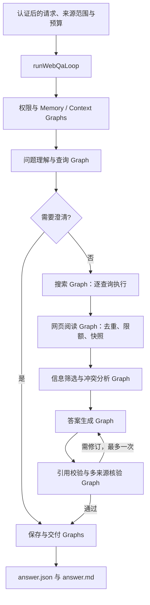

# 4.2 联网搜索问答

[English](README.md) · [执行模式目录](../README.zh-CN.md) · [API 与完整调用方法](../../../docs/worker-api/web-search-workflows.zh-CN.md)

从用户问题生成查询，搜索互联网，读取获准网页正文，筛选证据后生成带原文引用的答案。复杂问题可以启用多来源核验，识别并列出冲突。答案不使用搜索摘要替代网页阅读。

## 主 Loop 与阶段 Graph



图中是 Loop 调度的阶段顺序，Graph 内只包含 Worker 节点。runWebQa 只调用一次 runtime.loop；每个阶段通过 yield* graphStep 交由同一 Loop 执行，检查点和恢复分支共用总预算。执行计划本身不读文件、数据库或网络。

| 阶段 | 输入 → 输出 |
| --- | --- |
| 权限与恢复 | 可信请求及策略 → 授权结果、Redis 工作集、数据库检查点 |
| 理解与查询 | 问题及查询预算 → 目标、查询、所需事实或澄清问题 |
| 搜索 | 逐个查询 → URL、标题、摘要；这些还不是回答证据 |
| 阅读 | 获准且去重的 URL → HTML 快照、正文、抓取时间和 hash |
| 筛选 | 正文片段与问题 → 已选证据、缺失事实、冲突双方 |
| 回答与核验 | 所选证据 → 逐结论精确引文、支持性检查、多来源状态 |
| 保存与交付 | 核验后的报告 → SQLite Memory、不可变 JSON / Markdown |

## 运行

Node.js 24+，配置模型、Redis 和[搜索工具](../../_shared/tools/web-search/README.zh-CN.md)。在仓库根目录运行：

```sh
npm run build
npm install --prefix examples/_shared/tools/storage/dependencies
npm install --prefix examples/_shared/tools/retrieval/dependencies
npm run example:web-search -- --provider deepseek
```

默认演示通过 Wikipedia 搜索 SQLite，同时阅读用户指定的 SQLite 官方补充页面。MediaWiki 的搜索范围限于对应 Wiki；通用互联网搜索选择 brave 并提供密钥。

```sh
npm run example:web-search -- --provider deepseek --cross-check
npm run example:web-search -- --provider deepseek --stop-after read
npm run example:web-search -- --provider deepseek --directory .examples-web-search-tasks/cli-任务目录
```

新任务可用 --question、--origins、--references 指定问题、逗号分隔的允许来源和补充 URL；网络范围变化时应同步更换默认补充来源。恢复只读取保存的请求；不能在原任务上修改问题或网络权限。终端输出任务目录和结构化结果，answer.json / answer.md 位于目录内的 output/。

## 证据、预算与失败语义

- 最多三个查询、六个页面、每页四个片段、八个最终证据块。Loop 最多执行 128 个 Graph；答案最多修订一次，完整运行最多六次模型调用。
- 引用绑定真实读取的正文、最终 URL、抓取时间、SHA256 和规范化段落位置。无法追溯的引文拒绝交付。
- crossCheck 要求逐结论得到不同 origin、不同文本共同支持；不同 origin 不保证编辑机构独立。冲突展示双方，不强行给出单一答案。
- 缺少明确主题时先澄清；搜索成功但无依据时返回依据不足。全部搜索或读取失败会抛错。allowPartial 可保留成功来源，报告始终列出失败和预算遗漏。
- Context 使用真实 Redis；长期任务状态由 MEMORY.* 写入文件 SQLite。缓存过期可恢复，存储不可用不静默降级。HTML 文件不是 Memory 的替代品。
- 已完成搜索、网页快照与报告可幂等复用。每次恢复/交付重新检查权限和快照；源网页刷新使用新任务 ID。

## 文件

index.ts 是主 Loop、阶段 Graph 与完整链路；cli.ts 注册 Worker 并管理资源；fixtures.ts 提供公开资料演示请求。第三方实现放在 examples/_shared/tools/web-search，通用正文解析、存储和引用规则按相对路径复用。通过 [npm 消费者示例](../../../docs/worker-api/web-search-workflows.zh-CN.md)接入，无需源码导入或路径别名。

## 端到端验收

```sh
npm run check
npm run check:examples:web-search:types
npm run check:examples:web-search:package -- --provider deepseek
```

包验收在仓库外安装真实 tarball，检查公开导出、无路径别名的严格类型、静默导入和直接源码路径拦截，然后运行真实模型、Redis、SQLite 和文件交付。

报告明确区分 live-internet 与 controlled-http：前者使用真实搜索服务和公开网站；后者使用真实 HTTP 服务、真实模型及存储，确定性构造摘要误导、恶意页面、冲突、429/503、跳转越界、错误引用、无依据结论、权限撤销、快照篡改、缓存过期和进程崩溃。受控网络测试不冒充公网搜索；公网故障也不自动切换测试服务。模型调用数、HTTP 次数、Graph 轨迹和产物 hash 保存在被忽略的验收报告中。

默认公网用例使用 MediaWiki 搜索及 Wikipedia、SQLite 页面。验收 Brave 时，配置对应密钥、设置 DITTO_EXAMPLE_WEB_SEARCH_ENGINE=brave，再运行相同的 live-internet 用例；各 Provider 按实际配置分别验收。
